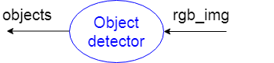
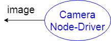

# ROS имена, пространства имен, мапирование

Данная тема определяет важные аспекты, связанные с организацией системы при работе с узлами и топиками. Относительно данной темы можно сослаться на офф страницу о [именах](http://wiki.ros.org/Names), а также к странице о [мапировании](http://wiki.ros.org/Remapping%20Arguments).

## Node name

Для начала определим, что __имя узла__ - это имя, которое присваивается узлу при его запуске. Ранее уже было произведено переопределение имени узла аргументом `__name` в команде
```bash
rosrun rospy_tutorials listener __name:=listener
```

Установка имени была сделана специально, так как по-умолчанию данный узел создается __анонимным__ (это свойство устанавливается в коде узла), что добавляет к его имени `listener` случайный численный суффикс. Именно поэтому мы явно и задали его имя.

##### > Запустите узел `listener` из пакета `rospy_tutorials` без явного указания имени и посмотрите список активных узлов, обратите внимание на имя узла

##### > Запустите узел `talker` из пакета `roscpp_tutorials` без явного задания имени и убедитесь в отсутствии свойства анонимности. 

##### > Запустите мастера, один узел `talker` из пакета `rospy_tutorials` с заданием имени и два узла `listener` из пакета `rospy_tutorials` без задания имени. Проверьте `rqt_graph` и убедитесь, что оба `listener` анонимные и подписались на топик `/chatter`

## Node namespace

__Пространство имен__ - фактически, это префикс имени узла в системе. Концептуально, пространство имен объединяет несколько узлов по определенной задаче, расположению или другому признаку. Задавая пространство `new_ns` узлу `talker`, мы получаем узел в системе `/new_ns/talker` и топик `/new_ns/chatter`.

Задание пространства имен для узла производится аргументом `__ns`. Также можно задать глобальное простанство имен с помощью переменной окружения `ROS_NAMESPACE`. По-умолчанию глобальное пространство имен `/`.

##### > Запустите узел `talker` с указание аргумента `__ns:=my_ns`. Обратите внимание на имена (префиксы) топиков и узлов.
##### > (Выполнив предыдущее задание) Запустите узел `listener` без явного задания пространства имен. Убедитесь в том, что `listener` не получает сообщения (нет вывода в терминале). Разберитесь в проблеме, используя `rqt_graph`, `rostopic`, `rosnode`.

Получается, простанство имен может объединять узлы (и, как следствие, их топики).

## Node remapping

__Мапирование__ - переназначение имени топика. Часто используется для соединения узлов, которые в названии топиков имеют общие имена.

Часто бывает так, что необходимо написать общий узел, в котором задаются имена топиков в общих форматах. Допустим, мы пишем узел-детектор объектов на изображении (RGB -> Found objects), он подписывается на топик `rgb_img`, по которому получает изображение. В топик `objects` он публикует обработанное изображение. Для лучшего представления:

<p align="center">

</p>

Названия топиков пишутся для наилучшего понимания работы узла и написания документации.

Далее используется драйвер камеры, который публикует в топик `image` изображение с камеры:  

<p align="center">

</p>

А теперь вопрос знатокам, как подключить эти два узла без переписывания кода? Ответ: мапирование топиков - запуск обработчика происходит следующим образом:
```bash
rosrun usb_cam usb_cam_node image:=rgb_img
```

##### > Запустите узел `talker`, смапировав топик `chatter` в `chat_topic`. Запустите узел `listener`, также смапировав топик `chatter`. Оцените результат утилитой `rqt_graph`.

##### > Запустите узлы `talker` и `listener`, при этом мапирование произведите только для узла `listener`. Убедитесь, что узлы не соединились через топик (не вывода в `listener`). Разберитесь в проблеме, используя `rqt_graph`, `rostopic`, `rosnode`.

Таким образом, разработчику достаточно назвать имена топиков, с которыми работает узел, в общей манере. Никакого специального названия. Далее при запуске человек может сам переименовать и соединить узлы топиками так, как ему удобно.

## В результате

- Мы научились таким аспектам организации, как имена узлов, пространства имен и мапирование топиков.
- Все рассмотренные вещи будут активно использоваться для корректной организации экосистемы на машине или в сети.
- Такие приемы позволяют писать узлы в общем виде. Далее один и тот же узел может использоваться для разных задач, при этом как названия самих узлов в системе, так и названия топиков могут быть настроены под конкретную систему.
