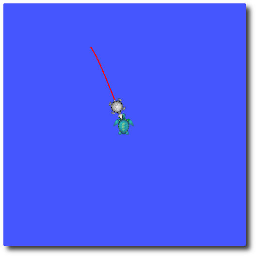
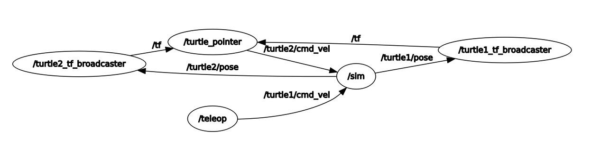

## ROS TF Intro

Вот мы и подобрались ко второй части курса =). Второй она названа по следующей причине - эта тема является также основой работы в ROS, но уже ближе к более продвинотому уровню, так как и без нее можно организовать крутые распределенные системы и организовывать работу узлов. Для нас теперь важно перелезть на более прикладные вещи и разбираться с работой подсистем ROS применительно роботов! Так что велком, начнем!

__TF__ - система в ROS, которая позволяет работать с системами координат и производить преобразования между ними. За основу возьмем [туториал по введению в TF](http://wiki.ros.org/tf/Tutorials/Introduction%20to%20tf).

Для начала запустим наш демонстрационный пример:
```bash
roslaunch turtle_tf turtle_tf_demo.launch
```
Увидим следующий вид (цвет и картинка черепашек может меняться):
  

Нажмите левой кнопкой мыши на терминал, в котором запускали launch-файл, чтобы взять его в фокус и понажимайте кнопки стрелок - все начнет двигаться =).

Давайте взглянем на рабочие узлы и топики утилитами rostopic и rosnode.

> Вывод здесь и в дальнейшем не представлен для мотивации проделать шаги самостоятельно

Давайте подпишемся на топик `/turtle1/cmd_vel` утилитой rostopic, вернем фокус на терминал, в котором запукали черепах и посмотрим на сообщения, которые публикутся в этот топик. Как видно, при нажатии кнопки происходит отправление сообщения типа `geometry_msgs/Twist` с информацией о задании движени черепахи.
Данное сообщение разделено на два блока:
- linear - линейное перемещение, кнопки вперед/назад меняют составляющую x;
- angular - угловой поворот, кнопки влево/вправо создают поворот по оси z.

Данный тип сообщения очень распространен среди модулей, связанных с перемещением, так как он может как передавать задание, так и отображать состояние в плане перемещения объекта. Его стоит запомнить =)

В данной системе первая черепашка жестко связана с заданием с клавиатуры, вторая же, в свою очередь, просто движется за первой с использованием TF. Как она это делает - разберем потом, сейчас попробуйте посмотреть на информацию в топике `/turtle2/cmd_vel` и понять, как она меняется.

Есть еще один важный топик, подпишитесь на `/turtle1/pose` и также поперемещайте черепашек. Здесь мы встречаем сообщение, которое определено специально в пакете `tutrlesim` - `turtlesim/Pose`. Его составляющие:
- x, y - положение черепаки на поле, нулевая точка находится в нижнем левом углу поля;
- theta - угол курса черепашки, 0 направлен на восток (правый край), поворот против часовой стрелки определяет положительный поворот;
- linear_velocity, angular_velocity - линейная и угловая скорости, подвигайте черепашку и увидите, как они меняются.

Данное соощение было определено внутри пакета и не является стандартным, в отличии от `geometry_msgs/Twist`. Аналогично мы можем определить свое сообщение, но часто пользуются именно сообщением `geometry_msgs/Twist`.

Последний штрих - посмотрим на полную схему запущенной системы утилитой rqt_graph. Увидим следующую картину:



На графе мы видим узел `/teleop`, который передает команды первой черепашке, он и читает наши нажатия с клавиатуры и передает в узел `/sim`, который является основным графическим узлом и создает первую черепашку. Также видно, что именно он рассылает сообщения `/turtle*/pose` в узлы `/turtle*_tf_broadcaster`. Эти узлы и узел `/turtle_pointer` мы разберем позже, но забегая вперед, `/turtle_pointer` передает `/turtle2/cmd_vel` топик в `/sim`, чтобы задавать управление второй черепашкой.

## Инструменты TF

Ранее мы с вами провели небольшой анализ готовой системы и поняли, через какие топики передается информация. Перейдем соответственно к TF и инструментам для анализа.

Немного о данной системе: обратите опять же внимание на граф узлов нашей системы, в нем есть топики `/tf`, которые обзначают, что они передают информацию о системах координат. В нашей системе черепашек есть три системы координат:
- Статическая (глобальная), относительно нее все остальные системы считаются
- Две локальные - у каждой черепаки своя система координат

### RQT

Запустим утилиту для простотра связей систем координат:
```bash
rosrun rqt_tf_tree rqt_tf_tree
```


На данном графе видны взаимосвзи систем координат, узлы, которые передают TF информацию и названия систем координат.
- world - глобальная
- turtle1 - локальная система первой черепашки
- turtle2 - локальная система второй черепашки

Такой граф позволяет посмотреть взаимосвязи в системе, при этом не видно информации =(. 

### Rviz

Давайте посмотри на нее визуально:
```bash
rviz
```
В открытом окне в меню Displays->Global Options->Fixed frame укажите world вместо map. Далее внизу меню Displays нажмите Add и выбирете By displa type->rviz->TF.

Теперь в вашем окне видны системы координат, они подписаны и соответствуют положениям черепашек и глобальной системы:


> Для ориентира: RGB -> XYZ, значит красная ось (X), зеленая (Y), синяя (Z).

### TF echo

Еще один инструмент - консольный вывод информации tf_echo из пакета tf:
```bash
rosrun tf tf_echo turtle1 turtle2
```

Первым агрументом передается название системы координат, относительно которой будет считаться проекция, вторым - названией другой, для которой будет считаться проекция. Короче, запускайте и двигайте черепах. Сразу видно, что утилита передает информацию о линейном смещении (Translation) и повороте (Rotation), причем в нескольких форматах!

Можно еще задать частоту вывода (желаемую, конечно, никто не обещает, что он будет успевать):
```bash
rosrun tf tf_echo turtle1 turtle2 10
```

Последний аргумент [Hz], включите и сразу видно, что работает пободрее.

Таким образом с помощью данной утилиты можно получать численную информацию о разнице меж двух систем координат.

## В результате
- Провели небольшой анализ готовой системы
- Познакомились с системой TF относительно черепашек
- Узнали новые инструменты для анализа TF подсистемы
