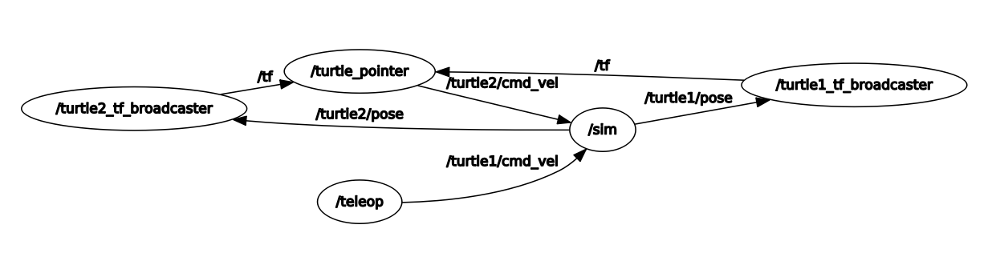
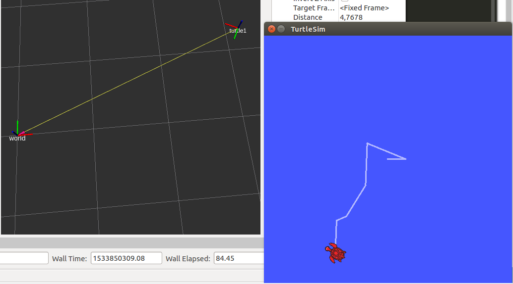
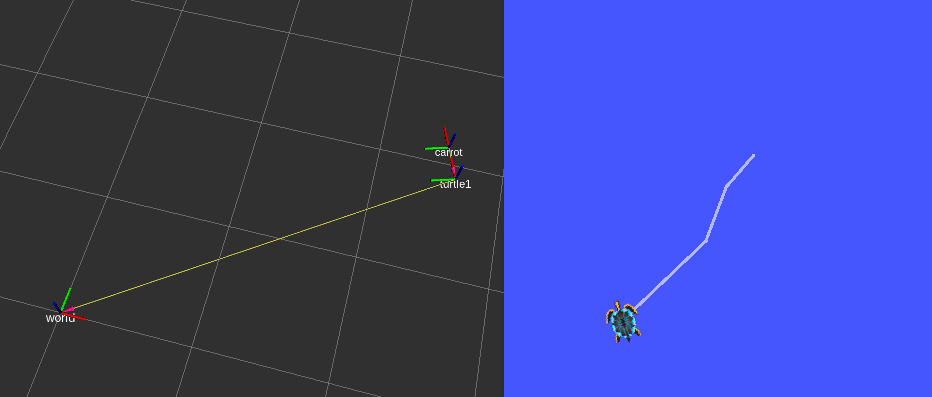

# ROS TF Broadcaster

В прошлом топике мы познакомились с инструментами представления данных TF в понятном нам формате. Все те инструменты позволяют отлаживать систему и наблюдать за работой TF преобразований пакетов. Остается важный вопрос, как же нам создавать свои данные TF и публиковать их в экосистему ROS?

Далее предлагается познакомиться с возможностями публикации данных TF с помощью программных средств (API - из узла) и посредством узла из пакета `tf` - `static_transform_publisher`.

Для поддержания терминологии надо ввести понятия статической и динамической TF трансформации:
- Статическая - не меняется во времени, то есть между двумя системами координат ни смещение, ни угол не меняется;
- Динамическая - меняется во времени, как - дело третье =).

> В данном топике рассмотрим только язык Python, С++ - для возможного дальнейшего дополнения.



Обратимся вновь к этому графу из примера, узел `sim` выступает в качестве главного по организации эмуляции черепашек, он рассылает инфу о положении (публикует) `/turtle*/pose` и получает информацию о командах перемещения (подписывается) `/turtle*/cmd_vel`. Убедиться в этом можно с помощью утилиты `rosnode info /sim`:
```
Node [/sim]
Publications: 
 * /rosout [rosgraph_msgs/Log]
 * /turtle1/color_sensor [turtlesim/Color]
 * /turtle1/pose [turtlesim/Pose]
 * /turtle2/color_sensor [turtlesim/Color]
 * /turtle2/pose [turtlesim/Pose]

Subscriptions: 
 * /turtle1/cmd_vel [geometry_msgs/Twist]
 * /turtle2/cmd_vel [geometry_msgs/Twist]
```

В данном примере узлы `/turtle*_tf_broadcaster` выступают в качестве адаптеров, которые переводят информацию из топиков положения `/turtle*/pose` в систему TF. Это удобно тем, что сама система TF позволит произвести относительные расчеты между системами координат, что топики сделать не позволяют. Таким образом преобразуется информация в систему для гибкой работы с системами координат и позиционированием.

Мы постараемся разобрать внуренний код топика и понять, как пользоваться API для работы с системой TF из узла. А далее постараемся создать программу, когда одна черепашка "как бы" таскает перед собой морковку, а другая бегает за этой морковкой =).

## Подготовка к работе

Для начала необходимо добавить все зависимости к пакету, чтобы он мог пользоваться как API TF, так и сообщением `turtlesim/Pose` из пакета `turtlesim`. Так шаг номер раз - открываем `package.xml` внутри нашего пакета и прописываем внутри тэгов `<build_depend>`, `<build_export_depend>` и `<exec_depend>` зависимости:
- roscpp
- rospy
- tf
- turtlesim
Должен получиться блок зависимостей для пакета наподобии этого:
```xml
  <build_depend>roscpp</build_depend>
  <build_depend>rospy</build_depend>
  <build_depend>tf</build_depend>
  <build_depend>turtlesim</build_depend>
  <build_export_depend>roscpp</build_export_depend>
  <build_export_depend>rospy</build_export_depend>
  <build_export_depend>tf</build_export_depend>
  <build_export_depend>turtlesim</build_export_depend>
  <exec_depend>roscpp</exec_depend>
  <exec_depend>rospy</exec_depend>
  <exec_depend>tf</exec_depend>
  <exec_depend>turtlesim</exec_depend>
```

> Не забывайте, что зависимости прописываются для всего пакета - следовательно, если у вас уже прописан `roscpp` в тэге `<build_depend>`, то прописывать второй раз не имеет смысла.

Шаг номер два - открываем файл `CMakeLists.txt` и пишет в функцию `find_package( catkin REQUIRED COMPONENTS !сюда! )` те же зависимости. Получилось что-то похожее:
```cmake
find_package(catkin REQUIRED COMPONENTS
  roscpp
  rospy
  tf
  turtlesim
)
```

> Если у вас есть еще другие зависимости, которые здесь не указаны, просто добавьте к ним те, которых не хватает. Второй раз писать функцию или удалять старые зависимости не надо =)

На этом все! Для C++ еще надо будет проделать те же шаги с компиляцией, что мы делали раньше при сборке C++ узла [T8]. При этом прописав зависимости в `find_package()`, думать о добавлении их еще куда либо - не требуется!

## Python узел с публикацей информации TF

Код мы, естественно, позаимствуем из туториала, при этом проведем небольшие модификации. С одной стороны, вот [туториал по узлу на Python](http://wiki.ros.org/tf/Tutorials/Writing%20a%20tf%20broadcaster%20%28Python%29). С другой стороны, так как мы ранее уже запускали узел с публикатором `/turtle*_tf_broabcaster`, то можем посмотреть его код. Для начала посмотрим на содержание launch-файла, который мы стартовали и в этом поможет утилита `roscat` (она просто отображает содержимое файла в консоли).

```bash
roscat turtle_tf turtle_tf_demo.launch
```

Видим вывод:
```xml
<launch>

  <!-- Turtlesim Node-->
  <node pkg="turtlesim" type="turtlesim_node" name="sim"/>

  <node pkg="turtlesim" type="turtle_teleop_key" name="teleop" output="screen"/>
  <!-- Axes -->
  <param name="scale_linear" value="2" type="double"/>
  <param name="scale_angular" value="2" type="double"/>

  <node name="turtle1_tf_broadcaster" pkg="turtle_tf" type="turtle_tf_broadcaster.py" respawn="false" output="screen" >
    <param name="turtle" type="string" value="turtle1" />
  </node>
  <node name="turtle2_tf_broadcaster" pkg="turtle_tf" type="turtle_tf_broadcaster.py" respawn="false" output="screen" >
    <param name="turtle" type="string" value="turtle2" />
  </node>
  <node name="turtle_pointer" pkg="turtle_tf" type="turtle_tf_listener.py" respawn="false" output="screen" >
  </node>

</launch>
```

Разберем его немного =)
- Узел `sim` на самом деле является узлом в пакете с названием `turtlesim_node`.
- Узел `teleop`, который публикует информацию для управления черепашкой через топик `/turtle1/cmd_vel`, называется в пакете `turtle_teleop_key`.
- Локальные параметры `scale_angular` и `scale_linear` что-то делают, (по секрету - они масштабируют задаваемые с клавиатуры команды, со `scale_linear` = 10000 один раз нажмите вперед и черепаха мигом улетит в край поля =) ).
- Два `turtle*_tf_broadcaster`, которые как раз таки переводят инфу из топиков в систему TF. Как видите, узел по факту в пакете один - `turtle_tf_broadcaster.py`, у него просто есть приватный параметр `turtle`, который меняет название топика и TF СК.
- Узел `turtle_pointer`, который (скажу по секрету) управляет второй черепашкой на основе данных TF о первой черепашке относительно СК (системы координат) `/world`.

Наша задача сейчас разобраться в коде broadcast узлов. Так как мы узнали настоящее имя узла в пакете - можем подглядеть его код =)

```bash
roscat turtle_tf turtle_tf_broadcaster.py
```

И примерно такое мы увидим:
```python
#!/usr/bin/env python
# Здесь была лицензия =)

import rospy
import tf
import turtlesim.msg

def handle_turtle_pose(msg, turtlename):
    br = tf.TransformBroadcaster()
    br.sendTransform((msg.x, msg.y, 0),
                     tf.transformations.quaternion_from_euler(0, 0, msg.theta),
                     rospy.Time.now(),
                     turtlename,
                     "world")

if __name__ == '__main__':
    rospy.init_node('tf_turtle')
    turtlename = rospy.get_param('~turtle')
    rospy.Subscriber('/%s/pose' % turtlename,
                     turtlesim.msg.Pose,
                     handle_turtle_pose,
                     turtlename)
    rospy.spin()
```

Разбираемся в нем, сначала импортируем модули - основной модуль, модуль TF и модуль содержащий типы сообщений из пакета `turtlesim`:
```python
import rospy
import tf
import turtlesim.msg
```

Далее пишем обработчик сообщений из топика положения черепашки. Вызываться обработчик будет каждый раз, как приходит сообщение в топик:
```python
def handle_turtle_pose(msg, turtlename):
    # сначала получаем объект публикатора информации TF
    br = tf.TransformBroadcaster()
    # публикуем информацию TF о преобразовании между системами координат
    br.sendTransform((msg.x, msg.y, 0),
                     tf.transformations.quaternion_from_euler(0, 0, msg.theta),
                     rospy.Time.now(),
                     turtlename,
                     "world")
```

Здесь поподробнее: сама функция `sendTransform()` принимает на вход 5 аргументов:
- линейное смещение между двумя СК [в виде вектора (tuple тип в Python)],
- угловое смещение между двумя СК [кватернион в виде вектора (tuple тип в Python)],
- время публикации,
- название СК, которая будет иметь данное смещение,
- название СК, относительно которой будет смещаться первая СК.

Так вот, первый аргумент мы формирует из данных пришедшего сообщения, полагая, что смещения по высоте нет (z = 0):
```python
(msg.x, msg.y, 0)
```

Второй аргумент формируем используя функцию `tf.transformations.quaternion_from_euler()`. На вход она принимает три аргумента - углы эйлера (в радианах). Вот [ссылка](http://docs.ros.org/kinetic/api/tf/html/python/transformations.html#tf.transformations.quaternion_from_euler), если что. На выходе формирует вектор (кватернион), который мы просто передаем как второй аргумент функции `sendTransform()`:
```python
tf.transformations.quaternion_from_euler(0, 0, msg.theta)
```

Третий аргумент - функция получения нынешнего времения в формате ROS, просто получили и передали как третий аргумент:
```python
rospy.Time.now()
```

Четвертый `turtlename` - передается через агрумент обработчика, содержит название СК черепашки.
Пятый - имя СК, относительно которой будет публиковаться смещение СК черепашки в системе TF.

Осталась последняя часть узла, которая к TF никак не относится и просто регистрирует узел и подписывается на топик:
```python
if __name__ == '__main__':
    rospy.init_node('tf_turtle')
    turtlename = rospy.get_param('~turtle')
    rospy.Subscriber('/%s/pose' % turtlename,
                     turtlesim.msg.Pose,
                     handle_turtle_pose,
                     turtlename)
    rospy.spin()
```
В этой части видно, что переменная `turtlename` заполняется значением приватного параметра `~turtle`, который кстати в launch-файле (выше) устанавливается строкой:
```xml
<param name="turtle" type="string" value="turtle1" />
```

> Пытливый читатель заметит, что ранее в функциях обработчика топика не было второго аргумента, как и в конструкторе `rospy.Subscriber()` было всего три аргумента. Четветрый передается напрямую в обработчик. Здесь таким образом получается из параметра имя СК для черепашки и передается прямо в обработчик.

А теперь прелагаю взгляуть на другой код, который и будет исходником для нашего преобразователя топика с типом `turtlesim/Pose` в систему координат системы TF:
```python
#!/usr/bin/env python
import rospy
import tf
from tf.transformations import quaternion_from_euler
from turtlesim.msg import Pose

# Register node / fake node name - we will rename =)
rospy.init_node('tf_turtle')
# Get private parameter / make it global variable
turtlename = rospy.get_param('~turtle_tf_name')
# Callback function
def handle_turtle_pose(msg):
    # Get broadcaster object
    br = tf.TransformBroadcaster()
    # Broadcast TF trasform (world -> turtlename)
    br.sendTransform((msg.x, msg.y, 0),
                     quaternion_from_euler(0, 0, msg.theta),
                     rospy.Time.now(),
                     turtlename,
                     "world")

# Subscribe to /input_pose topic - just gonna remap it to work with
rospy.Subscriber('input_pose',
                 Pose,
                 handle_turtle_pose)
# You spin my head right round, right round - Florida =)
# Just handle all topic messages until node (or ROS) is working
rospy.spin()
```

Код предыдущий и данный очень похожи, за исключением пары исправлений:
- Добавлен импорт `from tf.transformations import quaternion_from_euler`, который исключает необходимость прописывания `tf.transformations.quaternion_from_euler()`.
- Из обработчика и из `rospy.Subscriber()` убраны последние аргументы, так как мы только читаем переменную `turtlename` - можем сделать ее глобальной.
- Топик для подписки теперь не `'/%s/pose' % turtlename` (тут в строку подставляется значение переменной `turtlename`), а просто `/input_pose`. При запуске узла воспользуемся мапированием топика.
- В остальном, функционал тот же самый, что и в базовом коде.

##### > Задача - создайте в своем пакете (study_pkg) Python скрипт `turtle_tf_broadcaster.py`. Не забудьте назначить права на исполнения файла утилитой `chmod` [T6].

##### > Задача - напишите lauch-файл запуска системы симуляции черепашек для проверки работы написанного узла. В нем необходимо:
- Запустить `turtlesim_node` из пакета `turtlesim` для запуска симулятора. Переименовать в `simulator`.
- Запустить `turtle_teleop_key` из пакета `turtlesim` для управления первой черепашкой. Переименовать в `keyboard`.
- Запустить `turtle_tf_broadcaster.py` из нашего пакета и не забудьте смапировать топик из `input_pose` в `turtle1/pose`. Также не забудьте приватному параметру `turtle_tf_name` присвоить значение `turtle1`. Переименовать в `turtle1_tf_broadcaster`.

##### > Запустите и проверьте launch-файл. Проверку рекомендуется производить с помощью утилиты `rviz`. Если все сделано правильно - вы увидите следующую картину:

На ней видно, что информация о положении черепашки успешно переводится в систему TF, так как мы видим СК `world` и СК `turtle1`.

Узел работает! Это означает, что теперь мы можем публиковать данные TF динамического преоразования из узлов и пользоваться всеми прелестями данной системы (TF), о которых в полной мере узнаете позже =)
В узле публикуется динамическое преобразование, так как СК `world` не меняет положения, а СК `turtle1` - меняет, значит и преоразование меду ними меняет свое значение.

## Статическое преобразование TF из утилиты

Давайте сделаем такую систему, будто перед носом первой черепашки всегда висит морковка? То есть, между `turtle` и `carrot` всегда будет постоянное линейное и угловое смещения. Это означает, что между `turtle1` и `carrot` будет статическое преобразование TF. Пускай от носа морковка будет отстоять на 0.1 м.


Для выполненния этой непосильной ноши воспользуется узлом из пакета `tf` - `static_transform_publisher`.
Вызов с агрументами выглядит следующим образом:
```bash
rosrun tf static_transform_publisher <x> <y> <z> <yaw> <pitch> <roll> <frame_id> <child_frame_id> <period_ms>
```

Разберем по полочкам:
- `<x> <y> <z>` - указание линейного смещения от `<frame_id>` к `<child_frame_id>`,
- `<yaw> <pitch> <roll>` - углы Эйлера для задания углового смещения `<frame_id>` относительно `<child_frame_id>`,
- `<frame_id>` - имя исходной СК
- `<child_frame_id>` - имя результирующей СК
- `<period_ms>` - период публикации преобразования

Все рассмотренное является аргументами запуска узла. Для запуска в launch-файле будет сформирована следующая строка:
```xml
<node pkg="tf" type="static_transform_publisher" name="car_2_camera_tf" args="0 0.8 0.2 0 0 0 car_frame camera_frame 100" />
```

Данная строка запускает статическое TF преобразование от СК `car_frame` к СК `camera_frame` с линейным смещением по оси Y = 0.8 м и по оси Z = 0.2 м.

##### > Добавьте в launch-файл строку запуска статичекого TF преобразвания от `turtle1` к `carrot` со смещением по оси X = 0.3 м.

Также можно упростить запуск `rviz`, включив его в launch-файл:
```xml
<node pkg="rviz" type="rviz" name="rviz" />
```
> В результате добавления статического преобразования в окне `rviz` можно видеть еще одну СК, которая при движении всегда находится перед черепашкой (к сожалению симулятор морковку не показывает )= ):


##### > Большая задачка - напишите узел, который помимо публикации информации из топика положения черепашки в систему TF тажке публикует информацию о преобразовании морковки относительно СК черепашки. Морковка должна вращаться вокруг черепашки (частоту и амплитуду вращения задайте сами). Для выполнения рекомендуется воспользоваться тригонометрическими функицями `sin()` и `cos()`. В результате, в rviz черепашка при перемещении должна "как бы" иметь спутник в виде морковки =). Остальные подробности уточняются.

## В результате

- Научились из Python узла публиковать информацию о динамическом TF преобразовании.
- Испытали работу узла статического преобразования TF из пакета tf.
