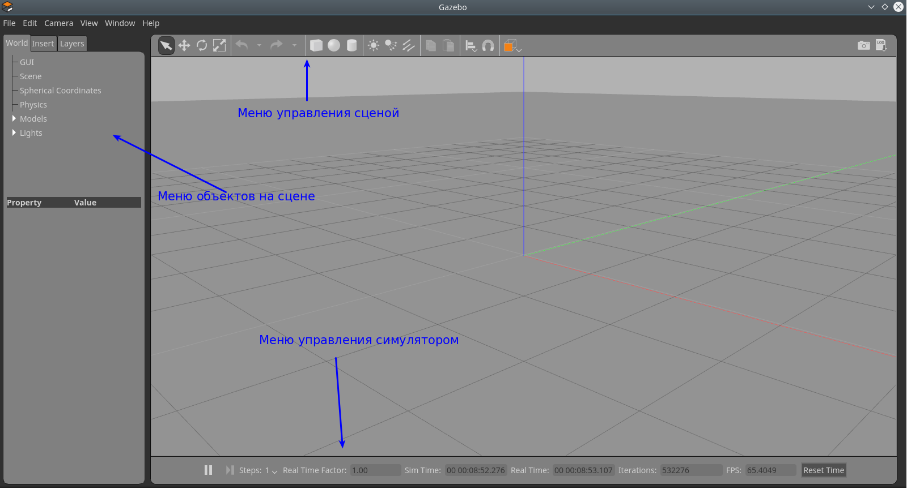
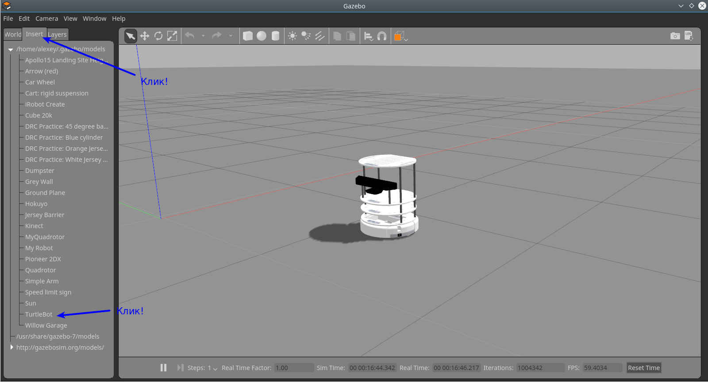
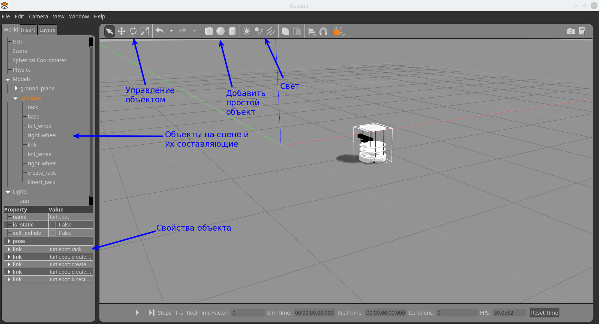
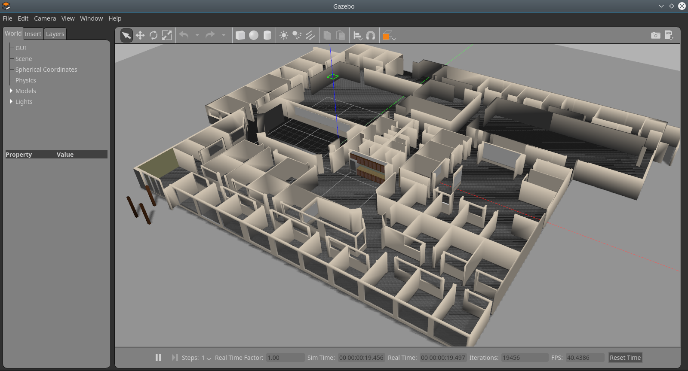
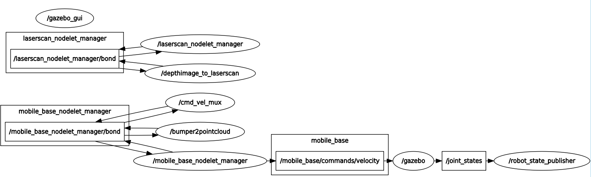
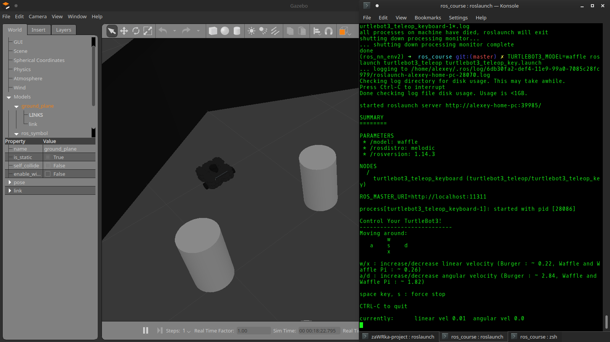
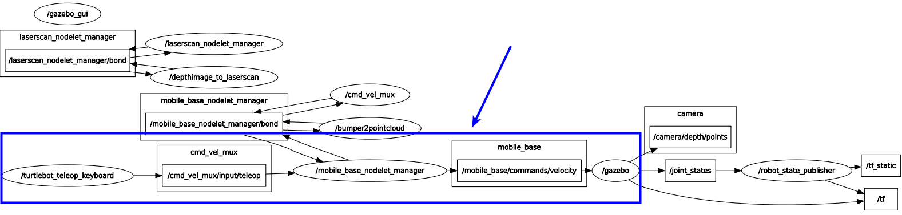

# Gazebo 101

И вот мы снова беремся за что-то интересное и увлекательное! Начиная с этого топика, не будет практических задач, из-за объема темы вы сами можете экспериментировать в свое удовольствие! Думаю, пора погружаться в этот удивительный вирутальный мир роботов =)

## Hello Gazebo!

Начнем с первого знакомства:
```bash
roslaunch gazebo_ros empty_world.launch
```

Всем привет меня зовут Gazebo =)
<p align="center">

</p>

Штука этот Gazebo достаточно интересная, давайте попробуем добавить TurtleBot на сцену:
<p align="center">

</p>

Он предстал перед нами в белой окраске!

> Управление камерой осуществляется трея кнопками мыши, со временем привыкните =)

> Чтобы передвигать, поворачивать или еще чего делать с объектами - не забывайте про меню управления сценой!

Во время работы с объектами есть пара интересных моментов:
<p align="center">

</p>

По основам работы это все, взглянем немного на внутренности launch-файла, чтобы понимать, что же мы запустили:
```bash
EDITOR=subl rosed gazebo_ros empty_world.launch
```
> Команда `rosed` откроет файл пакета ROS в редакторе, который задан через переменную `EDITOR`. Вы можете определить редактор по-умолчанию в файле `.bashrc` -> `export EDITOR=subl`, чтобы не прописывать перед командой каждый раз

```xml
<launch>

  <!-- these are the arguments you can pass this launch file, for example paused:=true -->
  <arg name="paused" default="false"/>
  <arg name="use_sim_time" default="true"/>
  <arg name="extra_gazebo_args" default=""/>
  <arg name="gui" default="true"/>
  <arg name="recording" default="false"/>
  <!-- Note that 'headless' is currently non-functional.  See gazebo_ros_pkgs issue #491 (-r arg does not disable
       rendering, but instead enables recording). The arg definition has been left here to prevent breaking downstream
       launch files, but it does nothing. -->
  <arg name="headless" default="false"/>
  <arg name="debug" default="false"/>
  <arg name="physics" default="ode"/>
  <arg name="verbose" default="false"/>
  <arg name="world_name" default="worlds/empty.world"/> <!-- Note: the world_name is with respect to GAZEBO_RESOURCE_PATH environmental variable -->
  <arg name="respawn_gazebo" default="false"/>
  <arg name="use_clock_frequency" default="false"/>
  <arg name="pub_clock_frequency" default="100"/>

  <!-- set use_sim_time flag -->
  <param name="/use_sim_time" value="$(arg use_sim_time)"/>

  <!-- set command arguments -->
  <arg unless="$(arg paused)" name="command_arg1" value=""/>
  <arg     if="$(arg paused)" name="command_arg1" value="-u"/>
  <arg unless="$(arg recording)" name="command_arg2" value=""/>
  <arg     if="$(arg recording)" name="command_arg2" value="-r"/>
  <arg unless="$(arg verbose)" name="command_arg3" value=""/>
  <arg     if="$(arg verbose)" name="command_arg3" value="--verbose"/>
  <arg unless="$(arg debug)" name="script_type" value="gzserver"/>
  <arg     if="$(arg debug)" name="script_type" value="debug"/>

  <!-- start gazebo server-->
  <group if="$(arg use_clock_frequency)">
    <param name="gazebo/pub_clock_frequency" value="$(arg pub_clock_frequency)" />
  </group>
  <node name="gazebo" pkg="gazebo_ros" type="$(arg script_type)" respawn="$(arg respawn_gazebo)" output="screen"
        args="$(arg command_arg1) $(arg command_arg2) $(arg command_arg3) -e $(arg physics) $(arg extra_gazebo_args) $(arg world_name)" />

  <!-- start gazebo client -->
  <group if="$(arg gui)">
    <node name="gazebo_gui" pkg="gazebo_ros" type="gzclient" respawn="false" output="screen" args="$(arg command_arg3)"/>
  </group>

</launch>
```
Много всякого, большое количество занимают аргументы launch-файла, комменты нам подсказывают, что в жанном файле запускается `gzserver`, что является вычислительным сервером, и `gzclient`, что является графическим представлением вычислений сервера. Запуск производится с картой `worlds/empty.world`, что является обычным полем без объектов.

> Не забывайте, чтобы отключить узел или launch-файл в терминале - есть команда `Ctrl+C`

Для оценки масштабов запустим другой launch-файл и посмотрим на интересную сцену:
```bash
roslaunch gazebo_ros willowgarage_world.launch

```

<p align="center">

</p>

Еще можно посмотреть на список рабочих топиков, узлов и сервисов, чтобы понять, что привносит сам Gazebo в систему:
```
Topics:

/clock
/gazebo/link_states
/gazebo/model_states
/gazebo/parameter_descriptions
/gazebo/parameter_updates
/gazebo/set_link_state
/gazebo/set_model_state
/gazebo_gui/parameter_descriptions
/gazebo_gui/parameter_updates
/rosout
/rosout_agg

Nodes:

/gazebo
/gazebo_gui
/rosout

Services:

/gazebo/apply_body_wrench
/gazebo/apply_joint_effort
/gazebo/clear_body_wrenches
/gazebo/clear_joint_forces
/gazebo/delete_light
/gazebo/delete_model
/gazebo/get_joint_properties
/gazebo/get_light_properties
/gazebo/get_link_properties
/gazebo/get_link_state
/gazebo/get_loggers
/gazebo/get_model_properties
/gazebo/get_model_state
/gazebo/get_physics_properties
/gazebo/get_world_properties
/gazebo/pause_physics
/gazebo/reset_simulation
/gazebo/reset_world
/gazebo/set_joint_properties
/gazebo/set_light_properties
/gazebo/set_link_properties
/gazebo/set_link_state
/gazebo/set_logger_level
/gazebo/set_model_configuration
/gazebo/set_model_state
/gazebo/set_parameters
/gazebo/set_physics_properties
/gazebo/spawn_sdf_model
/gazebo/spawn_urdf_model
/gazebo/unpause_physics
/gazebo_gui/get_loggers
/gazebo_gui/set_logger_level
/gazebo_gui/set_parameters
/rosout/get_loggers
/rosout/set_logger_level
```

Как видно, для работы gazebo появляется большое количество сервисов, через которые он сам работает, при этом в системе еще нет ни намека на рабочую систему для роботов или управления, все только связанное с самим Gazebo и его внутренней работой.

## Turtlebot sample

С одной стороны на этом простая работа с Gazebo заканчивается, так как наши роботы не имеют мозгов и не могут управляться, так что давайте посмотрим на пример запуска TurtleBot со всеми необходимыми мозгами пакетами для управления:
```bash
roslaunch turtlebot_gazebo turtlebot_world.launch
```

У нас запускается графическое представление и некоторое количество узлов для работы:
<p align="center">

</p>

Обратим внимание на узлы в системе:
```
/bumper2pointcloud
/cmd_vel_mux
/depthimage_to_laserscan
/gazebo
/gazebo_gui
/laserscan_nodelet_manager
/mobile_base_nodelet_manager
/robot_state_publisher
/rosout
```
Или в графике:
<p align="center">

</p>

И топики:
```
/camera/depth/camera_info
/camera/depth/image_raw
/camera/depth/points
/camera/parameter_descriptions
/camera/parameter_updates
/camera/rgb/camera_info
/camera/rgb/image_raw
/camera/rgb/image_raw/compressed
/camera/rgb/image_raw/compressed/parameter_descriptions
/camera/rgb/image_raw/compressed/parameter_updates
/camera/rgb/image_raw/compressedDepth
/camera/rgb/image_raw/compressedDepth/parameter_descriptions
/camera/rgb/image_raw/compressedDepth/parameter_updates
/camera/rgb/image_raw/theora
/camera/rgb/image_raw/theora/parameter_descriptions
/camera/rgb/image_raw/theora/parameter_updates
/clock
/cmd_vel_mux/active
/cmd_vel_mux/input/navi
/cmd_vel_mux/input/safety_controller
/cmd_vel_mux/input/switch
/cmd_vel_mux/input/teleop
/cmd_vel_mux/parameter_descriptions
/cmd_vel_mux/parameter_updates
/depthimage_to_laserscan/parameter_descriptions
/depthimage_to_laserscan/parameter_updates
/gazebo/link_states
/gazebo/model_states
/gazebo/parameter_descriptions
/gazebo/parameter_updates
/gazebo/set_link_state
/gazebo/set_model_state
/gazebo_gui/parameter_descriptions
/gazebo_gui/parameter_updates
/joint_states
/laserscan_nodelet_manager/bond
/mobile_base/commands/motor_power
/mobile_base/commands/reset_odometry
/mobile_base/commands/velocity
/mobile_base/events/bumper
/mobile_base/events/cliff
/mobile_base/sensors/bumper_pointcloud
/mobile_base/sensors/core
/mobile_base/sensors/imu_data
/mobile_base_nodelet_manager/bond
/odom
/rosout
/rosout_agg
/scan
/tf
/tf_static
```

> В данной системе вместо простых ущлов (Nodes) используются Nodelets - это схожий механизм, но имеет более специфичный интерфейс, разбираться с ним пока не будем, но он имеет свои преимущества =)
 
Проведем небольшой анализ:
- Судя по топикам у нас есть Kinect (`/camera/depth` + `/camera/rgb`), система управления роботом (`/mobile_base`) и система одометрии (`/odom`)
- Есть узел `/depthimage_to_laserscan`, значит данные кинекта переводятся в эмулятор лидара и получается топик `/scan`

Пока этого достаточно, чтобы понять, что у нас есть робот в симуляторе, у него есть датчикик и им можно управлять, но вот системы управления еще пока нету. Это также видно и по тому, что узлы по работе с Kinect и эмуляции лидара ни к чему не привязаны, а вот топики в `/mobile_base/*` связывают управляющие команды (`/cmd_vel_mux`) и Gazebo (`/gazebo`), чтобы мы задавали управление, а робот черех эту цепочку двигался внутри симулятора =)


Давайте теперь запустим управления с клавиатуры и проанализируем систему (не закрываем симулятор!):
```bash
roslaunch turtlebot_teleop keyboard_teleop.launch
```
<p align="center">

</p>

Как видно, запущенный launch-файл позволяет управлять роботм с помощью клавиш `j`, `i` и др. **Время гонять!**

Когда вам надоест кататься и врезаться в препятствия, посмотрим на граф узлов, особенно на выделенный участок:
<p align="center">

</p>

Что можно отметить, так это новый узел `/turtlebot_teleop_keyboard`, он свзяать через топик `/cmd_vel_mux/input/teleop` с узлом `/mobile_base_nodelet_manager` (который у нас отвечает за робота и его движение). Этот нодлет `/mobile_base_nodelet_manager` посылает сообщения о необходимом движении и перемещении в `/gazebo` через `/mobile_base/commands/velocity`.

> Капнем глубже и узнаем, что `/mobile_base/commands/velocity` имеет тип сообщения `geometry_msgs/Twist`, который нам уже знаком =)

Цепочка получается не очень длинная, по факту мы видим, как связано управление роботом и его результирующее движение в симуляторе. Для начала думаю достаточно, в дальнейшем попробуем увязать уже данные с кинекта и подключить пакет `move_base`, который нам откроет огромные возможности в планировании! 
