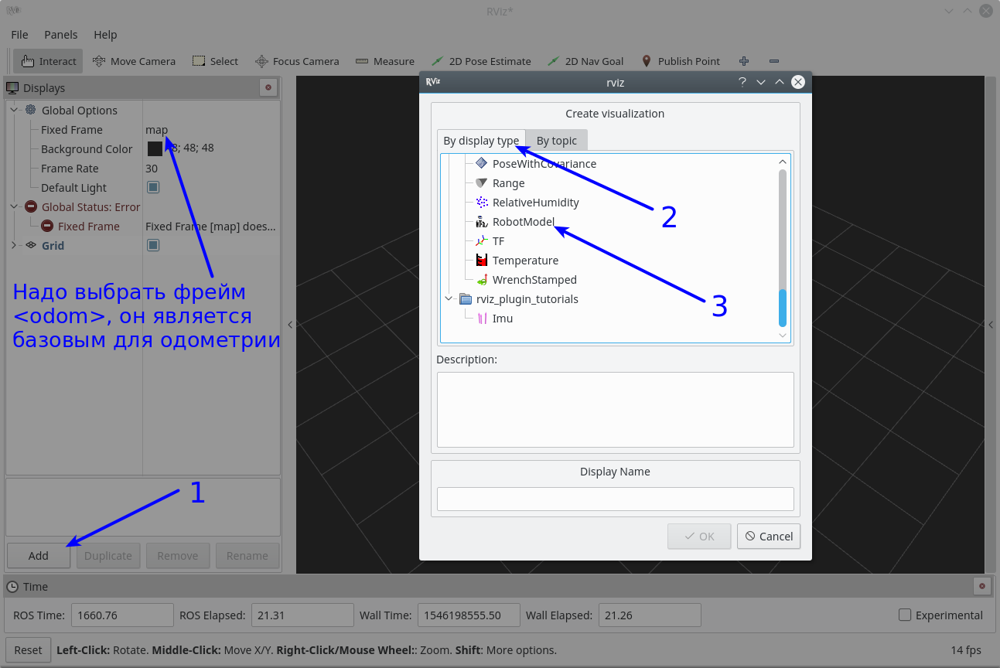
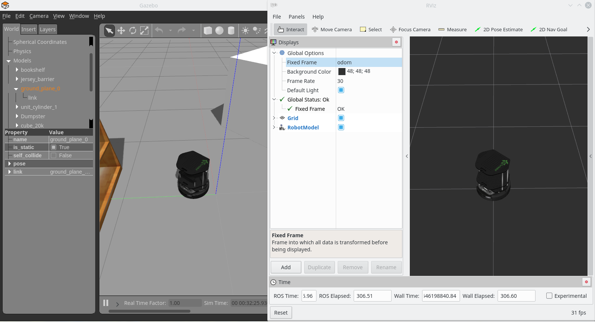
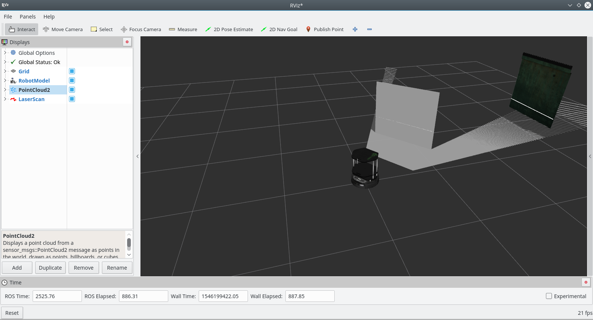
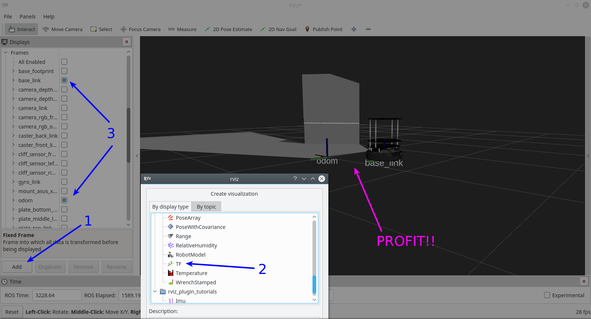
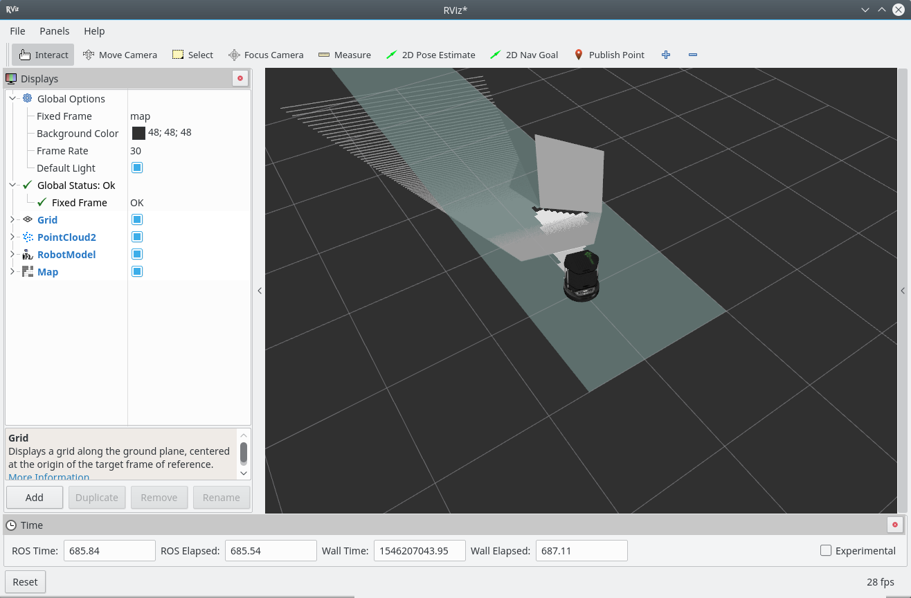

# Gazebo Turtlebot Movebase

Ранее мы уже запускали симулятор `Gazebo` с роботом `Turtlebot` и его средой (пара простых объектов), запустим его снова:
```bash
roslaunch turtlebot_gazebo turtlebot_world.launch
```
<p align="center">

</p>

Начнем веселиться с представлением информации, до этого мы смотрели конкретно в Gazebo, но в симуляторе не видно, что видит робот. Появилась проблема - мы не видим того, что видит робот, понимает или интерпретирует. Аналогичная проблема не только с симулятором связана, в реальном роботе мы также просто так не можем видеть, что робот видит. Есть выход - `rviz`! Запускаем!
```bash
rviz
```
или
```bash
rosrun rviz rviz
```

И вот, что мы видим по запуску:
<p align="center">

</p>

Таким образом, у нас запущены:  
- симулятор с запущенным роботом и средой  
- представление робота для симулятора (мы видим модельку, а экосистема ROS знает о его колесах и др. частях)  
- связи для управления роботом в симуляторе (запускали телеуправление раньше) 

Давайте начнем узнавать, что же доступно экосистеме ROS из симулятора (а значит и нам, так как экосистема ROS открыта для нас). Для начала попробуем увидеть, каким видим ROS робота:
<p align="center">

</p>

А теперь сравним с Gazebo:
<p align="center">

</p>

Воу, да один в один! На самом деле спасибо разработчикам данной симуляции робота, они предоставлили возможность увидеть робота в rviz публикацией вида робота через параметр `/robot_description`. Тем не менее для нас это первый шаг для визуализации информации из экосистемы ROS!

Пойдем дальше, попробуйте визуализировать информацию из топиков (с помощью вкладки в rviz `By topic`) `/camera/depth/points` и `/scan`. У меня получилось вот так:
<p align="center">

</p>

> Если поиграться с виуализацией топиков в меню слева можно увидеть, что `LaserScan` представляется информацией плоской (белая линия), а `PointCloud2` представлен трехмерной информацией. Эти все данные получены с Kinect на роботе.

Не слабо, не так ли? =) Таким образом, сейчас наш робот не имеет особо мозгов, не управляется, но уже может видеть мир (для САУшников - нет обратной связи ни в виде контроллера, ни в виде человека). Вот так мы визуализировали информацию о представлении робота о мире вокруг него! Гоу гонять и смотреть в rviz? =)
```bash
roslaunch turtlebot_teleop keyboard_teleop.launch
```

Тут еще и систему TF можно визуализировать!
<p align="center">

</p>


> Для особо пытливых - попробуйте поменять `Fixed frame` в настройках rviz с `odom` (глобальная СК для одометрии) на `base_link` (локальная СК робота). Вы можете увидеть, что робот встал на месте, а окружение меняется вокруг него. Настройка `Fixed frame` устанавливает СК, которая будет считаться глобальной.

# gmapping

Итак, детские забавы закончились, пора чудить по-крупному. Вы знали, что есть специальный пакет, который с помощью целого набора разных узлов, плагинов и других вещей может заставить робота двигаться к цели? А также есть пакет, который позволяет стоить карту местности, чтобы учитывать ее для построения пути? Есть у меня парочка для вас...

Начнем с ходьбы и ориентации. К сожалению, настройка представленных демо пакетов может привести к ряду проблем, причиной им - попытка универсиализировать пакеты чтобы все работало по щелчку. На данный момент у нас есть робот, на нем датчики, которые мы уже визуализировали, попробуем запустить систему построения карты. Создайте launch-файл в своем пакете `study_pkg` (или как вы его назвали) со следующим содержимым:
```xml
<?xml version="1.0"?>
<!-- roscat turtlebot_navigation kinect_gmapping.launch.xml -->
<launch>
  <arg name="scan_topic"  default="scan" />
  <arg name="base_frame"  default="base_footprint"/>
  <arg name="odom_frame"  default="odom"/>

  <node pkg="gmapping" type="slam_gmapping" name="slam_gmapping" output="screen">
    <param name="base_frame" value="$(arg base_frame)"/>
    <param name="odom_frame" value="$(arg odom_frame)"/>
    <param name="map_update_interval" value="5.0"/>
    <param name="maxUrange" value="6.0"/>
    <param name="maxRange" value="8.0"/>
    <param name="sigma" value="0.05"/>
    <param name="kernelSize" value="1"/>
    <param name="lstep" value="0.05"/>
    <param name="astep" value="0.05"/>
    <param name="iterations" value="5"/>
    <param name="lsigma" value="0.075"/>
    <param name="ogain" value="3.0"/>
    <param name="lskip" value="0"/>
    <param name="minimumScore" value="200"/>
    <param name="srr" value="0.01"/>
    <param name="srt" value="0.02"/>
    <param name="str" value="0.01"/>
    <param name="stt" value="0.02"/>
    <param name="linearUpdate" value="0.5"/>
    <param name="angularUpdate" value="0.436"/>
    <param name="temporalUpdate" value="-1.0"/>
    <param name="resampleThreshold" value="0.5"/>
    <param name="particles" value="80"/>

    <param name="xmin" value="-1.0"/>
    <param name="ymin" value="-1.0"/>
    <param name="xmax" value="1.0"/>
    <param name="ymax" value="1.0"/>

    <param name="delta" value="0.05"/>
    <param name="llsamplerange" value="0.01"/>
    <param name="llsamplestep" value="0.01"/>
    <param name="lasamplerange" value="0.005"/>
    <param name="lasamplestep" value="0.005"/>
    <remap from="scan" to="$(arg scan_topic)"/>
  </node>
</launch>
```
> Я назвал файл `gmapping.launch`, вы можете его назвать по-другому =)

> По факту вы можете увидеть, что на самом деле ничего страшного в файле нет, запускается обычный узел `slam_gmapping` из пакета [`gmapping`](http://wiki.ros.org/gmapping). Единственное, что напрягает - количество параметров, но так как мы только пробуем все новое то оставим их так, как они были заданы в примере =)

Теперь запустим систему с нуля! У вас должны быть запущены симулятор с роботом
```bash
roslaunch turtlebot_gazebo turtlebot_world.launch
```

визуализатор топиков
```bash
rviz
```

и система управления с клавиатуры
```bash
roslaunch turtlebot_teleop keyboard_teleop.launch
```

А также запускаем узел построения карты, launch-файл для которого мы только что создали
```bash
roslaunch study_pkg gmapping.launch
```

Дальше немного настройки:  
- После запуска gmapping узла у нас появляется TF под названием `map`. Теперь она будет глобальной (`Fixed frame`), когда в нашей системе появилось понятие карты (а оно появилось - см. дальше).  
- Для наглядности отображаем топики: `/camera/depth/points`, `/map` и представление робота (`Add->By display type->RobotModel`).

Отметимся, у меня получился такой вид:
<p align="center">

</p>

Открываем окно с запущенным управлением с клавиатуры и гоооу, катайтесь на здоровье =)
Кто как накатал, а у меня получилась вот такая штука:


Позравляю, вы построили карту местности! Только не закрывайте все сразу, давайте ивлечем пользу из того, что вы сделали!

# Бэкапы, джони!

Любая карта представляет собой информацию о местности, на данный момент построенная карта является важной вещью, так как, полагаю, нет желания постоянно перестраивать эту карту, хоть это и симулятор, который можно перезапускать вечно. Представьте что вы нахожитесь в условиях, где можно лишь пару раз проехать и получить инфу о местности.

Меньше разговоров, пакет [`map_server`](http://wiki.ros.org/map_server) - вот, что на нужно!
Заходим в папку, где хотим сохранить карту, и сохраняем ее:
```bash
rosrun map_server map_saver
```
по-умолчанию будет создано два файла `map.pgm` и `map.yaml`, также можно задать имена файлам:
```bash
rosrun map_server map_saver -f my_super_map
```
тогда заделаются файлы `my_super_map.pgm` и `my_super_map.yaml`.

> Я сохранил в пакет `study_pkg` в папку `maps`. Для вас выбор свободен =)

Файл `map.pgm` можно открыть просмотром картинки:
<p align="center">

</p>
Файл `map.yaml` содержит инфу о карте:
```yaml
image: map.pgm
resolution: 0.050000
origin: [-12.200000, -15.400000, 0.000000]
negate: 0
occupied_thresh: 0.65
free_thresh: 0.196
```

> Для вас моя сохраненная карта лежит в папке `data/T1_05` репозитория =)

Как пользоваться картой - рассмотрим потом, на моменте локализации, пока мы только научились ее строить =)

# Еще бэкапы, не настраивать же по новой rviz +)

Теперь по поводу rviz, вот вы настроили представление топиков, а потом закрыли или он упал (печально), настраивать надо все по новой. С одной стороны, если нажать `Ctrl+S` или `Save Config` в меню `File`, то можно сохранить настройку по-умолчанию. Это будет запускать вашу настройку при каждом запуске, но мы ведь хотим сохранить настройку для конкретного случая - сохраним в отдельный файл и воспользуемся, когда работаем конкретно с turtlebot!

Жмем `Ctrl+Shift+S` и сохраняем файл под названием `turtlebot.rviz` в пакет `study_pkg` в папку `rviz` - теперь у нас есть настройка под конкретный случай!

> Аналогично сохранил представление в `data/T1_05` репозитория.

# Возвращаемся с новыми силами!

Помните, мы запускали последний раз аж 4 разных терминила с симулятором, rviz и т.д.? Давайте сделаем все как надо, а то дальше - хуже =)

Создадим в `study_pkg` в соответствующей папке launch-файл `start_turtlebot_sim.launch`:
```xml
<?xml version="1.0"?>
<launch>
  <!-- Start turtlebot Gazebo simulation -->
  <include file="$(find turtlebot_gazebo)/launch/turtlebot_world.launch"/>

  <!-- Start Rviz with required views -->
  <node name="rviz" pkg="rviz" type="rviz" args="-d $(find study_pkg)/rviz/turtlebot.rviz" />

  <!-- Start gmapping node -->
  <include file="$(find study_pkg)/launch/gmapping.launch"/>
</launch>
```

Запускается он, соответственно, командой
```bash
roslaunch study_pkg start_turtlebot_sim.launch
```
Управление клавиатурой же
```bash
roslaunch turtlebot_teleop keyboard_teleop.launch
```

> Мы специально не добавили сюда запуск управления с клавиатуры, так как консоль управления быстро перетрется выводом основных узлов и подсказки по управлению исчезнут =(. Так что рекомендуем запускать его отдельно, тем более клавиатурное управление более отладочное, нежели включено в реальную систему =).

Вот так мы получили всю систему в одном launch-файле, предустановленное представление rviz, собранную информацию в виде карты и много новых знаний. Поверьте, это далеко не все!  

Также, вы, наверное, замечали, что на начале работы метод `gmapping` немного скачет. Причиной этому - недостаток информации. Указанный метод работает только по `LaserScan`, который создается из информации с кинекта сплющиванием трехмерной картинки в линию скана. Обычно линии скана имею обзор 360 градусов (лидары), так что информации больше, но даже сейчас система неплохо работает благодаря информации от одометрии колес! В дальнейшем мы рассмотрим метод `RTABmap`, который работает как раз таки с трехмерными изображениями с кинекта и увидим весомую разницу, но давайте пробовать все по очереди!

> P.S. Пока сохраненную карту попридержите, она нам очень понадобится чуть позже =)