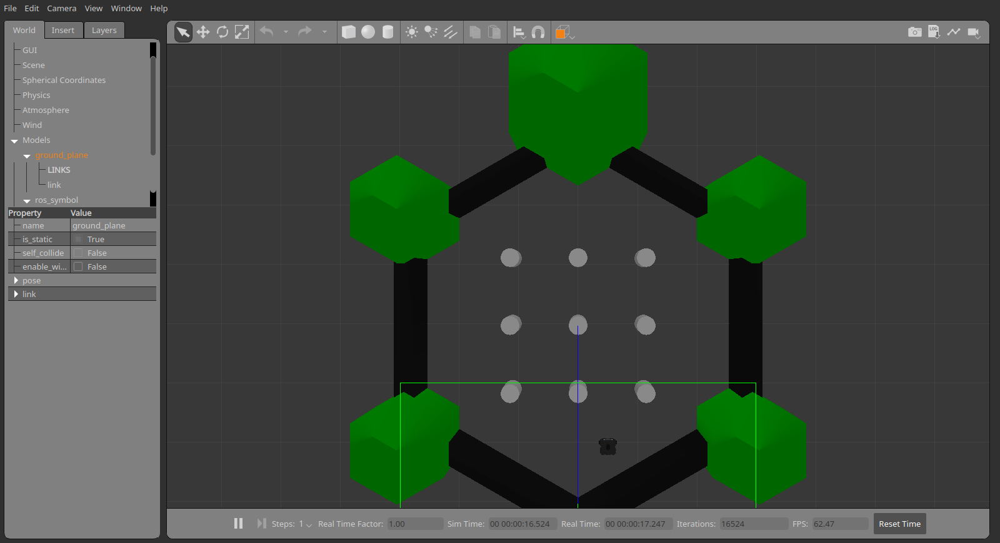
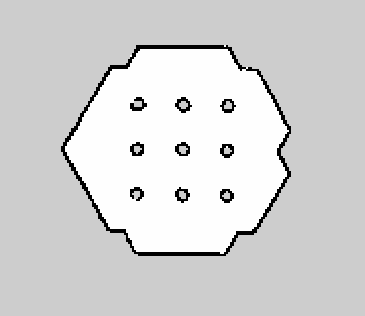

# Gazebo Turtlebot Mapping

Ранее мы уже запускали симулятор `Gazebo` с роботом `Turtlebot` и его средой (пара простых объектов), запустим его снова:
```bash
roslaunch turtlebot_gazebo turtlebot_world.launch
```
<p align="center">

</p>

Начнем веселиться с представлением информации, до этого мы смотрели конкретно в Gazebo, но в симуляторе не видно, что видит робот. Появилась проблема - мы не видим того, что видит робот, понимает или интерпретирует. Аналогичная проблема не только с симулятором связана, в реальном роботе мы также просто так не можем видеть, что робот видит. Есть выход - `rviz`! Запускаем!
```bash
rviz
```
или
```bash
rosrun rviz rviz
```

И вот, что мы видим по запуску:
<p align="center">

</p>

Давайте начнем узнавать, что же доступно экосистеме ROS из симулятора (а значит и нам, так как экосистема ROS открыта для нас). Для начала попробуем увидеть, каким видим ROS робота:
<p align="center">

</p>

А теперь сравним с Gazebo:
<p align="center">

</p>

Воу, да один в один! На самом деле спасибо разработчикам данной симуляции робота, они предоставлили возможность увидеть робота в rviz публикацией вида робота через параметр `/robot_description`. Тем не менее для нас это первый шаг для визуализации информации из экосистемы ROS!

Пойдем дальше, попробуйте визуализировать информацию из топиков (с помощью вкладки в rviz `By topic`) `/camera/depth/points` и `/scan`. У меня получилось вот так:
<p align="center">

</p>

> Если поиграться с виуализацией топиков в меню слева можно увидеть, что `LaserScan` представляется информацией плоской (белая линия), а `PointCloud2` представлен трехмерной информацией. Эти все данные получены с Kinect на роботе.

Не слабо, не так ли? =) Таким образом, сейчас наш робот не имеет особо мозгов, не управляется, но уже может видеть мир (для САУшников - нет обратной связи ни в виде контроллера, ни в виде человека). Вот так мы визуализировали информацию о представлении робота о мире вокруг него! Гоу гонять и смотреть в rviz? =)
```bash
roslaunch turtlebot_teleop keyboard_teleop.launch
```

Тут еще и систему TF можно визуализировать!
<p align="center">

</p>

Таким образом, у нас запущены:  
- симулятор с запущенным роботом и средой  
- представление робота для симулятора (мы видим модельку, а экосистема ROS знает о его колесах и др. частях)  
- связи для управления роботом в симуляторе (запускали телеуправление раньше) 

> Для особо пытливых - попробуйте поменять `Fixed frame` в настройках rviz с `odom` (глобальная СК для одометрии) на `base_link` (локальная СК робота). Вы можете увидеть, что робот встал на месте, а окружение меняется вокруг него. Настройка `Fixed frame` устанавливает СК, которая будет считаться глобальной.

# gmapping

Итак, детские забавы закончились, пора чудить по-крупному! Вы знали, что есть специальный пакет, который с помощью целого набора разных узлов, плагинов и других вещей может заставить робота двигаться к цели? А также есть пакет, который позволяет строить карту местности, чтобы учитывать ее для построения пути? Есть у меня парочка для вас...

Начнем с ходьбы и ориентации. К сожалению, настройка представленных демо пакетов может привести к ряду проблем, причиной им - попытка универсиализировать пакеты, чтобы все работало по щелчку. На данный момент у нас есть робот, на нем датчики, которые мы уже визуализировали, попробуем запустить систему построения карты. Создайте launch-файл в своем пакете `study_pkg` (или как вы его назвали) со следующим содержимым:
```xml
<?xml version="1.0"?>
<!-- roscat turtlebot_navigation kinect_gmapping.launch.xml -->
<launch>
  <arg name="scan_topic"  default="scan" />
  <arg name="base_frame"  default="base_footprint"/>
  <arg name="odom_frame"  default="odom"/>

  <node pkg="gmapping" type="slam_gmapping" name="slam_gmapping" output="screen">
    <param name="base_frame" value="$(arg base_frame)"/>
    <param name="odom_frame" value="$(arg odom_frame)"/>
    <param name="map_update_interval" value="5.0"/>
    <param name="maxUrange" value="6.0"/>
    <param name="maxRange" value="8.0"/>
    <param name="sigma" value="0.05"/>
    <param name="kernelSize" value="1"/>
    <param name="lstep" value="0.05"/>
    <param name="astep" value="0.05"/>
    <param name="iterations" value="5"/>
    <param name="lsigma" value="0.075"/>
    <param name="ogain" value="3.0"/>
    <param name="lskip" value="0"/>
    <param name="minimumScore" value="200"/>
    <param name="srr" value="0.01"/>
    <param name="srt" value="0.02"/>
    <param name="str" value="0.01"/>
    <param name="stt" value="0.02"/>
    <param name="linearUpdate" value="0.5"/>
    <param name="angularUpdate" value="0.436"/>
    <param name="temporalUpdate" value="-1.0"/>
    <param name="resampleThreshold" value="0.5"/>
    <param name="particles" value="80"/>

    <param name="xmin" value="-1.0"/>
    <param name="ymin" value="-1.0"/>
    <param name="xmax" value="1.0"/>
    <param name="ymax" value="1.0"/>

    <param name="delta" value="0.05"/>
    <param name="llsamplerange" value="0.01"/>
    <param name="llsamplestep" value="0.01"/>
    <param name="lasamplerange" value="0.005"/>
    <param name="lasamplestep" value="0.005"/>
    <remap from="scan" to="$(arg scan_topic)"/>
  </node>
</launch>
```
> Я назвал файл `gmapping.launch`, вы можете его назвать по-другому =)

> По факту вы можете увидеть, что на самом деле ничего страшного в файле нет, запускается обычный узел `slam_gmapping` из пакета [`gmapping`](http://wiki.ros.org/gmapping). Единственное, что напрягает - количество параметров, но так как мы только пробуем все новое то оставим их так, как они были заданы в примере =)

Теперь запустим систему с нуля! У вас должны быть запущены симулятор с роботом
```bash
roslaunch turtlebot_gazebo turtlebot_world.launch
```

визуализатор топиков
```bash
rviz
```

и система управления с клавиатуры
```bash
roslaunch turtlebot_teleop keyboard_teleop.launch
```

А также запускаем узел построения карты, launch-файл для которого мы только что создали
```bash
roslaunch study_pkg gmapping.launch
```

Дальше немного настройки:  
- После запуска gmapping узла у нас появляется TF под названием `map`. Теперь она будет глобальной (`Fixed frame`), когда в нашей системе появилось понятие карты (а оно появилось - см. дальше).  
- Для наглядности отображаем топики: `/camera/depth/points`, `/map` и представление робота (`Add->By display type->RobotModel`).

Отметимся, у меня получился такой вид:
<p align="center">

</p>

Открываем окно с запущенным управлением с клавиатуры и гоооу, катайтесь на здоровье =)
Кто как накатал, а у меня получилась вот такая штука:


Позравляю, вы построили карту местности! Только не закрывайте все сразу, давайте извлечем пользу из того, что вы сделали!

# Бэкапы, джони!

Любая карта представляет собой информацию о местности, на данный момент построенная карта является важной вещью, так как, полагаю, нет желания постоянно перестраивать эту карту, хоть это и симулятор, который можно перезапускать вечно. Представьте что вы находитесь в условиях, где можно лишь пару раз проехать и получить инфу о местности.

Меньше разговоров, пакет [`map_server`](http://wiki.ros.org/map_server) - вот, что нам нужно!
Заходим в папку, где хотим сохранить карту, и сохраняем ее:
```bash
rosrun map_server map_saver
```
по умолчанию будет создано два файла `map.pgm` и `map.yaml`, также можно задать имена файлам:
```bash
rosrun map_server map_saver -f my_super_map
```
тогда заделаются файлы `my_super_map.pgm` и `my_super_map.yaml`.

> Я сохранил в пакет `study_pkg` в папку `maps`. Для вас выбор свободен =)

Файл `map.pgm` можно открыть просмотром картинки:
<p align="center">

</p>
Файл `map.yaml` содержит инфу о карте:
```yaml
image: map.pgm
resolution: 0.050000
origin: [-12.200000, -15.400000, 0.000000]
negate: 0
occupied_thresh: 0.65
free_thresh: 0.196
```

> Для вас моя сохраненная карта лежит в папке `data/T1_05` репозитория =)

Как пользоваться картой - рассмотрим потом, на моменте локализации, пока мы только научились ее строить =)

# Еще бэкапы, не настраивать же по новой rviz +)

Теперь по поводу rviz, вот вы настроили представление топиков, а потом закрыли или он упал (печально), настраивать надо все по новой. С одной стороны, если нажать `Ctrl+S` или `Save Config` в меню `File`, то можно сохранить настройку по умолчанию. Это будет запускать вашу настройку при каждом запуске, но мы ведь хотим сохранить настройку для конкретного случая - сохраним в отдельный файл и воспользуемся, когда работаем конкретно с turtlebot!

Жмем `Ctrl+Shift+S` и сохраняем файл под названием `turtlebot.rviz` в пакет `study_pkg` в папку `rviz` - теперь у нас есть настройка под конкретный случай!

> Аналогично сохранил представление в `data/T1_05` репозитория.

# Возвращаемся с новыми силами!

Помните, мы запускали последний раз аж 4 разных терминила с симулятором, rviz и т.д.? Давайте сделаем все как надо, а то дальше - хуже =)

Создадим в `study_pkg` в соответствующей папке launch-файл `start_turtlebot_sim.launch`:
```xml
<?xml version="1.0"?>
<launch>
  <!-- Start turtlebot Gazebo simulation -->
  <include file="$(find turtlebot_gazebo)/launch/turtlebot_world.launch"/>

  <!-- Start Rviz with required views -->
  <node name="rviz" pkg="rviz" type="rviz" args="-d $(find study_pkg)/rviz/turtlebot.rviz" />

  <!-- Start gmapping node -->
  <include file="$(find study_pkg)/launch/gmapping.launch"/>
</launch>
```

Запускается он, соответственно, командой
```bash
roslaunch study_pkg start_turtlebot_sim.launch
```
Управление клавиатурой же
```bash
roslaunch turtlebot_teleop keyboard_teleop.launch
```

> Мы специально не добавили сюда запуск управления с клавиатуры, так как консоль управления быстро перетрется выводом основных узлов и подсказки по управлению исчезнут =(. Так что рекомендуем запускать его отдельно, тем более клавиатурное управление более отладочное, нежели включено в реальную систему =).

Вот так мы получили всю систему в одном launch-файле, предустановленное представление rviz, собранную информацию в виде карты и много новых знаний. Поверьте, это далеко не все!  

Также, вы, наверное, замечали, что на начале работы метод `gmapping` немного скачет. Причиной этому - недостаток информации. Указанный метод работает только по `LaserScan`, который создается из информации с кинекта сплющиванием трехмерной картинки в линию скана. Обычно линии скана имеют обзор 360 градусов (лидары), так что информации больше, но даже сейчас система неплохо работает благодаря информации от одометрии колес! В дальнейшем мы рассмотрим метод `RTABmap`, который работает как раз таки с трехмерными изображениями с кинекта и увидим весомую разницу, но давайте пробовать все по очереди!

> P.S. Пока сохраненную карту попридержите, она нам очень понадобится чуть позже =)

# Gazebo Turtlebot Mapping - Better, Faster, Stronger

> Для дальнейшей работы требуется установить метод RTABmap командой `sudo apt install ros-melodic-rtabmap-ros`.

Продолжая тему построения карты, важно упомянуть, что рассмотренный метод `gmapping` является методом работы с `LaserScan`, что делает его не очень выгодным для случая работы с кинектом, который стоит на черепашке. Поэтому в этом топике коснемся метода [`rtabmap`](http://wiki.ros.org/rtabmap_ros), который является методом работы с `RGB-D` данными (RGB картинка с дополнительным измерением глубины). К коллайдеру!

Нет времени объяснять, пишем запуск узла построения карты `rtabmap.launch`:
```xml
<?xml version="1.0"?>
<launch>
  <arg name="database_path"     default="rtabmap.db"/>
  <arg name="rgbd_odometry"     default="false"/>
  <arg name="rtabmapviz"        default="false"/>
  <arg name="localization"      default="false"/>
  <arg     if="$(arg localization)" name="args"  default=""/>
  <arg unless="$(arg localization)" name="args"  default="--delete_db_on_start"/>

  <arg name="rgb_topic"   default="/camera/rgb/image_raw"/>
  <arg name="depth_topic" default="/camera/depth/image_raw"/>
  <arg name="camera_info_topic" default="/camera/rgb/camera_info"/>
  
  <arg name="wait_for_transform"  default="0.2"/> 
  
  <!-- Mapping -->
  <group ns="rtabmap">
    <node name="rtabmap" pkg="rtabmap_ros" type="rtabmap" output="screen" args="$(arg args)">
      <param name="database_path"       type="string" value="$(arg database_path)"/>
      <param name="frame_id"            type="string" value="base_footprint"/>
      <param name="wait_for_transform_duration"  type="double"   value="$(arg wait_for_transform)"/>
      <param name="subscribe_depth"     type="bool"   value="true"/>
      <param name="subscribe_scan"      type="bool"   value="true"/>
      <param name="map_negative_poses_ignored" type="bool" value="true"/>

      <!-- inputs -->
      <remap from="scan"            to="/scan"/>
      <remap from="rgb/image"       to="$(arg rgb_topic)"/>
      <remap from="depth/image"     to="$(arg depth_topic)"/>
      <remap from="rgb/camera_info" to="$(arg camera_info_topic)"/>
      <remap unless="$(arg rgbd_odometry)" from="odom" to="/odom"/>
      
      <!-- output -->
      <remap from="grid_map" to="/map"/>

      <!-- RTAB-Map's parameters: do "rosrun rtabmap rtabmap (double-dash)params" to see the list of available parameters. -->
      <param name="RGBD/ProximityBySpace"        type="string" value="true"/>   <!-- Local loop closure detection (using estimated position) with locations in WM -->
      <param name="RGBD/OptimizeFromGraphEnd"    type="string" value="false"/>  <!-- Set to false to generate map correction between /map and /odom -->
      <param name="Kp/MaxDepth"                  type="string" value="4.0"/>
      <param name="Reg/Strategy"                 type="string" value="0"/>      <!-- Loop closure transformation: 0=Visual, 1=ICP, 2=Visual+ICP -->
      <param name="Icp/CorrespondenceRatio"      type="string" value="0.3"/>
      <param name="Vis/MinInliers"               type="string" value="15"/>      <!-- 3D visual words minimum inliers to accept loop closure -->
      <param name="Vis/InlierDistance"           type="string" value="0.1"/>    <!-- 3D visual words correspondence distance -->
      <param name="RGBD/AngularUpdate"           type="string" value="0.1"/>    <!-- Update map only if the robot is moving -->
      <param name="RGBD/LinearUpdate"            type="string" value="0.1"/>    <!-- Update map only if the robot is moving -->
      <param name="RGBD/ProximityPathMaxNeighbors" type="string" value="0"/> 
      <param name="Rtabmap/TimeThr"              type="string" value="700"/>
      <param name="Mem/RehearsalSimilarity"      type="string" value="0.30"/>
      <param name="Reg/Force3DoF"                type="string" value="false"/>
      <param name="GridGlobal/MinSize"           type="string" value="20"/>
      <param name="RGBD/OptimizeMaxError"        type="string" value="0.1"/>
      
      <!-- localization mode -->
      <param     if="$(arg localization)" name="Mem/IncrementalMemory" type="string" value="false"/>
      <param unless="$(arg localization)" name="Mem/IncrementalMemory" type="string" value="true"/>
      <param name="Mem/InitWMWithAllNodes" type="string" value="$(arg localization)"/> 
    </node>
   
    <!-- Odometry : ONLY for testing without the actual robot! /odom TF should not be already published. -->
    <node if="$(arg rgbd_odometry)" pkg="rtabmap_ros" type="rgbd_odometry" name="rgbd_odometry" output="screen">
      <param name="frame_id"                    type="string" value="base_footprint"/>
      <param name="wait_for_transform_duration" type="double" value="$(arg wait_for_transform)"/>
      <param name="Reg/Force3DoF"               type="string" value="true"/>
      <param name="Vis/InlierDistance"          type="string" value="0.05"/>
      
      <remap from="rgb/image"       to="$(arg rgb_topic)"/>
      <remap from="depth/image"     to="$(arg depth_topic)"/>
      <remap from="rgb/camera_info" to="$(arg camera_info_topic)"/>
    </node>
    
    <!-- visualization with rtabmapviz -->
    <node if="$(arg rtabmapviz)" pkg="rtabmap_ros" type="rtabmapviz" name="rtabmapviz" args="-d $(find rtabmap_ros)/launch/config/rgbd_gui.ini" output="screen">
      <param name="subscribe_depth"             type="bool" value="true"/>
      <param name="subscribe_scan"              type="bool" value="true"/>
      <param name="frame_id"                    type="string" value="base_footprint"/>
      <param name="wait_for_transform_duration" type="double" value="$(arg wait_for_transform)"/>
    
      <remap from="rgb/image"       to="$(arg rgb_topic)"/>
      <remap from="depth/image"     to="$(arg depth_topic)"/>
      <remap from="rgb/camera_info" to="$(arg camera_info_topic)"/>
      <remap from="scan"            to="/scan"/>
    </node>
    
  </group>
</launch>
```

Вот тут объемчик то и подрос, небольшой анализ необходим!

Запускаем узел `rtabmap` из пакета `rtabmap_ros`. Параметров также до кучи, как и в `gmapping`, но и тут я сошлюсь на то, что по умолчанию они работают, а перегружать мозг пока нет надобности =)
```xml
<node name="rtabmap" pkg="rtabmap_ros" type="rtabmap" output="screen" args="$(arg args)">
```

Запустим узел визуальной одометрии `rgbd_odometry` из пакета `rtabmap_ros` только в том случае, если переменную `rgbd_odometry` установим в `true`. Для нашего случая это не нужно, так как одометрия у нас идет от колес робота!
```xml
<arg name="rgbd_odometry"     default="false"/>
...
<node if="$(arg rgbd_odometry)" pkg="rtabmap_ros" type="rgbd_odometry" name="rgbd_odometry" output="screen">
```

Запуск визуализации в собственном `rtabmapviz`. Штука прикольная, посмотрим на нее в рамках этого топика.
```xml
<arg name="rtabmapviz"        default="false"/>
...
<node if="$(arg rtabmapviz)" pkg="rtabmap_ros" type="rtabmapviz" name="rtabmapviz" args="-d $(find rtabmap_ros)/launch/config/rgbd_gui.ini" output="screen">
```

Модифицируем файл `start_turtlebot_sim.launch` на следующий вид:
```xml
<?xml version="1.0"?>
<launch>
  <arg name="rtabmap" default="true"/>

  <!-- Start turtlebot Gazebo simulation -->
  <include file="$(find turtlebot_gazebo)/launch/turtlebot_world.launch"/>

  <!-- Start Rviz with required views -->
  <node name="rviz" pkg="rviz" type="rviz" args="-d $(find study_pkg)/rviz/turtlebot.rviz" />

  <!-- Start mapping node, method is based on <rtabmap> argument -->
  <include unless="$(arg rtabmap)" file="$(find study_pkg)/launch/gmapping.launch"/>
  <include     if="$(arg rtabmap)" file="$(find study_pkg)/launch/rtabmap.launch">
    <arg name="rtabmapviz" value="true"/>
  </include>
</launch>
```

В таком виде установка аргумента `rtabmap` в `true` включает метод для построения карты `rtabmap`, иначе используется метод `gmapping`. Вся работа заключена в параметрах `if` и `unless` тэга `include`.

Стартуем и катаем!
```bash
roslaunch study_pkg start_turtlebot_sim.launch
```
и управление клавиатурой
```bash
roslaunch turtlebot_teleop keyboard_teleop.launch
```

Покатали и вот, что получилось:
<p align="center">

</p>

Слева направо: rviz, rtabmapviz, gazebo

Как видите, метод дейстивтельно работает с трехмерными данными! Также, метод активно базируется на получаемой одометрии, что приводит к отсутствию проблем с совмещением кадров с кинекта. Для знакомства идеальная среда - самое то!

Вот так кратко познакомились с `rtabmap` методом. Теперь можно поизучать параметры методов `rtabmap` и `gmapping` для улучшения скорости, точности или других качеств при построении карты, так как это одна из основополагающих частей при выполнении задачи движения в неизвестной области.

# Любишь кататься - люби и саночки возить

Все бы хорошо, но вот мы попробовали поиспользовать методы построения карт, а взаимодействие с нашими датчиками совсем осталось за кадром. Пока только по опыту мы знаем, что `gmapping` работает на основе `LaserScan`, а `rtabmap` - на основе `PointCloud2` и других данных от RGB-D датчиков.

> `rtabmap` умеет, конечно, и по `LaserScan` строить карты, но если метод может вертеть RGBD картинками, почему этим не пользовать? =)

### Gmapping

Сначала тащим свои руки в `gmapping`. Из [документации](http://wiki.ros.org/gmapping) мы выясняем, что ему необходима следующая инфа
```
Subscribed Topics
  tf (tf/tfMessage)
    Transforms necessary to relate frames for laser, base, and odometry (see below)
  scan (sensor_msgs/LaserScan)
    Laser scans to create the map from
Required tf Transforms
  <the frame attached to incoming scans> → base_link
    usually a fixed value, broadcast periodically by a robot_state_publisher, or a tf static_transform_publisher.
  base_link → odom
    usually provided by the odometry system (e.g., the driver for the mobile base)
```
и заглядываем в `gmapping.launch`
```xml
  <!-- Задаем значения по умолчанию -->
  <arg name="scan_topic"  default="scan" />
  <arg name="base_frame"  default="base_footprint"/>
  <arg name="odom_frame"  default="odom"/>
...
  <!-- Устанавливаем названия наших TF  -->
    <param name="base_frame" value="$(arg base_frame)"/>
    <param name="odom_frame" value="$(arg odom_frame)"/>
...
  <!-- Вот мапируем к нашему топику от сплюснутого изображения от кинекта, что является сканом -->
    <remap from="scan" to="$(arg scan_topic)"/>
```
Полагаю, тут все ясно, ему нужен топик с информацией о сканировании, а также преобразования TF от СК сканера к базе робота и от СК робота до СК одометрии.

Узел соответственно
```
Published Topics
  map (nav_msgs/OccupancyGrid)
    Get the map data from this topic, which is latched, and updated periodically
Provided tf Transforms
  map → odom
    the current estimate of the robot's pose within the map frame
``` 
публикует карту и TF преобразование от СК одометрии до СК карты. Последнее позволяет внести поправку в положение робота при перемещении по местности.

Так что с `gmapping` разбор не несет сложностей, перейдем к `rtabmap`!

### Rtabmap

[Доки](http://wiki.ros.org/rtabmap_ros) - наше все! Там куча демок, чтобы вдохновиться мощностью пакета, но мы взглянем на требования по информации.

```
Subscribed Topics
  odom (nav_msgs/Odometry)
    Odometry stream. Required if parameters subscribe_depth or subscribe_stereo are true and odom_frame_id is not set.
  rgb/image (sensor_msgs/Image)
    RGB/Mono image. Should be rectified when subscribe_depth is true. Not required if parameter subscribe_stereo is true (use left/image_rect instead).
  rgb/camera_info (sensor_msgs/CameraInfo)
    RGB camera metadata. Not required if parameter subscribe_stereo is true (use left/camera_info instead).
  depth/image (sensor_msgs/Image)
    Registered depth image. Required if parameter subscribe_depth is true.
  scan (sensor_msgs/LaserScan)
    Laser scan stream. Required if parameter subscribe_scan is true.
  scan_cloud (sensor_msgs/PointCloud2)
    Laser scan point cloud stream. Required if parameter subscribe_scan_cloud is true.
  left/image_rect (sensor_msgs/Image)
    Left RGB/Mono rectified image. Required if parameter subscribe_stereo is true.
  left/camera_info (sensor_msgs/CameraInfo)
    Left camera metadata. Required if parameter subscribe_stereo is true.
  right/image_rect (sensor_msgs/Image)
    Right Mono rectified image. Required if parameter subscribe_stereo is true.
  right/camera_info (sensor_msgs/CameraInfo)
    Right camera metadata. Required if parameter subscribe_stereo is true.
  goal (geometry_msgs/PoseStamped)
    Planning Plan a path to reach this goal using the current online map. The goal should be close enough to the map's graph to be accepted (see RTAB-Map's parameter RGBD/LocalRadius). Note that only nodes in Working Memory are used, for exploration it may be ok, but it would be better to use service set_goal if you are coming back in a previously mapped area. See Planning published topics for corresponding generated outputs.
  rgbd_image (rtabmap_ros/RGBDImage)
    RGB-D synchronized image, only when subscribe_rgbd is true.
Required tf Transforms
  base_link → <the frame attached to sensors of incoming data>
    usually a fixed value, broadcast periodically by a robot_state_publisher, or a tf static_transform_publisher.
  odom → base_link
    usually provided by the odometry system (e.g., the driver for the mobile base).
```

Уф, не паникуем, разбираемся потихоньку, на самом деле большинство топиков, на которые подписывается `rtabmap`, имеют опциональный характер. Например, есть параметры, которые определяют возможные режимы:
```
Parameters
  ~subscribe_depth (bool, default: "true")
    Subscribe to depth image
  ~subscribe_scan (bool, default: "false")
    Subscribe to laser scan
  ~subscribe_scan_cloud (bool, default: "false")
    Subscribe to laser scan point cloud
  ~subscribe_stereo (bool, default: "false")
    Subscribe to stereo images
```
В нашем случае (`rtabmap.launch`) мы используем
```xml
      <param name="subscribe_depth"     type="bool"   value="true"/>
      <param name="subscribe_scan"      type="bool"   value="true"/>
```
значит топики, которые мы используем из доков, будут следующими
```
Subscribed Topics
  odom (nav_msgs/Odometry)
    Odometry stream. Required if parameters subscribe_depth or subscribe_stereo are true and odom_frame_id is not set.
  rgb/image (sensor_msgs/Image)
    RGB/Mono image. Should be rectified when subscribe_depth is true. Not required if parameter subscribe_stereo is true (use left/image_rect instead).
  rgb/camera_info (sensor_msgs/CameraInfo)
    RGB camera metadata. Not required if parameter subscribe_stereo is true (use left/camera_info instead).
  depth/image (sensor_msgs/Image)
    Registered depth image. Required if parameter subscribe_depth is true.
  scan (sensor_msgs/LaserScan)
    Laser scan stream. Required if parameter subscribe_scan is true.
```
конкретнее в `rtabmap.launch`
```xml
  <arg name="rgb_topic"   default="/camera/rgb/image_raw"/>
  <arg name="depth_topic" default="/camera/depth/image_raw"/>
  <arg name="camera_info_topic" default="/camera/rgb/camera_info"/>
  ...
      <!-- inputs -->
      <remap from="scan"            to="/scan"/>
      <remap from="rgb/image"       to="$(arg rgb_topic)"/>
      <remap from="depth/image"     to="$(arg depth_topic)"/>
      <remap from="rgb/camera_info" to="$(arg camera_info_topic)"/>
      <remap unless="$(arg rgbd_odometry)" from="odom" to="/odom"/>
```
> Для TF названия в параметрах не меняются, так как в нашей системе они названы также.

А что у нас на выходе? Да все также, как и в `gmapping`, но чуть сложнее:
```
Published Topics
  info (rtabmap_ros/Info)
    RTAB-Map's info.
  mapData (rtabmap_ros/MapData)
    RTAB-Map's graph and latest node data.
  mapGraph (rtabmap_ros/MapGraph)
    RTAB-Map's graph only.
  grid_map (nav_msgs/OccupancyGrid)
    Mapping Occupancy grid generated with laser scans. Use parameters with prefixes map_ and grid_ below.
  proj_map (nav_msgs/OccupancyGrid)
    Mapping Occupancy grid generated from projection of the 3D point clouds on the ground. Use parameters with prefixes map_, grid_ and proj_ below.
  cloud_map (sensor_msgs/PointCloud2)
    Mapping 3D point cloud generated with the 3D point clouds. Use parameters with prefixes map_ and cloud_ below.
  scan_map (sensor_msgs/PointCloud2)
    Mapping 3D point cloud generated with the 2D scans or 3D scans. Use parameters with prefixes map_ and scan_ below.
  labels (visualization_msgs/MarkerArray)
    Convenient way to show graph's labels in RVIZ.
  global_path (nav_msgs/Path)
    Planning Poses of the planned global path. Published only once for each path planned.
  local_path (nav_msgs/Path)
    Planning Upcoming local poses corresponding to those of the global path. Published on every map update.
  goal_reached (std_msgs/Bool)
    Planning Status message if the goal is successfully reached or not.
  goal_out (geometry_msgs/PoseStamped)
    Planning Current metric goal sent from the rtabmap's topological planner. For example, this can be connected to move_base_simple/goal topic of move_base.
  octomap_full (octomap_msgs/Octomap)
    Get an OctoMap. Available only if rtabmap_ros is built with octomap.
  octomap_binary (octomap_msgs/Octomap)
    Get an OctoMap. Available only if rtabmap_ros is built with octomap.
  octomap_occupied_space (sensor_msgs/PointCloud2)
    A point cloud of the occupied space (obstacles and ground) of the OctoMap. Available only if rtabmap_ros is built with octomap.
  octomap_obstacles (sensor_msgs/PointCloud2)
    A point cloud of the obstacles of the OctoMap. Available only if rtabmap_ros is built with octomap.
  octomap_ground (sensor_msgs/PointCloud2)
    A point cloud of the ground of the OctoMap. Available only if rtabmap_ros is built with octomap.
  octomap_empty_space (sensor_msgs/PointCloud2)
    A point cloud of empty space of the OctoMap. Available only if rtabmap_ros is built with octomap.
  octomap_grid (nav_msgs/OccupancyGrid)
    The projection of the OctoMap into a 2D occupancy grid map. Available only if rtabmap_ros is built with octomap.
Provided tf Transforms
  map → odom
    the current odometry correction.
```
Тоже многовато, но из описаний понятно, что карты создаются всякие разные, а для нашего случая мы используем
```xml
      <!-- output -->
      <remap from="grid_map" to="/map"/>
```
Это карта, которая формируется на основе `LaserScan`, в данном случае нет явных причин использовать именно это, в вашем распоряжении использовать любую из них, а посмотреть на разницу можно и в rviz.

Также на выходе публикуется TF от СК карты до СК одометрии, что также как и в `gmapping` является небольшой коррекцией показаний одометрии, так как все таки одометрия не может быть идеальной, а построенная карта может являться небольшим ориентиром, на который можно опираться.

# И что в итоге?

Вот мы и разобрались, как включать системы построения карт, через какие топики их подключать и какие результаты они дают. Логично вопрошать, а параметры то на что? Тут уж извините, но ROS доки дают хорошее описание всех параметров, а в совокупности с утилитами `rqt_reconfigure` и `rviz` вы можете наглядно менять параметры и видеть результаты изменения. Можно сказать лишь одно, рекоменую практиковаться! Так что сейчас у вас есть управляемый робот и он умеет строить карты, в ваших силах разобраться с тем, как влияют параметры на работу систем построения карт в идеальных условиях симулятора. Успехов!


