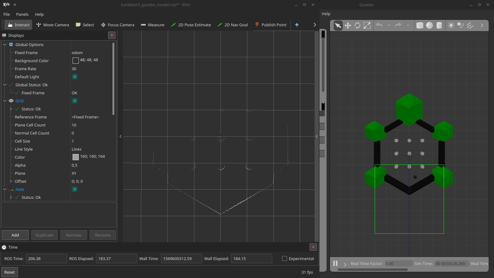

# Gazebo Turtlebot Mapping

Ранее мы уже запускали симулятор `Gazebo` с роботом `Turtlebot` и его средой (пара простых объектов), запустим его снова:
```bash
roslaunch turtlebot_gazebo turtlebot_world.launch
```
<p align="center">

</p>

Начнем веселиться с представлением информации, до этого мы смотрели конкретно в Gazebo, но в симуляторе не видно, что видит робот. Появилась проблема - мы не видим того, что видит робот, понимает или интерпретирует. Аналогичная проблема не только с симулятором связана, в реальном роботе мы также просто так не можем видеть, что робот видит. Есть выход - `rviz`! Запускаем!
```bash
rviz
```
или
```bash
rosrun rviz rviz
```

И вот, что мы видим по запуску:
<p align="center">

</p>

Это графический интерфейс, в котором можно представлять различные данные, используемые в работе робота!

А теперь закроем нынешний вариант rviz и запустим уже настроенный вариант из пакета черепашки:
```bash
TURTLEBOT3_MODEL=waffle roslaunch turtlebot3_gazebo turtlebot3_gazebo_rviz.launch
```  
<p align="center">

</p>

Белые точки на карте - это точки скана лидара, слева в меню `Displays` настроены отображаемые данные. В подменю `Global Options/Fixed Frame` указывается TF фрейм, относительно которого будут отображаться все данные и остальные TF фреймы. Давайте немного настроим отображение, чтобы было видно робота и лучше видно данные:
- `TF/Frames` - включите сам TF (рядом с названием галочку) и оставьте только `base_link`, который является СК, привязанной к роботу;
- `Laserscan/Style` -> Points;
- `LaserScan/Size (Pixels)` -> 3.

Должно получиться так:

<p align="center">

</p>

Теперь пора включить управление на клавиатуре, катать и сравнивать с Gazebo, что происходит на обоих экранах =)

> **А теперь задачка для вас: поменяйте `Global Options/Fixed Frame` с `odom` на другой и постарайтесь разобраться, что происходит и почему =)**

Окей, допустим, мы убедились, что мы можем видеть, как лидар на роботе видит, но уже на данный момент есть две проблемы:
- Нам для запуска всего уже требуется три консоли;
- При перезапуске Rviz снова приходится настраивать (самое грустное).

Окей, разбираемся с ними!

## With BlackJack and ... 

Пора бы подготовить своих скриптов для запуска, чтобы не маяться с запуском трех. Определим, что нам надо:
- Запуск симулции Gazebo;
- Запуск Rviz (пока просто то, что предлагает готовый пакет);
- Запуск управления по клавиатуре.

В собственном пакете (ранее это был `study_pkg` или ваше собственное название) в папке launch создаем скрипт `tb3_gz_keyboard_rviz.launch`:
```xml
<?xml version="1.0"?>
<launch>
    <!-- Start turtlebot Gazebo simulation -->
    <include file="$(find turtlebot3_gazebo)/launch/turtlebot3_world.launch">
    </include>

    <!-- Start Rviz with default setup -->
    <include file="$(find turtlebot3_gazebo)/launch/turtlebot3_gazebo_rviz.launch">
    </include>

    <!-- Start teleop -->
    <include file="$(find turtlebot3_teleop)/launch/turtlebot3_teleop_key.launch">
    </include>
</launch>
```

и проверяем запуск:
```
TURTLEBOT3_MODEL=waffle roslaunch study_pkg tb3_gz_keyboard_rviz.launch
```

Если вы можете управлять с консоли роботом и видите, как меняется ситуация в Rviz и Gazebo - поздравляю, вы успешно запустили симулятор, систему отображения и управления одним скриптом!

> Все еще приходится задавать переменную `TURTLEBOT3_MODEL`, хоть уже все один раз, но запомним это.

Окей, то есть с первой пролемой разобрались, давайте думать, что можно сделать с настройкой Rviz?


## ... Rviz!

Есть маленькая проблемка, мы не видим в нашем скрипте запуска явный вызов Rviz, не пойдет, давайте смотреть, можем ли мы вынести его из скриптов пакета прямо в наш!

```bash
roscat turtlebot3_gazebo turtlebot3_gazebo_rviz.launch
```

Получаем (добавлены комменты):
```xml
<launch>
    <!-- Аргумент launch скрипта, так вот где он читал переменную TURTLEBOT3_MODEL! -->
    <arg name="model" default="$(env TURTLEBOT3_MODEL)" doc="model type [burger, waffle, waffle_pi]"/>

    <!-- Какой-то старт другого launch, пока оставим -->
    <include file="$(find turtlebot3_bringup)/launch/turtlebot3_remote.launch">
      <arg name="model" value="$(arg model)"/>
    </include>

    <!-- Вот он! -->
    <node name="rviz" pkg="rviz" type="rviz" args="-d $(find turtlebot3_gazebo)/rviz/turtlebot3_gazebo_model.rviz"/>
</launch>
```

Мы нашли запуск, только он с какой-то опцией `-d`, давайте ее пока уберем и оставим читый запуск! Заменяем вызов `turtlebot3_gazebo_rviz.launch` на вызовы из скрипта, получаем:
```xml
<?xml version="1.0"?>
<launch>
    <!-- Start turtlebot Gazebo simulation -->
    <include file="$(find turtlebot3_gazebo)/launch/turtlebot3_world.launch">
    </include>


    <arg name="model" default="$(env TURTLEBOT3_MODEL)" doc="model type [burger, waffle, waffle_pi]"/>

    <include file="$(find turtlebot3_bringup)/launch/turtlebot3_remote.launch">
      <arg name="model" value="$(arg model)"/>
    </include>

    <!-- Start Rviz with default setup -->
    <node name="rviz" pkg="rviz" type="rviz"/>


    <!-- Start teleop -->
    <include file="$(find turtlebot3_teleop)/launch/turtlebot3_teleop_key.launch">
    </include>
</launch>
```

Запускаем:
```
TURTLEBOT3_MODEL=waffle roslaunch study_pkg tb3_gz_keyboard_rviz.launch
```

Теперь мы видим, что Rviz пустоват, настраиваем:
- `Global Options/Fixed Frame` -> `odom`;
- Создаем отображение (кнопка Add) по типу - TF, настраиваем на отображение `odom` и `base_link`;
- Создаем отображение по топику `/scan`, настраиваем тип и размер, как делали раньше;
- В панели `Views` устанавливаем тип `TopDownOrtho`.

> Если какой-то панели не хватает, всегда можно включить в меню `Panels` необходимую панель.

**Самое главное** - после настройки мы не хотим по-новой настраивать все эти вещи, особенно, если робот и датчики не меняютс, а значит пора сохранить настройки! Лезем в меню `File -> Save Config As` и сохраняем как файл `tb3_scan_tf`.

После этого в launch как раз подставляет к запуску ту самую опцию `-d`, но уже с указание нашей настройки, должно получиться так:
```xml
    <node name="rviz" pkg="rviz" type="rviz" args="-d $(find study_pkg)/rviz/tb3_scan_tf.rviz"/>
```

И перезапускаем!

Если вы увидели те же настройки, что и сделали раньше, то я вас поздравляю, теперь не придется кадый раз настраивать все по новой!

> Все настроенные режимы отображения лучше хранить в самом пакете - они занимают немного места и с ними можно работать через `git`.

> Если вы откроете Rviz командой `rviz` без указания файла через `-d`, то при сохранении через `Save Config` настроки сохранятся в файл `$HOME/.rviz/default.rviz` в домашней директории. Таким образом при любом открытии далее Rviz без указания файла будут использоваться именно эти настройки (по-умолчанию). Для сброса просто удалите файл.

# gmapping

Итак, детские забавы закончились, пора чудить по-крупному! Вы знали, что есть специальный пакет, который с помощью целого набора разных узлов, плагинов и других вещей может заставить робота двигаться к цели? А также есть пакет, который позволяет строить карту местности, чтобы учитывать ее для построения пути? Есть у меня парочка для вас...

Начнем с ходьбы и ориентации. К сожалению, настройка представленных демо пакетов может привести к ряду проблем, причиной им - попытка универсиализировать пакеты, чтобы все работало по щелчку. На данный момент у нас есть робот, на нем датчики, которые мы уже визуализировали, попробуем запустить систему построения карты. Создайте launch-файл в своем пакете `study_pkg` (или как вы его назвали) со следующим содержимым (взято из `turtlebot3_slam/turtlebot3_gmapping.launch` и немного пофикшено):
```xml
<?xml version="1.0"?>
<launch>
  <!-- Arguments -->
  <arg name="set_base_frame" default="base_footprint"/>
  <arg name="set_odom_frame" default="odom"/>
  <arg name="set_map_frame"  default="map"/>
  <arg name="scan_topic"     default="scan" />

  <!-- Gmapping -->
  <node pkg="gmapping" type="slam_gmapping" name="turtlebot3_slam_gmapping">
    <param name="base_frame" value="$(arg set_base_frame)"/>
    <param name="odom_frame" value="$(arg set_odom_frame)"/>
    <param name="map_frame"  value="$(arg set_map_frame)"/>
    <remap from="scan" to="$(arg scan_topic)"/>
    
    <param name="map_update_interval" value="2.0"/>
    <param name="maxUrange" value="3.0"/>
    <param name="sigma" value="0.05"/>
    <param name="kernelSize" value="1"/>
    <param name="lstep" value="0.05"/>
    <param name="astep" value="0.05"/>
    <param name="iterations" value="5"/>
    <param name="lsigma" value="0.075"/>
    <param name="ogain" value="3.0"/>
    <param name="lskip" value="0"/>
    <param name="minimumScore" value="50"/>
    <param name="srr" value="0.1"/>
    <param name="srt" value="0.2"/>
    <param name="str" value="0.1"/>
    <param name="stt" value="0.2"/>
    <param name="linearUpdate" value="1.0"/>
    <param name="angularUpdate" value="0.2"/>
    <param name="temporalUpdate" value="0.5"/>
    <param name="resampleThreshold" value="0.5"/>
    <param name="particles" value="100"/>
    <param name="xmin" value="-10.0"/>
    <param name="ymin" value="-10.0"/>
    <param name="xmax" value="10.0"/>
    <param name="ymax" value="10.0"/>
    <param name="delta" value="0.05"/>
    <param name="llsamplerange" value="0.01"/>
    <param name="llsamplestep" value="0.01"/>
    <param name="lasamplerange" value="0.005"/>
    <param name="lasamplestep" value="0.005"/>
  </node>
</launch>
```
> Я назвал файл `gmapping.launch`, вы можете его назвать по-другому =)

> По факту вы можете увидеть, что на самом деле ничего страшного в файле нет, запускается обычный узел `slam_gmapping` из пакета [gmapping](http://wiki.ros.org/gmapping). Единственное, что напрягает - количество параметров, но так как мы только пробуем все новое то оставим их так, как они были заданы в примере =)

Далее, запускаем симулятор, Rviz, телеуправление и gmapping:
```bash
# В одном терминале
TURTLEBOT3_MODEL=waffle roslaunch study_pkg tb3_gz_keyboard_rviz.launch
# В другом терминале
roslaunch study_pkg gmapping.launch
```

Дальше немного настройки:  
- После запуска gmapping узла у нас появляется TF под названием `map`. Теперь она будет глобальной (`Fixed frame`), когда в нашей системе появилось понятие карты (а оно появилось - см. дальше).  
- Для наглядности добавим к нынешнему отображению топик `/map`.

Отметимся, у меня получился такой вид:
<p align="center">

</p>

Открываем окно с запущенным управлением с клавиатуры и гоооу, катайтесь на здоровье =)
Кто как накатал, а у меня получилась вот такая штука:

<p align="center">

</p>

Позравляю, вы построили карту местности! Только не закрывайте все сразу, давайте извлечем пользу из того, что вы сделали!

# Бэкапы, джони!

Любая карта представляет собой информацию о местности, на данный момент построенная карта является важной вещью, так как, полагаю, нет желания постоянно перестраивать эту карту, хоть это и симулятор, который можно перезапускать вечно. Представьте что вы находитесь в условиях, где можно лишь пару раз проехать и получить инфу о местности.

Меньше разговоров, пакет [map_server](http://wiki.ros.org/map_server) - вот, что нам нужно!

> Сохраненные карты также можно хранить в системе контроля версии и рекомендуется держать в пакете в папке `maps`

Заходим в папку, где хотим сохранить карту, и сохраняем ее:
```bash
rosrun map_server map_saver
```
по умолчанию будет создано два файла `map.pgm` и `map.yaml`, также можно задать имена файлам:
```bash
rosrun map_server map_saver -f my_super_map
```
тогда заделаются файлы `my_super_map.pgm` и `my_super_map.yaml`.

> Я сохранил в пакет `study_pkg` в папку `maps`. Для вас выбор свободен =)

Файл `map.pgm` можно открыть просмотром картинки:
<p align="center">

</p>
Файл `map.yaml` содержит инфу о карте:
```yaml
image: map.pgm
resolution: 0.050000
origin: [-10.000000, -10.000000, 0.000000]
negate: 0
occupied_thresh: 0.65
free_thresh: 0.196
```

Как пользоваться картой - рассмотрим потом, при решении задачи локализации, пока мы только научились ее строить =)

# Еще бэкапы, не настраивать же по новой rviz +)

Не забудьте сохранить конфигурацию, так как в отличии в предыдущей сохраненной конфигурации, теперь мы решали другую задачу - построение карты, а значит и представлени изменилось (в нашем случае дополнилось), сохраняем конфиг под именем `tb3_slam`.

# Возвращаемся с новыми силами!

Ранее мы уже создали скрипт запуска Gazebo, Rviz и тееуправления. Но давайте говорить серьезно, Rviz не привязан к Turtlebot3, то же самое можно запустить с другим роботом, если не менять топиков и конфигурации TF, а значит делаем все по уму!

Отдельно создаем launch для открытия Rviz и отображения информации для решения SLAM (назовем `rviz_slam_view.launch`):
```xml
<?xml version="1.0"?>
<launch>
  <node name="rviz" pkg="rviz" type="rviz" args="-d $(find study_pkg)/rviz/tb3_slam.rviz" />
</launch>
```

Также сделаем файл `tb3_gz_keyboard_slam.launch`, который будет иметь назначением запустить Gazebo с роботом, включить узел построения карты (сейчас gmapping) и включить телеуправление:
```xml
<?xml version="1.0"?>
<launch>
    <!-- Start turtlebot Gazebo simulation -->
    <include file="$(find turtlebot3_gazebo)/launch/turtlebot3_world.launch">
    </include>

    <!-- Start additional nodes to work -->
    <arg name="model" default="$(env TURTLEBOT3_MODEL)" doc="model type [burger, waffle, waffle_pi]"/>

    <include file="$(find turtlebot3_bringup)/launch/turtlebot3_remote.launch">
      <arg name="model" value="$(arg model)"/>
    </include>

    <include file="$(find study_pkg)/launch/gmapping.launch">
    </include>

    <!-- Start teleop -->
    <include file="$(find turtlebot3_teleop)/launch/turtlebot3_teleop_key.launch">
    </include>
</launch>
```

Теперь мы должны убедиться, что запуск симулятора со всеми неоходимыми узлами и запуск отдельного Rviz, заточенного под SLAM, работают. 
```bash
# В одном терминале
TURTLEBOT3_MODEL=waffle roslaunch study_pkg tb3_gz_keyboard_slam.launch
# В другом терминале
roslaunch study_pkg rviz_slam_view.launch
```

> Отделив отображение Rviz, заточенного под конкретные задачи, от запусков и остального - мы уже сделали огромное дело для будущего! Молодцы!

Также, вы, наверное, замечали, что на начале работы метод `gmapping` немного скачет. Причиной этому - недостаток информации. Указанный метод работает только по `LaserScan`, который создается из информации с кинекта сплющиванием трехмерной картинки в линию скана. Обычно линии скана имеют обзор 360 градусов (лидары), так что информации больше, но даже сейчас система неплохо работает благодаря информации от одометрии колес!

> P.S. Пока сохраненную карту попридержите, она нам очень понадобится чуть позже =)

# Любишь кататься - люби и саночки возить

Все бы хорошо, но вот мы попробовали поиспользовать метод построения карт, а взаимодействие с нашими датчиками совсем осталось за кадром. Пока только по опыту мы знаем, что `gmapping` работает на основе `LaserScan`.

Из [доков gmapping](http://wiki.ros.org/gmapping) мы выясняем, что ему необходима следующая инфа
```
Subscribed Topics
  tf (tf/tfMessage)
    Transforms necessary to relate frames for laser, base, and odometry (see below)
  scan (sensor_msgs/LaserScan)
    Laser scans to create the map from
Required tf Transforms
  <the frame attached to incoming scans> → base_link
    usually a fixed value, broadcast periodically by a robot_state_publisher, or a tf static_transform_publisher.
  base_link → odom
    usually provided by the odometry system (e.g., the driver for the mobile base)
```
и заглядываем в `gmapping.launch`
```xml
  <!-- Задаем аргументы скрипта со значениями по умолчанию -->
  <arg name="set_base_frame" default="base_footprint"/>
  <arg name="set_odom_frame" default="odom"/>
  <arg name="set_map_frame"  default="map"/>
...
  <!-- Gmapping -->
  <node pkg="gmapping" type="slam_gmapping" name="turtlebot3_slam_gmapping" output="screen">
    <!-- Устанавливаем названия наших TF  -->
    <param name="base_frame" value="$(arg set_base_frame)"/>
    <param name="odom_frame" value="$(arg set_odom_frame)"/>
    <param name="map_frame"  value="$(arg set_map_frame)"/>
    <!-- Вот мапируем к нашему топику от сплюснутого изображения от кинекта, что является сканом -->
    <remap from="scan" to="$(arg scan_topic)"/>
```
Полагаю, тут все ясно, ему нужен топик с информацией о сканировании, а также преобразования TF от СК сканера к СК робота и от СК робота до СК одометрии.

Узел соответственно
```
Published Topics
  map (nav_msgs/OccupancyGrid)
    Get the map data from this topic, which is latched, and updated periodically
Provided tf Transforms
  map → odom
    the current estimate of the robot's pose within the map frame
``` 
публикует карту и TF преобразование от СК одометрии до СК карты. Последнее позволяет внести поправку в положение робота при перемещении по местности.

Проверим, как во время работы наших скриптов устроены топики (`rqt_graph`) и фреймы TF (`rqt_tf_tree`):

<p align="center">

</p>

<p align="center">

</p>

Схема немного подрезана для отображения наиболее интересных фреймов, остальные вы можете видеть сами. По топикам, думаю вопросов нет, все как написано в доках. Надо разобраться с TF:
- `map` - СК карты, gmapping строит карту относительно нее;
- `odom` - СК одометрии робота, робот отсчитывает свою одометрию относительно нее;
- `base_footprint` - СК робота, но, как бы, на полу (спроецированная на пол `base_link`);
- `base_link` - СК робота, все остальные части робота, как видно, отсчитываются от нее;
- `base_scan` - СК сканера (лидара), сканы выдаются относительно него.

Вот, что важно заметить, в параметрах gmapping мы указывали СК робота, СК одометрии и топик сканера. Таким образом пакет gmapping настраивается на работу с нашим TF структурой и успешно строит карту.

> Далее часто придется пакетам передавать часть информации о системе, чтобы они могли корректно отработать, главное четко понимать, какое назначение в вашей системе имеют узлы и TF фреймы.

> Как же он узнает, какая СК у сканера, мы не передавали ему инфы, хотя он хочет TF от сканера и базе робота! В сообщениях топика сканера указывается имя TF, к которой они привязаны. Так узел получает инфу и ищет такую TF в нашей системе.

# И что в итоге?

Вот мы и разобрались, как включать систему построения карты, через какие топики ее подключать и какие результаты она дает. Логично вопрошать, а параметры то на что? Тут уж извините, но ROS доки дают хорошее описание всех параметров, а в совокупности с утилитами `rqt_reconfigure` и `rviz` вы можете наглядно менять параметры и видеть результаты изменения. Можно сказать лишь одно, рекоменую практиковаться! Так что сейчас у вас есть управляемый робот и он умеет строить карту, в ваших силах разобраться с тем, как влияют параметры на работу системы построения карты в идеальных условиях симулятора. Успехов!
