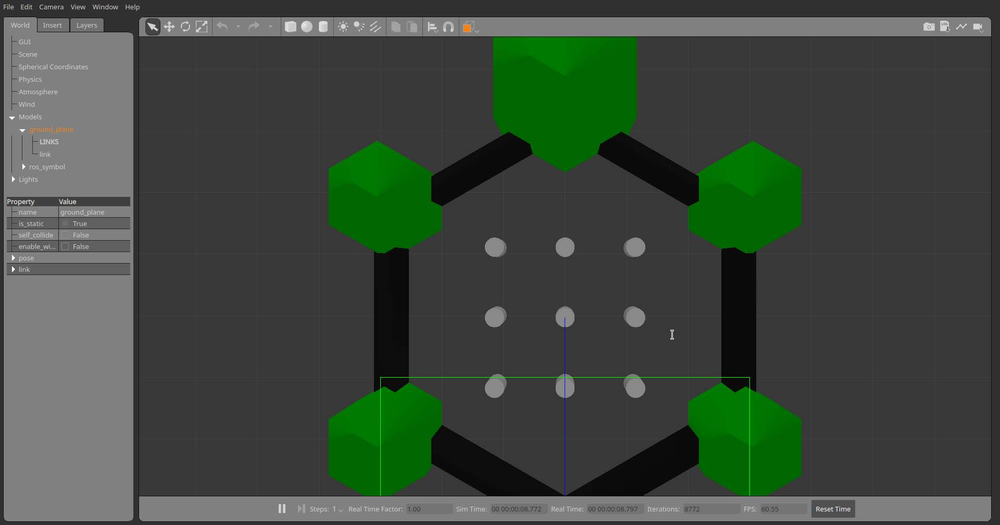
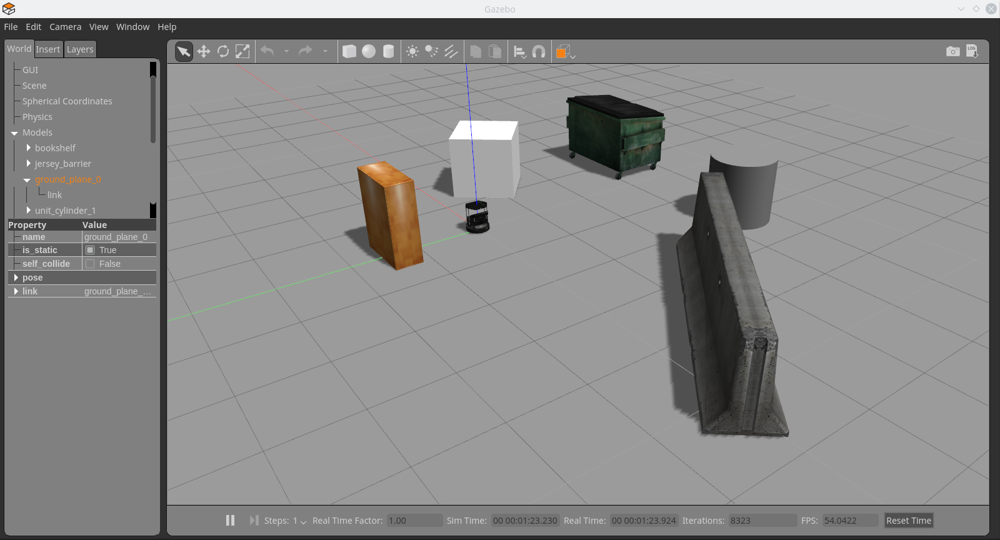
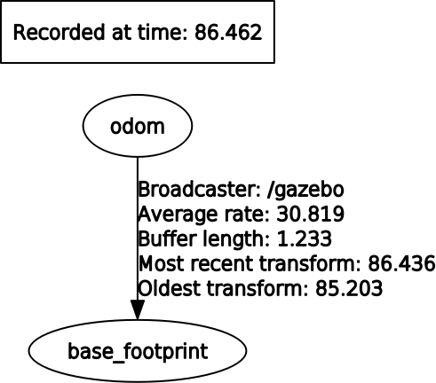
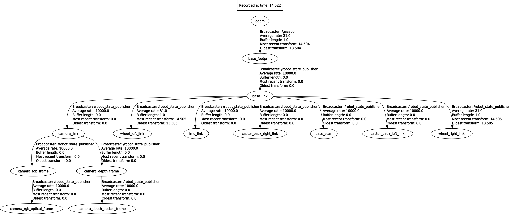

# Лирическое отступление

Позволю себе предположить, что вам не очень понятно, как мы запускаем робота, что для этого нужно сделать, если мы хотим создать и запустить свой прототип... Пока мы пользовались готовыми решениями, мы подошли к тому, что пора бы уже и эту область раскопать =)

> Спойлер, там не так все сложно! А еще наша задача - развернуть launch скрипты и сделать все максимально удобно для наших задач!

Давайте вспомним, какая часть в нашем `tb3_gz_keyboard_rviz.launch`/`tb3_gz_keyboard_slam.launch` отвечает за запуск робота и управление с клавиатуры:
```xml
    <include file="$(find turtlebot3_gazebo)/launch/turtlebot3_world.launch">
    </include>

    <include file="$(find turtlebot3_bringup)/launch/turtlebot3_remote.launch">
    ...
    </include>

    <include file="$(find turtlebot3_teleop)/launch/turtlebot3_teleop_key.launch">
    </include>
```

> Сейчас наша задача - написать launch скрипт, который будет запускать Gazebo по исходным файлам, создавать робота по описанию и базовым файлам, а не после переиспользования через 5й пакет. И не забываем про переменную окружения `TURTLEBOT3_MODEL`, от нее бы тоже избавиться.

Заглянем для начала в файл `turtlebot3_world.launch`:
```xml
<!-- roscat turtlebot3_gazebo turtlebot3_world.launch -->

<launch>
  <!-- Аргументы (ура, сейчас уберем эту надоедливую переменную окружения) -->
  <arg name="model" default="$(env TURTLEBOT3_MODEL)" doc="model type [burger, waffle, waffle_pi]"/>
  <arg name="x_pos" default="-2.0"/>
  <arg name="y_pos" default="-0.5"/>
  <arg name="z_pos" default="0.0"/>

  <!-- Запустить Gazebo -->
  <include file="$(find gazebo_ros)/launch/empty_world.launch">
    <arg name="world_name" value="$(find turtlebot3_gazebo)/worlds/turtlebot3_world.world"/>
    <arg name="paused" value="false"/>
    <arg name="use_sim_time" value="true"/>
    <arg name="gui" value="true"/>
    <arg name="headless" value="false"/>
    <arg name="debug" value="false"/>
  </include>

  <!-- Установить параметру с именем 'robot_description' описание робота -->
  <param name="robot_description" command="$(find xacro)/xacro --inorder $(find turtlebot3_description)/urdf/turtlebot3_$(arg model).urdf.xacro" />

  <!-- Создать робота по описанию из 'robot_description' и аргументам начального положения -->
  <node pkg="gazebo_ros" type="spawn_model" name="spawn_urdf"  args="-urdf -model turtlebot3_$(arg model) -x $(arg x_pos) -y $(arg y_pos) -z $(arg z_pos) -param robot_description" />
</launch>
```

То что надо! Комментарии кратко описывают, что делает каждая часть, а мы перейдем ко второму файлу `turtlebot3_remote.launch`:
```xml
<!-- roscat turtlebot3_bringup turtlebot3_remote.launch -->

<launch>
  ...

  <!-- Оставим самую важную часть, которая нам нужна -->
  <node pkg="robot_state_publisher" type="robot_state_publisher" name="robot_state_publisher">
    <param name="publish_frequency" type="double" value="50.0" />
    <param name="tf_prefix" value="$(arg multi_robot_name)"/>
  </node>
</launch>
```

Опустив все лишнее мы сталкиваемся с запуском `robot_state_publisher`, без которого не строится дерево TF из описания робота.

Осталось последнее, переделать скрипт управления телеметрией (он тоже просил ту переменную окружения), смотрим его:
```xml
<!-- roscat turtlebot3_teleop turtlebot3_teleop_key.launch -->

<launch>
  <!-- Тот самый аргумент -->
  <arg name="model" default="$(env TURTLEBOT3_MODEL)" doc="model type [burger, waffle, waffle_pi]"/>
  <!-- О, так он его в параметр записывает, почему бы не делать этого гобально при создании робота?? -->
  <param name="model" value="$(arg model)"/>

  <!-- Запуск управления по кнопкам -->
  <node pkg="turtlebot3_teleop" type="turtlebot3_teleop_key" name="turtlebot3_teleop_keyboard"  output="screen">
  </node>
</launch>
```

Не очень сложно, просто запуск узла перевода нажатий клавиш в топик `/cmd_vel`. Теперь давайте начнем создавать свой скрипт создания и запуска симуляции робота `tb3_gazebo_start.launch`. Начнем с простого запуска Gazebo с указание описания мира:

```xml
<?xml version="1.0"?>
<launch>
  <include file="$(find gazebo_ros)/launch/empty_world.launch">
    <!-- Да, описание мира все таки возьмем из пакета =) -->
    <arg name="world_name" value="$(find turtlebot3_gazebo)/worlds/turtlebot3_world.world"/>
    <arg name="paused" value="false"/>
    <arg name="use_sim_time" value="true"/>
    <arg name="gui" value="true"/>
    <arg name="headless" value="false"/>
    <arg name="debug" value="false"/>
  </include>
</launch>
```

Запускаем и проверяем, что творится:

```bash
roslaunch study_pkg tb3_gazebo_start.launch
```

<p align="center">

</p>

Таким образом мы запустили симулятор без робота, просто окружение.
Теперь добавим создание робота:

```xml
<?xml version="1.0"?>
<launch>
  <!-- Поставим по-умолчанию вафельку =) -->
  <arg name="model" default="waffle" doc="model type [burger, waffle, waffle_pi]"/>
  <!-- Аргументами можем передать начальное положение робота -->
  <arg name="x_pos" default="-2.0"/>
  <arg name="y_pos" default="-0.5"/>
  <arg name="z_pos" default="0.0"/>

  <include file="$(find gazebo_ros)/launch/empty_world.launch">
    <!-- Да, описание мира все таки возьмем из пакета =) -->
    <arg name="world_name" value="$(find turtlebot3_gazebo)/worlds/turtlebot3_world.world"/>
    <arg name="paused" value="false"/>
    <arg name="use_sim_time" value="true"/>
    <arg name="gui" value="true"/>
    <arg name="headless" value="false"/>
    <arg name="debug" value="false"/>
  </include>

  <!-- Да, описание робота все таки возьмем из пакета =) -->
  <param name="robot_description" command="$(find xacro)/xacro --inorder $(find turtlebot3_description)/urdf/turtlebot3_$(arg model).urdf.xacro" />

  <node pkg="gazebo_ros" type="spawn_model" name="spawn_urdf"  args="-urdf -model turtlebot3_$(arg model) -x $(arg x_pos) -y $(arg y_pos) -z $(arg z_pos) -param robot_description" />
</launch>
```

И снова запускаем и видим следующую картинку:
<p align="center">

</p>

Оп, появилась вафелька! Только если глянуть на дерево TF, то картина не радует:
<p align="center">

</p>

Не хватает того самого `robot_state_publisher`. В результате получаем конечный вид скрипта:

```xml
<?xml version="1.0"?>
<launch>
  <!-- Поставим по-умолчанию вафельку =) -->
  <arg name="model" default="waffle" doc="model type [burger, waffle, waffle_pi]"/>
  <!-- Аргументами можем передать начальное положение робота-->
  <arg name="x_pos" default="-2.0"/>
  <arg name="y_pos" default="-0.5"/>
  <arg name="z_pos" default="0.0"/>
  
  <!-- Запишем в параметр, чтобы вся система знала о типе робота -->
  <param name="model" value="$(arg model)"/>

  <!-- Добавим аргумент, который позволит включать/выключать отображение окна Gazebo при запуске/использовании скрипта -->
  <arg name="gz_gui" default="false"/>

  <include file="$(find gazebo_ros)/launch/empty_world.launch">
    <!-- Да, описание мира все таки возьмем из пакета =) -->
    <arg name="world_name" value="$(find turtlebot3_gazebo)/worlds/turtlebot3_world.world"/>
    <arg name="paused" value="false"/>
    <arg name="use_sim_time" value="true"/>
    <arg name="gui" value="$(arg gz_gui)"/>
    <arg name="headless" value="false"/>
    <arg name="debug" value="false"/>
  </include>

  <!-- Да, описание робота все таки возьмем из пакета =) -->
  <param name="robot_description" command="$(find xacro)/xacro --inorder $(find turtlebot3_description)/urdf/turtlebot3_$(arg model).urdf.xacro" />

  <node pkg="gazebo_ros" type="spawn_model" name="spawn_urdf"  args="-urdf -model turtlebot3_$(arg model) -x $(arg x_pos) -y $(arg y_pos) -z $(arg z_pos) -param robot_description" />

  <!-- Публикуем TF из описания робота -->
  <node pkg="robot_state_publisher" type="robot_state_publisher" name="robot_state_publisher">
    <param name="publish_frequency" type="double" value="50.0" />
  </node>
</launch>
```

> На всякий случай скажу, отображение окна Gazebo не является всей симуляцией, можно работать с роботом без включения окна Gazebo, так как весь робот и физика в симуляторе - набор формул и математики, а не визуальное представление (разделение на gzclient [окно отображения] и gzserver [физический движок]).

Запустим и проверим, что все на месте:
<p align="center">

</p>

И теперь создадим скрипт, который просто запустит симулятор без отображения и позволит управлять роботом с клавиатуры с отображением в Rviz (точнее исправим `tb3_gz_keyboard_rviz.launch`):
```xml
<?xml version="1.0"?>
<launch>
    <include file="$(find study_pkg)/launch/tb3_gazebo_start.launch">
    </include>

    <node name="rviz" pkg="rviz" type="rviz" args="-d $(find study_pkg)/rviz/tb3_scan_tf.rviz"/>

    <!-- Можно написать свой launch с запуском узла, но так как нет никаких настроек - оставим -->
    <node pkg="turtlebot3_teleop" type="turtlebot3_teleop_key" name="turtlebot3_teleop_keyboard"  output="screen">
    </node>
</launch>
```

Просто выглядит, не так ли? Убеждаемся, что все работает!

> Если вы все таки переживаете за отображение - не волнуйтесь, просто запустите `gzclient` в отдельном терминале и вот вам отображение.

## Что дальше?

Попробуйте переделать скрипт `tb3_gz_keyboard_slam.launch` для запуска симуляции через новый скрипт создания робота и среды. Думаю, у вас получится! И можно еще покатать =).

На данном этапе можно сказать, что мы научились выделять определенные назначения скриптов. Это важно при построении системы, так как размещение всех конечных вызовов узлов в единственном скрипте без вложенности раздувает этот скрипт и делает его нечитаемые.

## P.S.

На самом деле, то, что мы пытались избавиться от переменной окружения, было задумано разработчиками специально, так как они предполагают простой запуск нескольких таких роботов в симуляторе. Чтобы управлять каждый типом робота, были и добавлен аргумент с указанием конкретной модели. Но так как для наших задач важнее управлять одним - мы упрощает под себя =).


