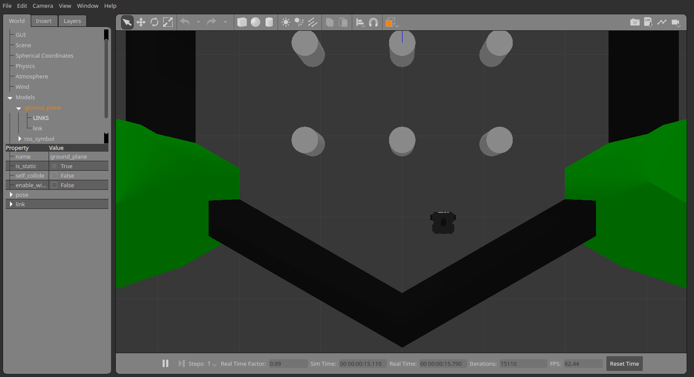

# Лирическое отступление

Позволю себе предположить, что вам не очень понятно, как мы запускаем робота, что для этого нужно сделать, если мы хотим создать и запустить свой прототип... Пока мы пользовались готовыми решениями, мы подошли к тому, что пора бы уже и эту область раскопать =)

> Спойлер, там не так все сложно!

Давайте вспомним, какая часть в нашем `start_turtlebot_sim.launch` отвечает за запуск робота:
```xml
  <!-- Start turtlebot Gazebo simulation -->
  <include file="$(find turtlebot_gazebo)/launch/turtlebot_world.launch"/>
```

Все остальное в нашем скрипте мы написали сами (ну как, взяты примеры настроек, тем не менее мы напрямую управляем стандартными узлами ROS, а в этом случае мы используем какой-то launch-файл для быстрого старта!

> Для тех, кого устраивает положение дел - welcome на следующий топик. В данном топике мы разберем данную строку как можно подробнее, чтобы получить первое понимание дела. Аналогично мы будем делать при создании своей симулируемой машинки =)

Ну и для начала мы смотрим в глубь файл утилитой `roscat`
```bash
roscat turtlebot_gazebo turtlebot_world.launch
```
```xml
<launch>
	<!-- Аргумент названия файла мира -->
  <arg name="world_file"  default="$(env TURTLEBOT_GAZEBO_WORLD_FILE)"/>

  <!-- Некоторые параметры для черепашки -->
  <arg name="base"      value="$(optenv TURTLEBOT_BASE kobuki)"/> <!-- create, roomba -->
  <arg name="battery"   value="$(optenv TURTLEBOT_BATTERY /proc/acpi/battery/BAT0)"/>  <!-- /proc/acpi/battery/BAT0 --> 
  <arg name="gui" default="true"/>
  <arg name="stacks"    value="$(optenv TURTLEBOT_STACKS hexagons)"/>  <!-- circles, hexagons --> 
  <arg name="3d_sensor" value="$(optenv TURTLEBOT_3D_SENSOR kinect)"/>  <!-- kinect, asus_xtion_pro --> 

  <!-- Стандартный запуск Gazebo - дальше нет смысла идти, здесь точка запуска Gazebo -->
  <include file="$(find gazebo_ros)/launch/empty_world.launch">
    <arg name="use_sim_time" value="true"/>
    <arg name="debug" value="false"/>
    <arg name="gui" value="$(arg gui)" />
    <!-- А вот здесь указываем мир, который хотим запустить -->
    <arg name="world_name" value="$(arg world_file)"/>
  </include>

  <!-- Запуск системы представления Turtlebot - надо будет капнуть поглубже -->
  <include file="$(find turtlebot_gazebo)/launch/includes/$(arg base).launch.xml">
    <arg name="base" value="$(arg base)"/>
    <arg name="stacks" value="$(arg stacks)"/>
    <arg name="3d_sensor" value="$(arg 3d_sensor)"/>
  </include>
  
  <!-- Запуск публикации состояния робота - нужен для TF представления робота, глубже не копаем -->
  <node pkg="robot_state_publisher" type="robot_state_publisher" name="robot_state_publisher">
    <param name="publish_frequency" type="double" value="30.0" />
  </node>
  
  <!-- Узел (тут правда нодлет) преобразования RGBD изображения в LaserScan, преобразуем к запуску обычног узла -->
  <!-- Fake laser -->
  <node pkg="nodelet" type="nodelet" name="laserscan_nodelet_manager" args="manager"/>
  <node pkg="nodelet" type="nodelet" name="depthimage_to_laserscan"
        args="load depthimage_to_laserscan/DepthImageToLaserScanNodelet laserscan_nodelet_manager">
    <param name="scan_height" value="10"/>
    <param name="output_frame_id" value="/camera_depth_frame"/>
    <param name="range_min" value="0.45"/>
    <remap from="image" to="/camera/depth/image_raw"/>
    <remap from="scan" to="/scan"/>
  </node>
</launch>
```

Я позволил себе добавить немного комментов, но давайте практиковаться, чтобы поразобраться!

## Gazebo

Начнем с ходьбы - запуск Gazebo с желаемым миром, напишем новый launch-файл `turtlebot_gazebo.launch`
```xml
<?xml version="1.0"?>
<launch>
	<!-- GAZEBO -->

	<!-- Аргумент названия файла мира (берем из пакета turtlebot_gazebo пока не создавали свой) -->
	<!-- В комментариях закрыты варианты из пакета -->
  <arg name="world_file"  default="$(find turtlebot_gazebo)/worlds/playground.world"/>
  <!-- <arg name="world_file"  default="$(find turtlebot_gazebo)/worlds/empty.world"/> -->
  <!-- <arg name="world_file"  default="$(find turtlebot_gazebo)/worlds/corridor.world"/> -->
  
  <!-- Аргумент включения GUI представления, иногда оно не нужно, проверим позже =) -->
  <!-- Вынесено отдельным аргументом, чтобы можно было управлять при запуске скрипта -->
  <arg name="gui" default="true"/>
  
  <!-- Стандартный запуск Gazebo - дальше нет смысла идти, здесь точка запуска Gazebo -->
  <include file="$(find gazebo_ros)/launch/empty_world.launch">
  	<!-- Работа ведется не в реальном времени, а в симулируемом -->
    <arg name="use_sim_time" value="true"/>
    <!-- Отключим отладочную инфу - лишнее на данный момент -->
    <arg name="debug" value="false"/>
    <!-- Включим/отключим GUI в завимиости от того, что имеет аргумент -->
    <arg name="gui" value="$(arg gui)" />
    <!-- А вот здесь указываем мир, который хотим запустить -->
    <arg name="world_name" value="$(arg world_file)"/>
  </include>

</launch>
```

[Подробнее про симулруемое время](http://wiki.ros.org/Clock).  

Запускаем
```bash
roslaunch study_pkg turtlebot_gazebo.launch
```
И вот, что получилось:
<p align="center">

</p>

Объявляют вас наученным запускать Gazebo из launch-файла с определенным миром =) Предлагаю попробовать поставить мир `corridor.world` и запустить =)

## Turtlebot подробнее

Разберем запуск робота 
```xml
<include file="$(find turtlebot_gazebo)/launch/includes/$(arg base).launch.xml">
```
База (аргумент `base`) у нас `kobuki`, поэтому
```bash
roscat turtlebot_gazebo kobuki.launch.xml
```
```xml
<launch>
  <arg name="base"/>
  <arg name="stacks"/>
  <arg name="3d_sensor"/>
  
  <!-- Вот здесь самый сок и происходит, задаем аргумент, который потом передадим в `robot_description` -->
  <arg name="urdf_file" default="$(find xacro)/xacro.py '$(find turtlebot_description)/robots/$(arg base)_$(arg stacks)_$(arg 3d_sensor).urdf.xacro'" />
  <!-- Настраиваем параметр `robot_description`, который будет нашим описанием робота -->
  <param name="robot_description" command="$(arg urdf_file)" />
  
  <!-- Вызываем узел `spawn_model`, который делает всю работу! -->
  <!-- Он из параметра `robot_description` создает представление робота! -->
  <!-- Gazebo model spawner -->
  <node name="spawn_turtlebot_model" pkg="gazebo_ros" type="spawn_model"
        args="$(optenv ROBOT_INITIAL_POSE) -unpause -urdf -param robot_description -model mobile_base"/>
  
	<!-- Дальше не очень интересно -->
	<!-- 1. Создаем мультиплексор для различных видов управения, упростим это для себя -->
	<!-- 2. Создается датчик "бампер" =) -->
  <!-- Velocity muxer -->
  <node pkg="nodelet" type="nodelet" name="mobile_base_nodelet_manager" args="manager"/>
  <node pkg="nodelet" type="nodelet" name="cmd_vel_mux"
        args="load yocs_cmd_vel_mux/CmdVelMuxNodelet mobile_base_nodelet_manager">
    <param name="yaml_cfg_file" value="$(find turtlebot_bringup)/param/mux.yaml" />
    <remap from="cmd_vel_mux/output" to="mobile_base/commands/velocity"/>
  </node>

  <!-- Bumper/cliff to pointcloud (not working, as it needs sensors/core messages) -->
  <include file="$(find turtlebot_bringup)/launch/includes/kobuki/bumper2pc.launch.xml"/>
</launch>
```

Давайте перетащим наиболее важные кусочки и разберем их. Теперь наш файл `turtlebot_gazebo.launch` будет вот таким:
```xml
<?xml version="1.0"?>
<launch>
	<!-- GAZEBO -->

	<!-- Аргумент названия файла мира (берем из пакета turtlebot_gazebo пока не создавали свой) -->
	<!-- В комментариях закрыты варианты из пакета -->
  <arg name="world_file"  default="$(find turtlebot_gazebo)/worlds/playground.world"/>
  <!-- <arg name="world_file"  default="$(find turtlebot_gazebo)/worlds/empty.world"/> -->
  <!-- <arg name="world_file"  default="$(find turtlebot_gazebo)/worlds/corridor.world"/> -->
  
  <!-- Аргумент включения GUI представления, иногда оно не нужно, проверим позже =) -->
  <!-- Вынесено отдельным аргументом, чтобы можно было управлять при запуске скрипта -->
  <arg name="gui" default="true"/>
  
  <!-- Стандартный запуск Gazebo - дальше нет смысла идти, здесь точка запуска Gazebo -->
  <include file="$(find gazebo_ros)/launch/empty_world.launch">
  	<!-- Работа ведется не в реальном времени, а в симулируемом -->
    <arg name="use_sim_time" value="true"/>
    <!-- Отключим отладочную инфу - лишнее на данный момент -->
    <arg name="debug" value="false"/>
    <!-- Включим/отключим GUI в завимиости от того, что имеет аргумент -->
    <arg name="gui" value="$(arg gui)" />
    <!-- А вот здесь указываем мир, который хотим запустить -->
    <arg name="world_name" value="$(arg world_file)"/>
  </include>

  <!-- TURTLEBOT -->

  <!-- Вот здесь самый сок и происходит, задаем аргумент, который потом передадим в `robot_description` -->
  <!-- Подставим жесткое описание из файла `kobuki_hexagons_kinect.urdf.xacro` -->
  <arg name="urdf_file" default="$(find xacro)/xacro.py '$(find turtlebot_description)/robots/kobuki_hexagons_kinect.urdf.xacro'" />
  <!-- Настраиваем параметр `robot_description`, который будет нашим описанием робота -->
  <param name="robot_description" command="$(arg urdf_file)" />
  
  <!-- Вызываем узел `spawn_model`, который делает всю работу! -->
  <!-- Он из параметра `robot_description` создает представление робота! -->
  <node name="spawn_turtlebot_model" pkg="gazebo_ros" type="spawn_model"
        args="$(optenv ROBOT_INITIAL_POSE) -unpause -urdf -param robot_description -model mobile_base"/>
  
</launch>

```

Ура, связались с описанием файла, теперь запускаем
```bash
roslaunch study_pkg turtlebot_gazebo.launch
```

И вот, что получилось:
<p align="center">

</p>

Взглянем на топики, которые сейчас есть в экосистеме:
```
/camera/depth/camera_info
/camera/depth/image_raw
/camera/depth/points
/camera/parameter_descriptions
/camera/parameter_updates
/camera/rgb/camera_info
/camera/rgb/image_raw
/camera/rgb/image_raw/compressed
/camera/rgb/image_raw/compressed/parameter_descriptions
/camera/rgb/image_raw/compressed/parameter_updates
/camera/rgb/image_raw/compressedDepth
/camera/rgb/image_raw/compressedDepth/parameter_descriptions
/camera/rgb/image_raw/compressedDepth/parameter_updates
/camera/rgb/image_raw/theora
/camera/rgb/image_raw/theora/parameter_descriptions
/camera/rgb/image_raw/theora/parameter_updates
/clock
/gazebo/link_states
/gazebo/model_states
/gazebo/parameter_descriptions
/gazebo/parameter_updates
/gazebo/set_link_state
/gazebo/set_model_state
/gazebo_gui/parameter_descriptions
/gazebo_gui/parameter_updates
/joint_states
/mobile_base/commands/motor_power
/mobile_base/commands/reset_odometry
/mobile_base/commands/velocity
/mobile_base/events/bumper
/mobile_base/events/cliff
/mobile_base/sensors/imu_data
/odom
/rosout
/rosout_agg
/tf
```

По топикам все достаточно интересно:  
- Есть пространство `/camera` - оно отвечает за кинект, это подтверждается топиками этого пространства;  
- Пространство `/gazebo` - это пространство симулятора, для нас оно сейчас неинтересно;  
- Пространство `/mobile_base` - пространство робота, в нем мы видим, что подпространство `commands` соответствует заданию определенных величин для робота (`motor_power` - мощность моторов [тип топика нестандартный, берется из пакета `kobuki_msgs`], `velocity` - скорость вращения, `reset_odometry` - сброс одометрии).

И посмотрим на систему TF:
```bash
rosrun rqt_tf_tree rqt_tf_tree
```
<p align="center">

</p>

Из TF инфы маловато, есть всего две СК: одометрия и СК робота. Тут сейчас ничего не скажешь и мы увидим, чего не хватает в системе.

А давайте запустим rviz и попробуем увидеть робота через визуализацию:
<p align="center">

</p>

Судя по ряду ошибок, для полноценного отображения rviz не хватает большого количества TF преобразований. На самом деле это логично, так как модель робота состоит из частей, распределенных между собой, а TF позволяет сообщить о том, как они между собой располагаются. Если пролистать, мы увидим, что количество их большое. Причиной этому - сложная композиция робота, но возможность починить - простая. 

# Последние тонкости

Нам не хватает специального узла [`robot_state_publisher`](http://wiki.ros.org/robot_state_publisher), который может публиковать данные TF на основе описания робота `robot_description`. Такой узел запускается в файле `turtlebot_world.launch` пакета `turtlebot_gazebo`:
```xml
  <node pkg="robot_state_publisher" type="robot_state_publisher" name="robot_state_publisher">
    <param name="publish_frequency" type="double" value="30.0" />
  </node>
```

Так что добавляем аналогичную строку в наш файл.

> По секрету всему свету, `robot_state_publisher` подписывается на топик `/joint_states`, который публикуется при запуске модели робота (момент запуска узла `spawn_model`). В этом топике летят состояния узлов робота, а с помощью `robot_state_publisher` эти состояния переходят в вид TF.

Ну и сразу добавим узел [`depthimage_to_laserscan`](http://wiki.ros.org/depthimage_to_laserscan), который будет генерировать данный `LaserScan` на основе RGBD данных с кинекта. В результате, файл будет иметь следующий вид:
```xml
<?xml version="1.0"?>
<launch>
	<!-- GAZEBO -->

	<!-- Аргумент названия файла мира (берем из пакета turtlebot_gazebo пока не создавали свой) -->
	<!-- В комментариях закрыты варианты из пакета -->
  <arg name="world_file"  default="$(find turtlebot_gazebo)/worlds/playground.world"/>
  <!-- <arg name="world_file"  default="$(find turtlebot_gazebo)/worlds/empty.world"/> -->
  <!-- <arg name="world_file"  default="$(find turtlebot_gazebo)/worlds/corridor.world"/> -->
  
  <!-- Аргумент включения GUI представления, иногда оно не нужно, проверим позже =) -->
  <!-- Вынесено отдельным аргументом, чтобы можно было управлять при запуске скрипта -->
  <arg name="gui" default="true"/>
  
  <!-- Стандартный запуск Gazebo - дальше нет смысла идти, здесь точка запуска Gazebo -->
  <include file="$(find gazebo_ros)/launch/empty_world.launch">
  	<!-- Работа ведется не в реальном времени, а в симулируемом -->
    <arg name="use_sim_time" value="true"/>
    <!-- Отключим отладочную инфу - лишнее на данный момент -->
    <arg name="debug" value="false"/>
    <!-- Включим/отключим GUI в завимиости от того, что имеет аргумент -->
    <arg name="gui" value="$(arg gui)" />
    <!-- А вот здесь указываем мир, который хотим запустить -->
    <arg name="world_name" value="$(arg world_file)"/>
  </include>

  <!-- TURTLEBOT -->

  <!-- Вот здесь самый сок и происходит, задаем аргумент, который потом передадим в `robot_description` -->
  <!-- Подставим жесткое описание из файла `kobuki_hexagons_kinect.urdf.xacro` -->
  <arg name="urdf_file" default="$(find xacro)/xacro.py '$(find turtlebot_description)/robots/kobuki_hexagons_kinect.urdf.xacro'" />
  <!-- Настраиваем параметр `robot_description`, который будет нашим описанием робота -->
  <param name="robot_description" command="$(arg urdf_file)" />
  
  <!-- Вызываем узел `spawn_model`, который делает всю работу! -->
  <!-- Он из параметра `robot_description` создает представление робота! -->
  <node name="spawn_turtlebot_model" pkg="gazebo_ros" type="spawn_model"
        args="$(optenv ROBOT_INITIAL_POSE) -unpause -urdf -param robot_description -model mobile_base"/>
  
  <!-- Опубликуем TF преобразования на основе описания `robot_description` -->
  <node pkg="robot_state_publisher" type="robot_state_publisher" name="robot_state_publisher">
    <param name="publish_frequency" type="double" value="30.0" />
  </node>

  <!-- Запускаем преобразование из RGBD изображения в LaserScan -->
	<node pkg="depthimage_to_laserscan" type="depthimage_to_laserscan" name="depthimage_to_laserscan">
    <!-- То, какую высоту учитывать присплющивании точек в линию -->
    <param name="scan_height" value="10"/>
    <!-- Название TF СК, которая будет считаться СК для псевдолидара -->
    <param name="output_frame_id" value="/camera_depth_frame"/>
    <!-- Минимальная дистанция для скана -->
    <param name="range_min" value="0.45"/>
    <!-- Исходное изображение с каналом Depth (цвет нас все таки не интересует) -->
    <!-- На этот топик подписываемся -->
    <remap from="image" to="/camera/depth/image_raw"/>
    <!-- Этот топик публикуется как результат -->
    <remap from="scan" to="/scan"/>
  </node>
</launch>
```

Вот теперь запускаем `rosrun rqt_tf_tree rqt_tf_tree` и видим, что TF преобразований на порядок больше, проверяем в rviz:
<p align="center">

</p>

Вот и знакомая нам черепашка! Можете сами проверить работоспособность все топиков датчиков =)

# Что дальше?

В этом топике мы написали замену launch-файла `turtlebot_world.launch` из пакета `turtlebot_gazebo`. Наш файл `turtlebot_gazebo.launch` имеет аналогичный функционал. По факту мы упростили работу узлов, исключив различные нодлеты и теперь в нашей реализации работают только понятные нам узлы. Единственным расхождением является узел телеуправления (с клавиатуры). Так что напишем свою реализацию под названием `turtlebot_teleop.launch`:
```xml
<?xml version="1.0"?>
<launch>
  <!-- turtlebot_teleop_key already has its own built in velocity smoother -->
  <node pkg="turtlebot_teleop" type="turtlebot_teleop_key" name="turtlebot_teleop_keyboard"  output="screen">
    <param name="scale_linear" value="0.5" type="double"/>
    <param name="scale_angular" value="1.5" type="double"/>
    <!-- Вот главная точка расхождения, нужно мапировать к другому топику! -->
    <remap from="turtlebot_teleop_keyboard/cmd_vel" to="mobile_base/commands/velocity"/>
  </node>
</launch>
```

А также можем поправить файл запуска симулятора с rviz и узлом построения карты к следующему виду:
```xml
<?xml version="1.0"?>
<launch>
  <arg name="rtabmap" default="true"/>

  <!-- Start turtlebot Gazebo simulation -->
  <!-- <include file="$(find turtlebot_gazebo)/launch/turtlebot_world.launch"/> -->
  <!-- Replaced with our new file! -->
  <include file="$(find study_pkg)/launch/turtlebot_gazebo.launch">
    <arg name="gui" value="false"/>
  </include>

  <!-- Start Rviz with required views -->
  <node name="rviz" pkg="rviz" type="rviz" args="-d $(find study_pkg)/rviz/turtlebot.rviz" />

  <!-- Start mapping node, method is based on <rtabmap> argument -->
  <include unless="$(arg rtabmap)" file="$(find study_pkg)/launch/gmapping.launch"/>
  <include     if="$(arg rtabmap)" file="$(find study_pkg)/launch/rtabmap.launch">
    <arg name="rtabmapviz" value="false"/>
  </include>
</launch>
```

> Обратите внимание, аргументы `gui` и `rtabmapviz` установлены в `false` чтобы отключить отображение GUI Gazebo и RTABmapViz. Все таки, все данные видны в rviz =)

<p align="center">

</p>

Как видно, все работает как и прежде, неплохой результат!

# В итоге

Давайте еще раз посмотрим на наш новый файл `turtlebot_gazebo.launch`
```xml
<?xml version="1.0"?>
<launch>
	<!-- GAZEBO -->

	<!-- Аргумент названия файла мира (берем из пакета turtlebot_gazebo пока не создавали свой) -->
	<!-- В комментариях закрыты варианты из пакета -->
  <arg name="world_file"  default="$(find turtlebot_gazebo)/worlds/playground.world"/>
  <!-- <arg name="world_file"  default="$(find turtlebot_gazebo)/worlds/empty.world"/> -->
  <!-- <arg name="world_file"  default="$(find turtlebot_gazebo)/worlds/corridor.world"/> -->
  
  <!-- Аргумент включения GUI представления, иногда оно не нужно, проверим позже =) -->
  <!-- Вынесено отдельным аргументом, чтобы можно было управлять при запуске скрипта -->
  <arg name="gui" default="true"/>
  
  <!-- Стандартный запуск Gazebo - дальше нет смысла идти, здесь точка запуска Gazebo -->
  <include file="$(find gazebo_ros)/launch/empty_world.launch">
  	<!-- Работа ведется не в реальном времени, а в симулируемом -->
    <arg name="use_sim_time" value="true"/>
    <!-- Отключим отладочную инфу - лишнее на данный момент -->
    <arg name="debug" value="false"/>
    <!-- Включим/отключим GUI в завимиости от того, что имеет аргумент -->
    <arg name="gui" value="$(arg gui)" />
    <!-- А вот здесь указываем мир, который хотим запустить -->
    <arg name="world_name" value="$(arg world_file)"/>
  </include>

  <!-- TURTLEBOT -->

  <!-- Вот здесь самый сок и происходит, задаем аргумент, который потом передадим в `robot_description` -->
  <!-- Подставим жесткое описание из файла `kobuki_hexagons_kinect.urdf.xacro` -->
  <arg name="urdf_file" default="$(find xacro)/xacro.py '$(find turtlebot_description)/robots/kobuki_hexagons_kinect.urdf.xacro'" />
  <!-- Настраиваем параметр `robot_description`, который будет нашим описанием робота -->
  <param name="robot_description" command="$(arg urdf_file)" />
  
  <!-- Вызываем узел `spawn_model`, который делает всю работу! -->
  <!-- Он из параметра `robot_description` создает представление робота! -->
  <node name="spawn_turtlebot_model" pkg="gazebo_ros" type="spawn_model"
        args="$(optenv ROBOT_INITIAL_POSE) -unpause -urdf -param robot_description -model mobile_base"/>
  
  <!-- Опубликуем TF преобразования на основе описания `robot_description` -->
  <node pkg="robot_state_publisher" type="robot_state_publisher" name="robot_state_publisher">
    <param name="publish_frequency" type="double" value="30.0" />
  </node>

  <!-- Запускаем преобразование из RGBD изображения в LaserScan -->
	<node pkg="depthimage_to_laserscan" type="depthimage_to_laserscan" name="depthimage_to_laserscan">
    <!-- То, какую высоту учитывать присплющивании точек в линию -->
    <param name="scan_height" value="10"/>
    <!-- Название TF СК, которая будет считаться СК для псевдолидара -->
    <param name="output_frame_id" value="/camera_depth_frame"/>
    <!-- Минимальная дистанция для скана -->
    <param name="range_min" value="0.45"/>
    <!-- Исходное изображение с каналом Depth (цвет нас все таки не интересует) -->
    <!-- На этот топик подписываемся -->
    <remap from="image" to="/camera/depth/image_raw"/>
    <!-- Этот топик публикуется как результат -->
    <remap from="scan" to="/scan"/>
  </node>
</launch>
```

Можно увидеть, что исключая запуск Gazebo, а также узел псевдолидара (создание `LaserScan`), мы лишь запускаем узлы `spawn_model` и `robot_state_publisher`. Второй публикует данные TF из описания, а первый делает всю работу.

Можно обратиться к файлу описания робота `kobuki_hexagons_kinect.urdf.xacro`:
```bash
roscat turtlebot_description kobuki_hexagons_kinect.urdf.xacro
```

Вы увидите, что он тянет множество других файлов, демонстрироваться они здесь не будут, так как с этого момента начинается тема создания описания робота. Из-за того, что робот `turtlebot` очень комплексный, то тематику создания робота логично начать с более простых образцов, а `turtlebot` будет для нас пока закрытым готовым решением =)

> Для особо любопытных - можете прогуляться по файлам и посмотреть, как создан `turtlebot` и его датчики.
