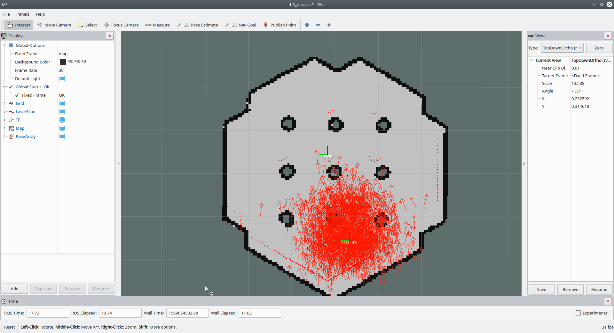
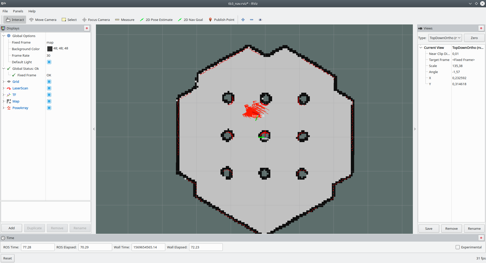
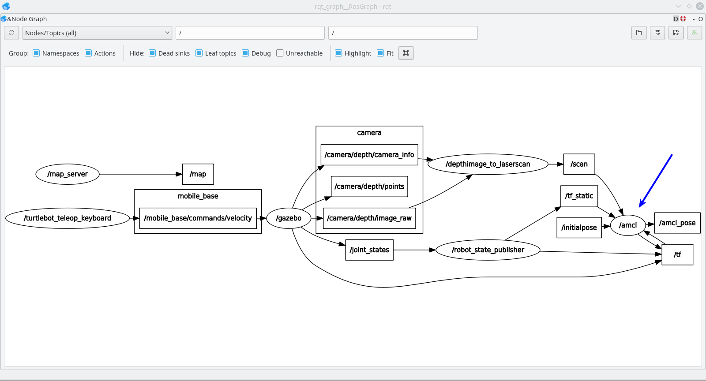
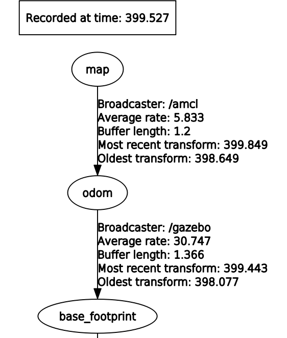

# AMCL - Adaptive Monte-Carlo Localization

Помните, мы когда-то пользовались узлом `map_saver` из пакета [map_server](http://wiki.ros.org/map_server)? Мы таким образом сохранили карту в файлы каринки и описания. Самое время пользоваться ими! Для этого мы посмотрим на интересный алогритм [AMCL](http://wiki.ros.org/amcl) в ROS (за основу возьмем `amcl.launch` из `turtlebot3_navigation`).

Создаем файл `amcl.launch` в нашем пакете:
```xml
<?xml version="1.0"?>
<launch>
	<!-- Arguments -->
	<arg name="scan_topic"     default="scan"/>
	<arg name="initial_pose_x" default="0.0"/>
	<arg name="initial_pose_y" default="0.0"/>
	<arg name="initial_pose_a" default="0.0"/>
	<!-- Добавим агрументов, чтобы можно было настроить фреймы -->
	<arg name="set_base_frame" default="base_footprint"/>
	<arg name="set_odom_frame" default="odom"/>

	<!-- AMCL -->
	<node pkg="amcl" type="amcl" name="amcl">
		<param name="min_particles"             value="500"/>
		<param name="max_particles"             value="3000"/>
		<param name="kld_err"                   value="0.02"/>
		<param name="update_min_d"              value="0.20"/>
		<param name="update_min_a"              value="0.20"/>
		<param name="resample_interval"         value="1"/>
		<param name="transform_tolerance"       value="0.5"/>
		<param name="recovery_alpha_slow"       value="0.00"/>
		<param name="recovery_alpha_fast"       value="0.00"/>
		<param name="initial_pose_x"            value="$(arg initial_pose_x)"/>
		<param name="initial_pose_y"            value="$(arg initial_pose_y)"/>
		<param name="initial_pose_a"            value="$(arg initial_pose_a)"/>
		<param name="gui_publish_rate"          value="50.0"/>

		<remap from="scan"                      to="$(arg scan_topic)"/>
		<param name="laser_max_range"           value="3.5"/>
		<param name="laser_max_beams"           value="180"/>
		<param name="laser_z_hit"               value="0.5"/>
		<param name="laser_z_short"             value="0.05"/>
		<param name="laser_z_max"               value="0.05"/>
		<param name="laser_z_rand"              value="0.5"/>
		<param name="laser_sigma_hit"           value="0.2"/>
		<param name="laser_lambda_short"        value="0.1"/>
		<param name="laser_likelihood_max_dist" value="2.0"/>
		<param name="laser_model_type"          value="likelihood_field"/>

		<param name="odom_model_type"           value="diff"/>
		<param name="odom_alpha1"               value="0.1"/>
		<param name="odom_alpha2"               value="0.1"/>
		<param name="odom_alpha3"               value="0.1"/>
		<param name="odom_alpha4"               value="0.1"/>
		<param name="odom_frame_id"             value="$(arg set_odom_frame)"/>
		<param name="base_frame_id"             value="$(arg set_base_frame)"/>
	</node>
</launch>
```

Опять же, как и с gmapping, алгоритм имеет ряд параметров, а также входные и выходные данные, начнем с параметров по-умолчанию.

В этот раз сразу напишем новый файл, который будет представлять стадию локализации на уже известной карте (+ запуск симулятора, телеуправление), под названием `tb3_gz_keyboard_localization.launch`:
```xml
<?xml version="1.0"?>
<launch>
	<!-- Запускаем симулятор с роботом -->
    <include file="$(find study_pkg)/launch/tb3_gazebo_start.launch">
    </include>

	<!-- Подгрузка сохраненной карты, чтобы робот уже имел представление о пространстве -->
	<node name="map_server" pkg="map_server" type="map_server" args="$(find study_pkg)/maps/map.yaml" />

	<!-- Запуск AMCL для локализации на карте -->
	<!-- Поставим начальные координаты близко к координатам создания робота, -->
	<!-- 	но с небольшим промахом -->
	<include file="$(find study_pkg)/launch/amcl.launch">
		<arg name="initial_pose_x" default="-1.5"/>
		<arg name="initial_pose_y" default="-0.3"/>
		<arg name="initial_pose_a" default="0.0"/>
	</include>

	<!-- Телеуправление -->
    <node pkg="turtlebot3_teleop" type="turtlebot3_teleop_key" name="turtlebot3_teleop_keyboard"  output="screen">
    </node>
</launch>
```

В новом файле пропали методы построения карты, зато используется узел `map_server`, который предоставляет нам статическую карту в топик `/map`. А также запускается наш launch-файл c алгоритмом AMCL.

Для создания конфигурации Rviz под задачу локализации мы скопируем файл `tb3_slam.rviz` рядом (в ту же папку), но уже с названием `tb3_localization.rviz`. Это позволит начать конфигурацию не с нуля, а затем сохранить все в нужный файл. Также напишем файл запуска Rviz под визуализацию решения задачи локализации `rviz_localization_view.launch`: 
```xml
<?xml version="1.0"?>
<launch>
  <node name="rviz" pkg="rviz" type="rviz" args="-d $(find study_pkg)/rviz/tb3_localization.rviz" />
</launch>
```

Стартуем
```bash
roslaunch study_pkg tb3_gz_keyboard_localization.launch
roslaunch study_pkg rviz_localization_view.launch
```
После этого настроим отображение топика `/particlecloud`, который содержит информацию об облаке частиц с вероятным расположением робота.

> **Не забудьте сделать** `Save Config` - это сохранит информацию о настройке в тот файл, через который мы открыли конфигурацию Rviz (`tb3_localization.rviz`).

Должен получиться вот такой вид:
<p align="center">

</p>

Ой, что-то пошло не так? На самом деле все ок, большая куча стрелочек посередине - это предположения алгоритма о том, где может находиться робот. То, что не сошелся скан лазера и карта - мы сообщили AMCL о начальном положении вот так:
```xml
<!-- tb3_gz_keyboard_localization.launch -->
	<arg name="initial_pose_x" default="-1.5"/>
	<arg name="initial_pose_y" default="-0.3"/>
	<arg name="initial_pose_a" default="0.0"/>
```
Загрузка симуляции при этом происходила вот так:
```xml
<!-- tb3_gazebo_start.launch -->
	<arg name="x_pos" default="-2.0"/>
	<arg name="y_pos" default="-0.5"/>
	<arg name="z_pos" default="0.0"/>
```

В реальности часто бывает, что начало локализации робота происходит не из точки начала записи карты. Для этого AMCL и нужен - покатайте робота по карте и понаблюдайте за результатом. Должно получиться наподобии такого:
<p align="center">

</p>

> В нашем случае усложняет дело сильная симметричность и отсутсвие разнообразности на карте. На деле отклонения реального положения и того, что задано алгоритму, могут быть достаточно большими и при достаточной информации на карте (углы, выступы, другие особенности, за которые можно зацепиться) алгоритм справляется также хорошо.

Как видно, карта сошлась с показаниями сканера и за это спасибо алгоритму AMCL!

Можете еще поэкспериметрировать, но на этом принцип работы всё, задача AMCL - поставить соответствие между СК карты и одометрии так, чтобы сканы ложились максимально точно на карту.

# Вход/выход, как работает?

Аналогично с методами построения карт разберем и этот метод на предмет входных и выходных данных. Я просто покажу картинки из `rqt_graph` и `rqt_tf_tree`:

<p align="center">

</p>

<p align="center">

</p>

По топикам можно еще отметить, что в документации говорится о подписке на топик `/map`, но так как карта статическая, то ее достаточно один раз получить и больше не требовать (AMCL делает это через сервис).  

По TF преобразованиям и так было видно, что AMCL модифицирует связь `odom` и `map`, чтобы свести соответствие к максимуму.

Думаю, на этом можно рассказ про AMCL завершить, параметры можете покрутить сами, в вашем распоряжении есть целый скрипт запуска `amcl.launch`. Успехов!
