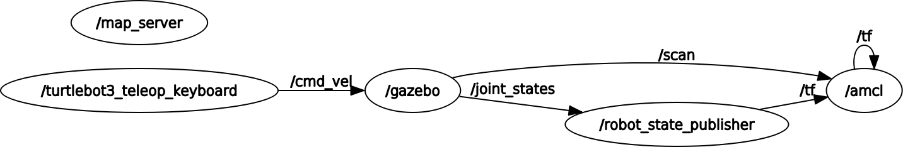

# AMCL - Adaptive Monte-Carlo Localization

Помните, мы когда-то пользовались узлом `map_saver` из пакета `map_server`? Мы таким образом сохранили карту в файлы каринки и описания. Самое время пользоваться ими! Для этого мы посмотрим на интересный алогритм [AMCL](http://wiki.ros.org/amcl) в ROS.

Создаем файл `amcl.launch` в нашем пакете:
```xml
<?xml version="1.0"?>
<launch>
	<node pkg="amcl" type="amcl" name="amcl" output="screen">
	  <!-- Publish scans from best pose at a max of 10 Hz -->
	  <param name="odom_model_type" value="diff"/>
	  <param name="odom_alpha5" value="0.1"/>
	  <param name="transform_tolerance" value="0.2" />
	  <param name="gui_publish_rate" value="10.0"/>
	  <param name="laser_max_beams" value="30"/>
	  <param name="min_particles" value="500"/>
	  <param name="max_particles" value="5000"/>
	  <param name="kld_err" value="0.05"/>
	  <param name="kld_z" value="0.99"/>
	  <param name="odom_alpha1" value="0.2"/>
	  <param name="odom_alpha2" value="0.2"/>
	  <!-- translation std dev, m -->
	  <param name="odom_alpha3" value="0.8"/>
	  <param name="odom_alpha4" value="0.2"/>
	  <param name="laser_z_hit" value="0.5"/>
	  <param name="laser_z_short" value="0.05"/>
	  <param name="laser_z_max" value="0.05"/>
	  <param name="laser_z_rand" value="0.5"/>
	  <param name="laser_sigma_hit" value="0.2"/>
	  <param name="laser_lambda_short" value="0.1"/>
	  <param name="laser_lambda_short" value="0.1"/>
	  <param name="laser_model_type" value="likelihood_field"/>
	  <!-- <param name="laser_model_type" value="beam"/> -->
	  <param name="laser_likelihood_max_dist" value="2.0"/>
	  <param name="update_min_d" value="0.2"/>
	  <param name="update_min_a" value="0.5"/>
	  <param name="odom_frame_id" value="odom"/>
	  <param name="resample_interval" value="1"/>
	  <param name="transform_tolerance" value="0.1"/>
	  <param name="recovery_alpha_slow" value="0.0"/>
	  <param name="recovery_alpha_fast" value="0.0"/>
	</node>
</launch>
```

Опять же, как и с прошлыми алгоритмами, алгоритм имеет ряд параметров, а также входные и выходные данные, начнем с параметров по-умолчанию.

Также напишем новый файл, который будет представлять стадию локализации на уже известной карте, под названием `start_turtlebot_sim_amcl.launch`:
```xml
<?xml version="1.0"?>
<launch>
  <!-- Start turtlebot Gazebo simulation -->
  <!-- <include file="$(find turtlebot_gazebo)/launch/turtlebot_world.launch"/> -->
  <!-- Replaced with our new file! -->
  <include file="$(find study_pkg)/launch/turtlebot_gazebo.launch">
    <arg name="gui" value="false"/>
  </include>

  <!-- Start Rviz with required views -->
  <node name="rviz" pkg="rviz" type="rviz" args="-d $(find study_pkg)/rviz/turtlebot.rviz" />

  <!-- Start map server to provide our saved map -->
  <node name="map_server" pkg="map_server" type="map_server" args="$(find study_pkg)/maps/map.yaml" />

  <!-- Start localization in map -->
  <include file="$(find study_pkg)/launch/amcl.launch" />
</launch>
```

В новом файле пропали методы построения карты, зато используется узел `map_server`, который предоставляет нам статическую карту в топик `/map`. А также запускается наш launch-файл c алгоритмом AMCL.

Стартуем
```bash
roslaunch study_pkg start_turtlebot_sim_amcl.launch
```
и настраиваем отображение топика `/amcl_pose` и TF под названиями `base_footage`, `odom` и `map`. Сохраняем настройку rviz под названием `turtlebot_amcl.rviz`. После этого модифицируем строку в файле `start_turtlebot_sim_amcl.launch` c
```xml
  <node name="rviz" pkg="rviz" type="rviz" args="-d $(find study_pkg)/rviz/turtlebot.rviz" />
```
на
```xml
  <node name="rviz" pkg="rviz" type="rviz" args="-d $(find study_pkg)/rviz/turtlebot_amcl.rviz" />
```

И перезапускаем нашу систему
```bash
roslaunch study_pkg start_turtlebot_sim_amcl.launch
```

У меня восстановился такой вид
<p align="center">

</p>

Разберемся, как видно справа от робота, кубик лег ровно на карту. Фиолетовый круг и красная стрелка - локализация робота с некоторой степенью неуверенности. Под роботом виднеются надписи - это отображения TF систем, увидите их лучше в движении робота.

После запуска телеуправления и катания по карте видно, что круг под роботом уменьшается, а СК одометрии и карты находятся очень близко друг к другу. Это говорит о том, что изначальный запуск системы был произведен в идеальном положении. Теперь подкинем подлянку системе, создадим начальное расхождение.

Как видно из launch-файла `turtlebot_gazebo.launch`, в нем при создании робота используется переменная `ROBOT_INITIAL_POSE`:
```xml
  <!-- Вызываем узел `spawn_model`, который делает всю работу! -->
  <!-- Он из параметра `robot_description` создает представление робота! -->
  <node name="spawn_turtlebot_model" pkg="gazebo_ros" type="spawn_model"
        args="$(optenv ROBOT_INITIAL_POSE) -unpause -urdf -param robot_description -model mobile_base"/>
```

Аналогичная вещь используется и в скрипте пакета `turtlebot_gazebo`. Запустим систему с указанием начального положения, смещенного на 1 метр вправо:
```bash
ROBOT_INITIAL_POSE='-y -1' roslaunch study_pkg start_turtlebot_sim_amcl.launch
```

И вот какую страшную картину видим...
<p align="center">

</p>

Епрст, кубик прямо перед нами, а по карте он должен быть правее! Не боимся, катаем чуток (запустить телеметрию не забудьте), опираясь только на наше зрение, после этого можно наблюдать слдующий феномен:
<p align="center">

</p>

Как видно, кубик встал на свое место, а СК одометрии сдвинуась относительно СК карты примерно на -1 метр, как мы и задали. Это говорит о том, что алгоритм AMCL смог свести нынешние показания скана и исходную карту таким образом, чтобы получить максимальное соответствие.

Можете еще поэкспериметрировать, но на этом принцип работы всё, задача AMCL - поставить соответствие между СК карты и одометрии так, чтобы сканы ложились максимально точно на карту.

# Вход/выход, как работает?

Аналогично с методами построения карт разберем и этот метод на предмет входных и выходных данных. Я просто покажу картинки из `rqt_graph` и `rqt_tf_tree`:

<p align="center">

</p>

<p align="center">

</p>

По топикам можно еще отметить, что в документации говорится о подписке на топик `/map`, но так как карта статическая, то ее достаточно один раз получить и больше не требовать.  

По TF преобразованиям и так было видно, что AMCL модифицирует связь `odom` и `map`, чтобы свести соответствие к максимуму. Думаю, на это можно рассказ про AMCL завершить, параметры можете покрутить сами, в вашем распоряжении есть целый скрипт запуска `amcl.launch`. Успехов!
