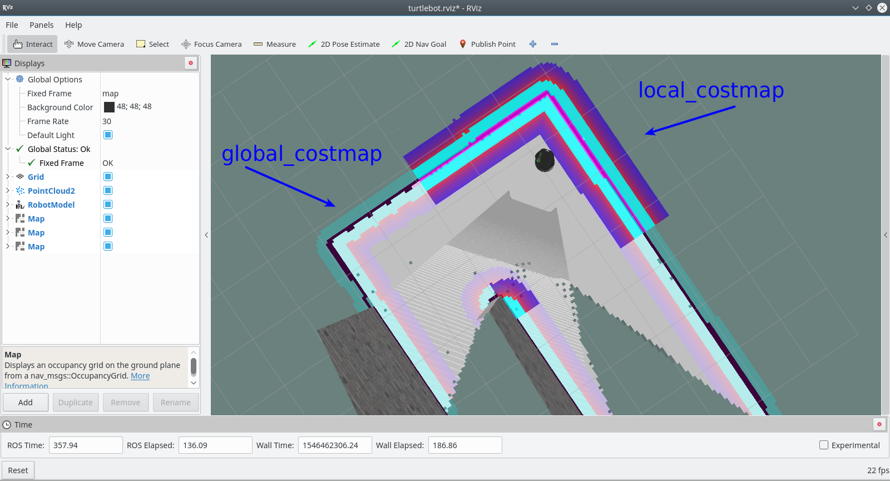
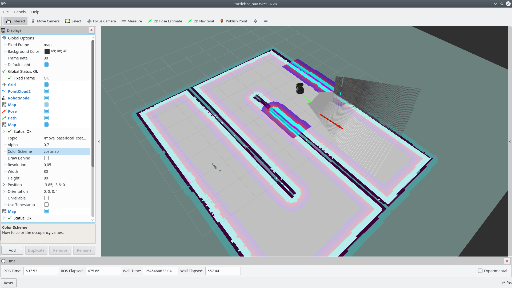

# Пора двигаться вперед!

Настало время поговорить о самостоятельном движении робота. В этой теме речь пойдет о пакете [`move_base`](http://wiki.ros.org/move_base), который располагается в стэке пакетов [`navigation`](http://wiki.ros.org/navigation). Для начала мы будем стартовать с примера катания уже знакомого Turtlebot на карте коридора.

Давайте создадим файл запуска `start_turtlebot_sim_nav.launch` в нашем пакете:
```xml
<?xml version="1.0"?>
<launch>
  <arg name="rtabmap" default="true"/>

  <!-- Start Turtlebot in Gazebo -->
  <include file="$(find study_pkg)/launch/turtlebot_gazebo.launch">
  	<!-- Disable GUI -->
    <arg name="gui" value="false"/>
    <!-- Set map to Corridor from turtlebot_gazebo pkg -->
    <arg name="world_file" value="$(find turtlebot_gazebo)/worlds/corridor.world"/>
  </include>

  <!-- Start Rviz with required views -->
  <node name="rviz" pkg="rviz" type="rviz" args="-d $(find study_pkg)/rviz/turtlebot.rviz" />

  <!-- Start mapping node, method is based on <rtabmap> argument -->
  <include unless="$(arg rtabmap)" file="$(find study_pkg)/launch/gmapping.launch"/>
  <include     if="$(arg rtabmap)" file="$(find study_pkg)/launch/rtabmap.launch">
    <arg name="rtabmapviz" value="false"/>
  </include>

  <!-- Whaaat?? -->
  <include file="$(find study_pkg)/launch/move_base.launch"/>
</launch>
```

Скрипт знакомый, запускаем Gazebo без мордахи (GUI), Rviz, RTABmap метод для построения карты и тайный скрипт `move_base.launch` из нашего пакета, которого еще нет.

Если прогуляться по скриптам запуска, то можно увидеть, что основной запуск узла `move_base` происходит из пакета `turtlebot_navigation` файла `move_base.launch.xml`, так что прочитаем его
```bash
roscat turtlebot_navigation move_base.launch.xml
```
```xml
<!-- 
    ROS navigation stack with velocity smoother and safety (reactive) controller
-->
<launch>
  <include file="$(find turtlebot_navigation)/launch/includes/velocity_smoother.launch.xml"/>
  <include file="$(find turtlebot_navigation)/launch/includes/safety_controller.launch.xml"/>
  
  <arg name="odom_frame_id"   default="odom"/>
  <arg name="base_frame_id"   default="base_footprint"/>
  <arg name="global_frame_id" default="map"/>
  <arg name="odom_topic" default="odom" />
  <arg name="laser_topic" default="scan" />
  <arg name="custom_param_file" default="$(find turtlebot_navigation)/param/dummy.yaml"/>

  <node pkg="move_base" type="move_base" respawn="false" name="move_base" output="screen">
    <rosparam file="$(find turtlebot_navigation)/param/costmap_common_params.yaml" command="load" ns="global_costmap" />
    <rosparam file="$(find turtlebot_navigation)/param/costmap_common_params.yaml" command="load" ns="local_costmap" />   
    <rosparam file="$(find turtlebot_navigation)/param/local_costmap_params.yaml" command="load" />   
    <rosparam file="$(find turtlebot_navigation)/param/global_costmap_params.yaml" command="load" />
    <rosparam file="$(find turtlebot_navigation)/param/dwa_local_planner_params.yaml" command="load" />
    <rosparam file="$(find turtlebot_navigation)/param/move_base_params.yaml" command="load" />
    <rosparam file="$(find turtlebot_navigation)/param/global_planner_params.yaml" command="load" />
    <rosparam file="$(find turtlebot_navigation)/param/navfn_global_planner_params.yaml" command="load" />
    <!-- external params file that could be loaded into the move_base namespace -->
    <rosparam file="$(arg custom_param_file)" command="load" />
    
    <!-- reset frame_id parameters using user input data -->
    <param name="global_costmap/global_frame" value="$(arg global_frame_id)"/>
    <param name="global_costmap/robot_base_frame" value="$(arg base_frame_id)"/>
    <param name="local_costmap/global_frame" value="$(arg odom_frame_id)"/>
    <param name="local_costmap/robot_base_frame" value="$(arg base_frame_id)"/>
    <param name="DWAPlannerROS/global_frame_id" value="$(arg odom_frame_id)"/>

    <remap from="cmd_vel" to="navigation_velocity_smoother/raw_cmd_vel"/>
    <remap from="odom" to="$(arg odom_topic)"/>
    <remap from="scan" to="$(arg laser_topic)"/>
  </node>
</launch>
```

Файл содержит много нового и интересного, давайте создадим у себя файл `move_base.launch` с необходимым нам содержимым, чтобы взять только необходимое из этого файла:
```xml
<?xml version="1.0"?>
<launch>
  <!-- Настроим аргументы, начнем с наших названий TF -->
  <arg name="odom_frame_id"   default="odom"/>
  <arg name="base_frame_id"   default="base_footprint"/>
  <arg name="global_frame_id" default="map"/>
  <!-- Добавим в качестве аргументов названия наших топиков -->
  <arg name="odom_topic" default="odom" />
  <arg name="laser_topic" default="scan" />

  <!-- Как вы помните, аргументы launch-файлов можно задавать при запуске, поэтому это очень удобный механизм -->

  <!-- Запускаем move_base узел -->
  <node pkg="move_base" type="move_base" respawn="false" name="move_base" output="screen">
    <!-- Импортируем файлы с параметрами -->
    <!-- Начнем с файла параметров общих для global_costmap и local_costmap -->
    <rosparam file="$(find study_pkg)/navigation/costmap_common_params.yaml" command="load" ns="global_costmap" />
    <rosparam file="$(find study_pkg)/navigation/costmap_common_params.yaml" command="load" ns="local_costmap" />   

    <!-- Импортируем отдельные параметры для global_costmap и local_costmap -->
    <rosparam file="$(find study_pkg)/navigation/local_costmap_params.yaml" command="load" />   
    <rosparam file="$(find study_pkg)/navigation/global_costmap_params.yaml" command="load" />
    <!-- Параметры специально для узла move_base -->
    <rosparam file="$(find study_pkg)/navigation/move_base_params.yaml" command="load" />

    <!-- Параметры для глобального и локального планеров -->
    <rosparam file="$(find study_pkg)/navigation/global_planner_params.yaml" command="load" />
    <rosparam file="$(find study_pkg)/navigation/dwa_local_planner_params.yaml" command="load" />
    
    <!-- Переопределим ранее заданные параметры -->
    <!-- reset frame_id parameters using user input data -->
    <param name="global_costmap/global_frame" value="$(arg global_frame_id)"/>
    <param name="global_costmap/robot_base_frame" value="$(arg base_frame_id)"/>
    <param name="local_costmap/global_frame" value="$(arg odom_frame_id)"/>
    <param name="local_costmap/robot_base_frame" value="$(arg base_frame_id)"/>
    <param name="DWAPlannerROS/global_frame_id" value="$(arg odom_frame_id)"/>

    <!-- Переопределим ранее заданные параметры -->
    <param name="DWAPlannerROS/max_rot_vel" value="0.5"/>
    <param name="base_global_planner" value="global_planner/GlobalPlanner"/>

    <!-- Правильно смапируем топики для связи с move_base -->
    <remap from="cmd_vel" to="mobile_base/commands/velocity"/>
    <remap from="odom" to="$(arg odom_topic)"/>
    <remap from="scan" to="$(arg laser_topic)"/>
  </node>
</launch>
```

А также скопируем к себе в пакет настройки, из которых берутся параметры для работы `move_base`. Положим и в папку `navigation`: 
> При неоднозначном выборе выбирайте путь, который начинается с `/opt/ros/kinetic/share/turtlebot_navigation/param`

```bash
roscd study_pkg
mkdir navigation
roscp turtlebot_navigation costmap_common_params.yaml navigation
roscp turtlebot_navigation local_costmap_params.yaml navigation
roscp turtlebot_navigation global_costmap_params.yaml navigation
roscp turtlebot_navigation move_base_params.yaml navigation
roscp turtlebot_navigation global_planner_params.yaml navigation
roscp turtlebot_navigation dwa_local_planner_params.yaml navigation
```

Немного разберемся с тем, что происходит в файле `move_base.launch`. Заданием аргументов и запуском узла уже никого не удивишь, а вот внутри запуска узла идет настройка приватных параметров, причем это делается не через тэг `<param>`, а через `<rosparam>` и команду `load`. На самом деле это аналогично тому, что мы будет передавать огромное количество параметров через тэги `<param>`, просто завернули это в файлик. Глянем, например, в файл `dwa_local_planner_params.yaml` в нашем пакете в папке `navigation`:
```yaml
DWAPlannerROS:

# Robot Configuration Parameters - Kobuki
  max_vel_x: 0.5  # 0.55
  min_vel_x: 0.0 

  max_vel_y: 0.0  # diff drive robot
  min_vel_y: 0.0  # diff drive robot

  max_trans_vel: 0.5 # choose slightly less than the base's capability
  min_trans_vel: 0.1  # this is the min trans velocity when there is negligible rotational velocity
  trans_stopped_vel: 0.1

  # Warning!
  #   do not set min_trans_vel to 0.0 otherwise dwa will always think translational velocities
  #   are non-negligible and small in place rotational velocities will be created.

  max_rot_vel: 5.0  # choose slightly less than the base's capability
  min_rot_vel: 0.4  # this is the min angular velocity when there is negligible translational velocity
  rot_stopped_vel: 0.4
```

Здесь приведен не весь файл, а лишь часть и особенно хочется обратить внимание на эту строку `max_rot_vel: 5.0`. Для начала, таким образом задается пространство параметров с указанием включения пространств имен. Например, при импорте файла в качестве приватного параметра для узла `move_base` для параметра `max_rot_vel` будет установлено следующее имя:
```
/move_base/DWAPlannerROS/max_rot_vel
```
Сначала идет имя ушла, так как импорт идет в качестве приватного параметра, далее `DWAPlannerROS`, так как он задан первым (обратите внимание на отступ), а дальше имя самого параметра.

Теперь конкретнее про этот параметр, такое значение при работе приводит к постоянному вращению робота, так как его все время выкидывает на вращение. В результате нам нужно установить значение `0.5` и можно это сделать двумя способами:  
- поменять значение в самом файле,  
- переустановить значение приватного параметра для узла после импорта всего файла.

Мы воспользовались вторым методом в этом кусочке `move_base.launch` (мы еще и название глобального планера переопределили):
```xml
    <!-- Переопределим ранее заданные параметры -->
    <param name="DWAPlannerROS/max_rot_vel" value="0.5"/>
    <param name="base_global_planner" value="global_planner/GlobalPlanner"/>
```

Значит с параметрами понятно, таким образом, если вы посмотрите на содержание всех файлов, можно увидеть количество параметров и поймете, почему они распределяются по файлам. Теперь к более высшим материям перейдем.

# Высшие материи

При работе с `move_base` мы сталкиваемся с новыми понятиями:  
- local_costmap  
- global_costmap  
- local_planner  
- global_planner

Первая пара `*_costmap` являются картами стоимостей, если коряво перевести с английского. Тут конечно же не без [ссылочки](http://wiki.ros.org/costmap_2d) =)

<p align="center">

</p>

По сути costmap карты являются лишь оценками пространства для возможного движения. Как видно на изображении, локальный costmap выделяется ярче, чем глобальный, но суть остается сутью, это оценка того, как далеко от препятствий можно двигаться. Возле стен costmap имеет максимальное значение и по мере удаления от них он уменьшается и становится свободнее. Таким образом планировщики движения понимают, где робот может пройти, а где нет.

Вторая пара `*_planner` являются теми самыми планировщиками, которые делают за нас всю грязную работу по построению пути. Полагаю, не надо объяснять, что именно они формируют траекторию, которой робот следует. А какова разница между глобальным и локальным планировщиками? Глобальный строит путь по всей карте, да, прям по всей. Нет, без исключения, по всей известной карте. Локальный же в этом плане более халявный, он строит только в "локальной" области. Размер этой области задается в параметрах `move_base`. То есть, глобальный планировщик строит весь путь, а локальный потихоньку, по кусочку, пытается ему следовать. Но не все так просто, в плане внезапных препятствий спасает нас именно локальный планировщик, так как он не просто оценивает всю карту, но еще и смотрит на последние данные о препятствиях от `LaserScan`, что позволяет перестраивать маршрут "на ходу" при появлении препятствий. Меньше слов: глобальный планировщик смотрит карту и строит полный путь, локальный динамичненько перестраивает небольшой маршрут на основе полного пути.

Аналогичная разница и между локальным и глобальным costmaps, один работает на всю карту, а другой в локальной области. Но давайте взглянем на схему работы `move_base`:
<p align="center">

</p>
(стырено с http://wiki.ros.org/move_base)

Ну, повторим, кто-то дает нам `map`, на основе этого формируется `global_costmap`. Эта информация идет в `global_planner` и в `local_costmap`. В свою очередь `local_planner` смотрит на глобальный путь от `global_planner` и на `global_costmap` и формирует небольшой путь, которому уже следует сам робот командами `cmd_vel` с типом `geometry_msgs/Twist`.

Такс, все понятно?) Предлагаю сделать перерыв на чай =)

# Попив чаёчек

Давайте уже стартовать, итак слишком много наговорили, устанавливаем недостающий пакет и запускаем файл:
```bash
sudo apt install ros-kinetic-global-planner
roslaunch study_pkg start_turtlebot_sim_nav.launch
```

> Для большей визуализации можете добавить следующие поля и сохранить настройку rviz с небольшой модификацией launch-файла:  
- Отобразить топик `/move_base/current_goal`  
- Отобразить топик `/move_base/GlobalPlanner/plan`  
- Отобразить топик `/move_base/local_costmap/costmap` с установкой `Color Scheme` = `costmap`   
- Отобразить топик `/move_base/global_costmap/costmap` с установкой `Color Scheme` = `costmap`  

> Я сохранил это под названием `turtlebot_nav.rviz` и модифицировал `start_turtlebot_sim_nav.launch`:
```xml
  <node name="rviz" pkg="rviz" type="rviz" args="-d $(find study_pkg)/rviz/turtlebot_nav.rviz" />
```

<p align="center">

</p>

Как видно, робот видит стену, вокруг неизвестность...) Именно поэтому мы не запускали мордочку Gazebo. С помощью указанной кнопки попробуйте позадавать различные точки и направления и посмотреть, как отрабатывает робот - развлекайтесь =) 

> Если у вас не запускается сразу такое представление, имеет смысл немного подождать =)

<p align="center">

</p>

> В качестве испытания попробуйте поставить недостижимую точку снаружи коридора =)

# Поиграли? Поехали дальше..

Вот и я наигрался, такая картина получилась:

<p align="center">

</p>

Давайте немного разберемся, сейчас мы задавали движение из графического интерфейса, а что же делать, если мы хотим задавать ее программно? Вот здесь есть хороший [гайдик](http://wiki.ros.org/navigation/Tutorials/SendingSimpleGoals), который сможет описать последовательность. По факту в нем используются actions, то есть способ взаимодействия, который ранее уже был разобран. Думаю, вы сможете в нем разобраться, так как там нет ничего суперневообразимого, а я на этом откланяюсь с надеждой на то, что полученные знания по `move_base` у вас останутся еще на пару постов, так как после создания роботов мы планируем вернуться к `move_base`, но с уже новым подходом. Успехов! =)
