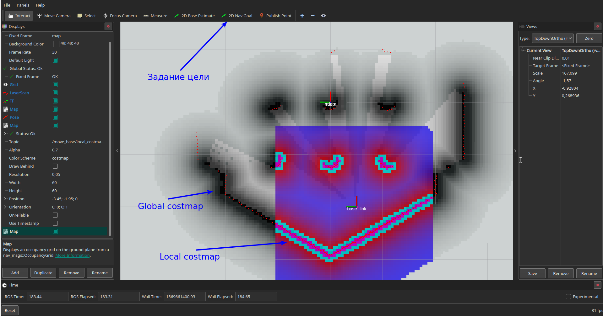
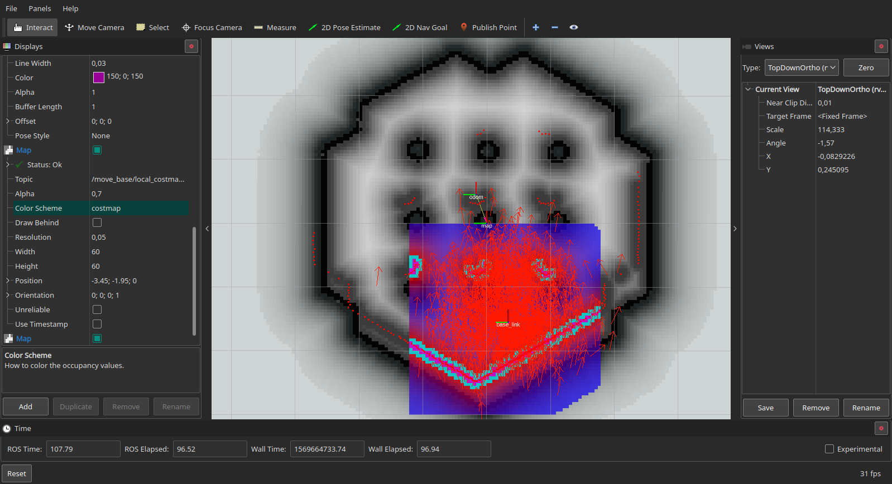

# Пора двигаться вперед!

Настало время поговорить о самостоятельном движении робота. В этой теме речь пойдет о пакете [move_base](http://wiki.ros.org/move_base), который располагается в стеке пакетов [navigation](http://wiki.ros.org/navigation). Для начала мы будем стартовать с примера катания и построения карты.

> Подготовка, скачаем докальный планнер [dwa_local_planner](http://wiki.ros.org/dwa_local_planner), который используется в примере:
```bash
sudo apt install ros-melodic-dwa-local-planner
```

Начнем, с того, что подготовим все необходимое, чтобы запускать указание цели и работала автономная навигация (сам ехал к заданной точке) робота в пространстве. Скопируем следующие файлы из `turtlebot3_navigation/param` к себе в папку `mb_cfg`:
- `costmap_common_params_waffle.yaml`
- `local_costmap_params.yaml`
- `global_costmap_params.yaml`
- `move_base_params.yaml`
- `dwa_local_planner_params_waffle.yaml`

Сделать это можно через `roscp`:
```bash
roscp turtlebot3_navigation costmap_common_params_waffle.yaml <указываете папку, куда положить>
```

Для нашего случая будет такой ряд команд:
```bash
# Установим переменную, чтобы не копировать одно и то же
COPY_TARGET=`rospack find study_pkg`/mb_cfg
# Создадим папку, если такой еще не было
mkdir -p $COPY_TARGET
# Копируем файлы
roscp turtlebot3_navigation costmap_common_params_waffle.yaml $COPY_TARGET
roscp turtlebot3_navigation local_costmap_params.yaml $COPY_TARGET
roscp turtlebot3_navigation global_costmap_params.yaml $COPY_TARGET
roscp turtlebot3_navigation move_base_params.yaml $COPY_TARGET
roscp turtlebot3_navigation dwa_local_planner_params_waffle.yaml $COPY_TARGET
```

Далее создадим скрипт запуска всего необходимого для `move_base`, назовем, не поверите, `move_base.launch` (за основу возьмем `turtlebot3_navigation/move_base.launch`):
```xml
<?xml version="1.0"?>
<launch>
  <!-- Аргументы -->
  <arg name="cmd_vel_topic" default="/cmd_vel" />
  <arg name="odom_topic" default="odom" />

  <!-- Запуск move_base -->
  <node pkg="move_base" type="move_base" respawn="false" name="move_base" output="screen">
      <!-- Подгрузим параметры из файлов конфигурации -->
      <param name="base_local_planner" value="dwa_local_planner/DWAPlannerROS" />
      <rosparam file="$(find study_pkg)/mb_cfg/costmap_common_params_waffle.yaml" command="load" ns="global_costmap" />
      <rosparam file="$(find study_pkg)/mb_cfg/costmap_common_params_waffle.yaml" command="load" ns="local_costmap" />
      <rosparam file="$(find study_pkg)/mb_cfg/local_costmap_params.yaml" command="load" />
      <rosparam file="$(find study_pkg)/mb_cfg/global_costmap_params.yaml" command="load" />
      <rosparam file="$(find study_pkg)/mb_cfg/move_base_params.yaml" command="load" />
      <rosparam file="$(find study_pkg)/mb_cfg/dwa_local_planner_params_waffle.yaml" command="load" />
      <!-- Передаем названия топиков для работы -->
      <remap from="cmd_vel" to="$(arg cmd_vel_topic)"/>
      <remap from="odom" to="$(arg odom_topic)"/>
  </node>
</launch>
```

Осталось только сделать скрипт, который будет запускать симулятор, построение карты и навигацию на карте (уже без телеуправления), назовем `tb3_gz_mb_slam.launch`:
```xml
<?xml version="1.0"?>
<launch>
    <include file="$(find study_pkg)/launch/tb3_gazebo_start.launch">
    </include>

    <include file="$(find study_pkg)/launch/gmapping.launch">
    </include>

    <include file="$(find study_pkg)/launch/move_base.launch">
    </include>
</launch>
```

Как и ранее, на потребуется дополнительно настроить Rviz отображение для этой задачи, поэтому копируем `tb3_slam.rviz` в `tb3_slam_mb.rviz`. Осталось написать скрипт отображения `rviz_slam_mb_view.launch`:
```xml
<?xml version="1.0"?>
<launch>
  <node name="rviz" pkg="rviz" type="rviz" args="-d $(find study_pkg)/rviz/tb3_slam_mb.rviz" />
</launch>
```

Запускаем:
```bash
roslaunch study_pkg tb3_gz_mb_slam.launch
roslaunch study_pkg rviz_slam_mb_view.launch
```

Немного донастройки:
- Добавляем отображение топика `/move_base/current_goal`;
- Топика `/move_base/local_costmap/costmap` ---> параметры: `Color Scheme` -> `costmap`;
- Топика `/move_base/global_costmap/costmap`;
- Топика `/move_base/NavfnROS/plan` ---> параметры: `Line Style` -> `Billboard`;
- Топика `/move_base/DWAPlannerROS/global_plan` ---> параметры: `Line Style` -> `Billboard`, `Color` -> `150; 0; 150`;
- Сохраняем конфиг.

Вот такая картинка должна получиться:
<p align="center">

</p>

Давайте притормозим и разберемся, что за costmap тут появились и где наш `current_goal`:
- Global costmap
  - глобальная карта;
  - покрывает все данные о карте местности;
  - по ней глобальный планнер (в нашем случае NavfnROS) строит маршрут;
- Local costmap
  - локальная карта;
  - покрывает заданную область вокруг робота;
  - может работать с часто обновляемыми данными (например, сканнер), чтобы реагировать на изменения карты в ходе работы (например, человек зашел);
  - локальный планнер (в нашем случае DWA), учитывая эту карту и маршрут от глобального планнера, строит локальный маршрут, по которому уже и движется робот;

Сама концепция costmap предполагает, что точки препятствий на карте (черные точки на глобальной карте, красные на локальной)имеют наибольшую стоимость и строить любой маршрут (локальный/глобальный) через них не выгодно. Как видно, стоимость при удалении от препятствия уменьшается.

Возвращается к Rviz и клацаем на `2D Nav Goal`, затем нажимаем (не отпускаем!) на местности и тянем, чтобы указать направление. После этого у нас появляется отображение топика `/move_base/current_goal`:
Вот такая картинка должна получиться:
<p align="center">

</p>

Здесь фиолетовой линией отображена работа глобального планнера [NavfnROS](http://wiki.ros.org/navfn), зеленой - локальнго планнера [dwa_local_planner](http://wiki.ros.org/dwa_local_planner). Катайтесь с удовольствием!

## Разбираемся, как все работает

Как только вы поняли, что накатались и выпили чаечка, то начнем с простого, топики:
<p align="center">

</p>

Ну, тут добавилась куча топиков от `move_base`, часть мы визуализировали, часть вы можете попробовать и познакомиться сами, но, например, если вы хотите узнать описание топика `/move_base/global_costmap/footprint`, то надо лезть не в доки [move_base](http://wiki.ros.org/move_base), а сразу в доки [global_costmap](http://wiki.ros.org/costmap_2d), так как `move_base` работает по принципу запуска плагинов - каждый плагин это отдельное управление, но работает через один узел `move_base`.

В отношении TF ничего не поменялось, так как `move_base` никак не влияет на положение робота и отношение TF фреймов - он лишь задает команды управления на основе информации о том, где сейчас робот и какая карта вокруг.

Теперь осталось понять, как настраивать все это чудо, так как в launch было мало инфы про параметры (но все таки была) в отличии от запуска gmapping или AMCL. С этим на самом деле все просто, заглянем в `mb_cfg/dwa_local_planner_params_waffle.yaml`:
```yaml
DWAPlannerROS:

# Robot Configuration Parameters
  max_vel_x: 0.26
  min_vel_x: -0.26

  max_vel_y: 0.0
  min_vel_y: 0.0

# The velocity when robot is moving in a straight line
  max_trans_vel:  0.26
  min_trans_vel:  0.13

  max_rot_vel: 1.82
  min_rot_vel: 0.9

  acc_lim_x: 2.5
  acc_lim_y: 0.0
  acc_lim_theta: 3.2 

# Goal Tolerance Parametes
  xy_goal_tolerance: 0.05
  yaw_goal_tolerance: 0.17
  latch_xy_goal_tolerance: false

# Forward Simulation Parameters
  sim_time: 2.0
  vx_samples: 20
  vy_samples: 0
  vth_samples: 40
  controller_frequency: 10.0

# Trajectory Scoring Parameters
  path_distance_bias: 32.0
  goal_distance_bias: 20.0
  occdist_scale: 0.02
  forward_point_distance: 0.325
  stop_time_buffer: 0.2
  scaling_speed: 0.25
  max_scaling_factor: 0.2

# Oscillation Prevention Parameters
  oscillation_reset_dist: 0.05

# Debugging
  publish_traj_pc : true
  publish_cost_grid_pc: true
```

Тут есть куча параметров, которые просто подгружаются через команду `rosparam load` в систему, а `move_base` при запуске плагина `DWAPlannerROS` уже читает их и настраивается. По такому принципу настроены глобальный и локальный costmap, сам `move_base` и все остальное, что касается пакетов, поэтому при желании разобраться - обращаемся к документации пакета и экспериментируем с параметрами.

## Больше практики

Окей, строить карту с помощью указания цели мы научились, а что если нам нужна навигация на известной местности? Есть у меня для вас - совместим задачу локализации и управление с помощью `move_base`!

Вообще, для начала покажу схему работы `move_base` при решении задачи локализации:
<p align="center">

</p>
(стырено с http://wiki.ros.org/move_base)

А теперь к реализации, начнем с `tb3_gz_mb_localization.launch`:
```xml
<?xml version="1.0"?>
<launch>
    <include file="$(find study_pkg)/launch/tb3_gazebo_start.launch">
    </include>

    <node name="map_server" pkg="map_server" type="map_server" args="$(find study_pkg)/maps/map.yaml" />

    <include file="$(find study_pkg)/launch/amcl.launch">
        <arg name="initial_pose_x" default="-1.5"/>
        <arg name="initial_pose_y" default="-0.3"/>
        <arg name="initial_pose_a" default="0.0"/>
    </include>

    <include file="$(find study_pkg)/launch/move_base.launch">
    </include>
</launch>
```

Не сложно уже в этом разбираться, не так ли? Теперь визуализация, копируем `tb3_localization.rviz` в `tb3_localization_mb.rviz` и делаем скрипт `rviz_localization_mb_view.launch`:
```xml
<?xml version="1.0"?>
<launch>
  <node name="rviz" pkg="rviz" type="rviz" args="-d $(find study_pkg)/rviz/tb3_localization_mb.rviz" />
</launch>
```

Осталось донастроить:
- Добавляем отображение топика `/move_base/current_goal`;
- Топика `/move_base/local_costmap/costmap` ---> параметры: `Color Scheme` -> `costmap`;
- Топика `/move_base/global_costmap/costmap`;
- Топика `/move_base/NavfnROS/plan` ---> параметры: `Line Style` -> `Billboard`;
- Топика `/move_base/DWAPlannerROS/global_plan` ---> параметры: `Line Style` -> `Billboard`, `Color` -> `150; 0; 150`;
- Сохраняем конфиг.

<p align="center">

</p>

> Уф, многовато информации, если вам что-то мешает или не нужно - всегда можно лишнее отключить в меню `Displays` просто сняв галочку.

Покатайте немного робота и вы увидите, что все встало на свои места, а вероятные положения сошлись близко к самому роботу. Отлично!

<p align="center">

</p>

> Заметьте, мы ни капли не изменили параметры `move_base`, лишь дали ему другой источник информации, тем не менее все функционировало корректно!

## Под конец

Какие мы большие молодцы! После трудных топиков по симулятору и навигации мы узнали:
- как запустить симулятор робота с помощью ряда файлов с описанием мира, робота и запуска необходимых узлов;
- как строить карты, просто карты местности, с помощью gmapping;
- как найти себя на уже построенной карте с учетом данных с датчиков и алгоритма AMCL;
- как создать свой стек скриптов, чтобы было удобнее работать;
- как управлять роботом с помощью задания цели;
- как организовано взаимодействие узлов в навигации и какие узлы за что отвечают;
- и много остального нового =)

## P.S.

Сейчас мы задавали движение из графического интерфейса, а что же делать, если мы хотим задавать ее программно? Вот здесь есть хороший [гайдик](http://wiki.ros.org/navigation/Tutorials/SendingSimpleGoals), который сможет описать последовательность. По факту в нем используются actions, то есть способ взаимодействия, который ранее уже был разобран. Думаю, вы сможете в нем разобраться, так как там нет ничего суперневообразимого, а я на этом откланяюсь с надеждой на то, что полученные знания по `move_base` у вас останутся еще на пару постов, так как после создания роботов мы планируем вернуться к `move_base`, но с уже новым подходом. Успехов! =)
