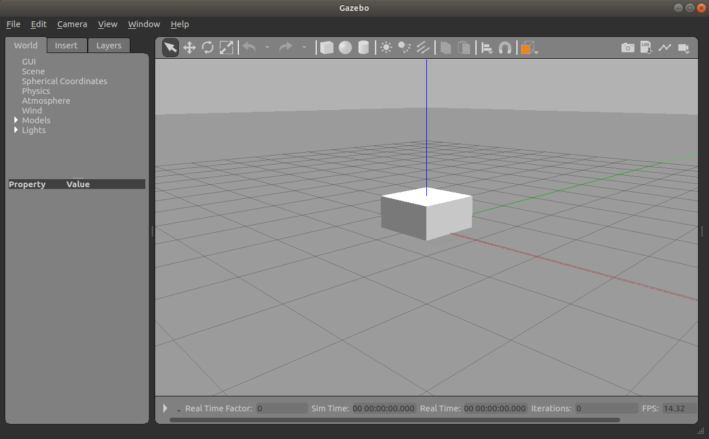

# Разработка собственного робота

TODO - добавить инфу про создание пакета, так как описание собственного робота лучше делать в отдельном пакете `wunderobot_description`

Самое время заняться разработкой собственного робота, ведь одним Tuetlebot в собственных экспериментах не обойтись. В этом разделе мы пройдемся по пути от создания простой модельки до организации работы модели в рамках ROS с помощью топиков.

Как обычно мы сразу начнем с практики и первым делом нам надо организовать launch-файл для запуска Gazebo с нашей моделькой. Для этого реализуем файл `launch/gz_start.launch` со следующим содержимым:
```xml
<?xml version="1.0"?>
<launch>
  <!-- Включить gzclient или нет -->
  <arg name="gz_gui" default="true" />

  <!-- Запуск Gazebo -->
  <include file="$(find gazebo_ros)/launch/empty_world.launch">
    <arg name="respawn_gazebo" value="true" />
    <arg name="use_sim_time" value="true"/>
    <arg name="debug" value="false"/>
    <arg name="gui" value="$(arg gz_gui)"/>
  </include>
</launch>
```

Этот скрипт просто запускает Gazebo-сервер вместе с Gazebo-клиентом (аргумент `gz_gui`). В результате запуска такого скрипта у нас появится пустой мир. 

Отлично! Мы еще раз убедились, что Gazebo работает. Теперь определимся, как будем создавать робота. Робот в Gazebo - это по сути описание в файле (или нескольких файлах) следующих форматов:
- SDF ([ссылка на спецификацию](http://sdformat.org/spec))
- URDF ([ссылка на доки](http://wiki.ros.org/urdf))

> 🚧 Warning
>
> Несмотря на то, что оба формата построены на основе XML, они кардинально разные. При этом есть специальные конвертеры, которые позволяют перегнать URDF в SDF

Если формат SDF ближе относится к общему описанию (Gazebo и другим симуляторам), то URDF имеет большее отношение к ROS, поэтому пользоваться мы будем именно последним! Более того, URDF поддерживается расширением Xacro, которое позволяет организовывать описание с помощью макросов.

Начало создания робота происходит с создания файла `urdf/robot.urdf.xacro` (`urdf` - папка, которую надо создать) со следующим содержанием:
```xml
<?xml version="1.0"?>
<robot name="my_robot" xmlns:xacro="http://www.ros.org/wiki/xacro">
  <link name="base_link">
    <visual>
      <geometry>
        <box size="1 1 1">
      </geometry>
    </visual>
    <collision>
      <geometry>
        <box size="1 1 1">
      </geometry>
    </collision>
    <inertial>
      <mass value="6"/>
      <inertia ixx="1" ixy="0" ixz="0"
               iyy="1" iyz="0"
               izz="1"/>
    </inertial>
  </link>
</robot>
```

Такое описание создает куб с длиной ребра 1 м и всеми самимы необходимыми параметрами. Что это за параметры разберем чуть позже, а сейчас нужно его увидеть в Gazebo!

Добавляет в `launch/gz_custom_robot.launch` строки для создания модели:
```xml
  <!-- Начальное положение робота -->
  <arg name="initial_pose" default="-x $(arg x) -y $(arg y) -z 0.025 -R 0 -P 0 -Y $(arg yaw)" />
  <!-- Аргументов задаем путь до файла с роботом -->
  <arg name="urdf_file" default="$(find wunderobot_description)/urdf/robot.urdf.xacro" />
  
  <!-- Затем прописывает в параметр описание робота -->
  <!-- * Здесь robot_description будет представлять содержимое файла описания -->
  <param name="robot_description" command="$(find xacro)/xacro '$(arg urdf_file)'" />

  <!-- Узел, который создает робота в Gazebo -->
  <node name="spawn_base_model" pkg="gazebo_ros" type="spawn_model"
        args="$(arg initial_pose) -unpause -urdf -param robot_description" />
```

Вот таким нехитрым способом при запуске launch-файла включается симулятор, создается наш робот и мы видим его в симуляторе!
<p align="center">

</p>


